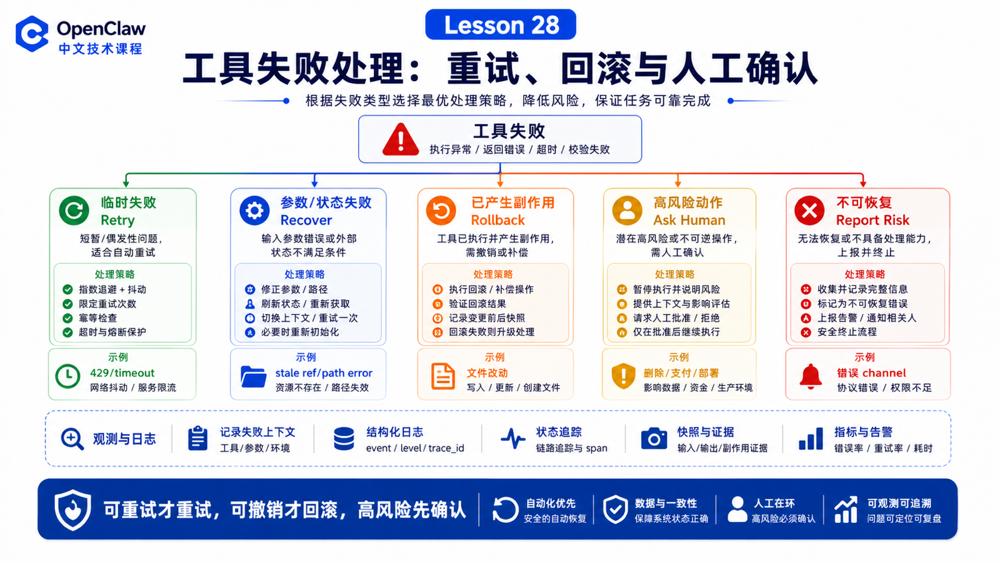

# 工具失败时怎么办：重试、回滚、人工确认和风险提示



工具失败不是异常情况。

在真实 Agent 系统里，它是常态。

Shell 会超时。

Browser 会遇到登录、2FA、captcha。

文件会不存在。

模型会传错参数。

外部 API 会 429。

所以一个成熟的 OpenClaw 工作流，不应该假设工具总会成功，而应该有一套失败处理策略。

## 先说结论：失败处理要先分类，再动作

不要看到失败就立刻重试。

先分类：

```text
临时失败
  网络抖动、429、服务暂时不可用

参数失败
  路径错、selector 错、参数缺字段

权限失败
  approval 未通过、tool policy 拒绝、sandbox 看不到文件

状态失败
  页面未加载、session 过期、进程等待输入

危险失败
  可能破坏数据、重复提交、误删文件、发送到错误 channel
```

分类以后再决定：

```text
retry
recover
rollback
ask human
report risk
stop
```

## Retry：只适合可重试的失败

适合重试：

```text
短暂网络错误
可幂等的读取
临时 5xx
页面加载偶发超时
provider 短重试
```

不适合盲目重试：

```text
支付
发消息
删除
迁移数据库
提交表单
触发生产部署
```

因为重复执行可能造成真实副作用。

官方 retry policy 也强调：按请求重试，避免重复非幂等操作。

## Recover：修正参数和状态

很多失败不是需要重试，而是需要恢复。

例如 Browser stale ref：

```text
旧 snapshot 里的 ref 失效
  ↓
重新 snapshot
  ↓
找新的 ref
  ↓
再尝试一次
```

例如 shell 路径错误：

```text
command failed: file not found
  ↓
pwd / ls / rg 确认路径
  ↓
用正确 workdir 重跑
```

这比“原样重试三次”聪明得多。

## Rollback：能撤销的才叫可靠

工具失败后，如果已经改变了文件或系统状态，要考虑回滚。

常见策略：

```text
文件修改
  使用 apply_patch，保留 diff，必要时反向 patch

代码改动
  先看 git diff，再决定撤回哪一部分

生成文件
  删除或标记临时产物

外部系统
  如果没有可靠撤销 API，不要假装能 rollback
```

回滚不是“把一切恢复到过去”这么简单。

特别是外部系统、数据库、消息发送、支付、部署，很多动作不可逆。此时正确做法是停止、报告风险、请求人工处理。

## Human confirmation：什么时候必须问人

应该问人的场景：

```text
执行破坏性 shell 命令
approval policy 要求确认
Browser 遇到登录、2FA、captcha
要发送敏感数据到群聊
要删除、覆盖或迁移重要文件
要进行生产部署或付款
无法确定用户真实意图
```

人工确认不是 Agent 的失败，而是安全设计的一部分。

## 风险提示：不要把不确定包装成成功

当工具失败或只完成部分工作时，最终回复要说明：

```text
完成了什么
哪里失败
失败原因是什么
有没有副作用
是否重试过
是否需要人工确认
下一步建议
```

不要说：

```text
已完成。
```

如果实际上只是：

```text
已打开网页，但下载失败。
已生成报告，但没有成功发送。
已修改文件，但测试未通过。
```

## Trajectory：失败后的飞行记录

OpenClaw 的 trajectory capture 可以作为每个 session 的 flight recorder。它记录 prompt、tool calls、runtime events、模型、插件、usage、错误等结构化时间线。

当你需要回答：

```text
模型为什么调用这个工具？
哪个工具失败了？
上下文里到底有什么？
fallback 有没有发生？
```

可以考虑导出 trajectory bundle。

这让失败不只是“感觉上出错了”，而是可以被复盘。

## 一个真实场景

用户说：

```text
帮我清理项目里的临时文件。
```

Agent 不能直接：

```bash
rm -rf *
```

合理流程：

```text
1. 先列出候选文件
2. 区分 build artifact、cache、用户文件
3. 给出将删除清单
4. 需要时请求确认
5. 执行可回滚或低风险删除
6. 保留日志
7. 报告删除了什么、跳过了什么
```

如果删除失败，应该说明哪个文件失败、为什么失败，而不是继续扩大范围。

## 常见误解

### 误解一：工具失败就应该自动重试

不对。要先判断是否幂等和是否安全。

### 误解二：回滚就是 git reset

不能这么粗暴。回滚要针对本次变更，而且不能撤掉用户已有修改。

### 误解三：人工确认会降低自动化能力

不是。它让自动化可以进入更高风险场景。

### 误解四：失败时只要道歉就行

不够。要给证据、影响范围和下一步。

## 最后总结

工具失败处理，是 Agent 可靠性的核心。

一句话总结：

```text
可重试的才重试，可撤销的才回滚，高风险的先确认，不确定的要透明报告。
```

## 本节作业

1. 写出五类工具失败，并分别给出处理策略。
2. 设计一个删除文件前的人工确认流程。
3. 解释为什么发消息、支付、部署不适合盲目重试。
4. 找一次失败任务，写出它的完成部分、失败部分和风险提示。

## 下一节预告

下一部分进入 Skill、MCP 与插件扩展：我们会从“如何使用 OpenClaw Skill”继续讲到如何自己写 Skill、接 MCP、做插件。

## 参考资料

- OpenClaw Docs：[Retry policy](https://docs.openclaw.ai/concepts/retry)
- OpenClaw Docs：[Exec approvals](https://docs.openclaw.ai/tools/exec-approvals)
- OpenClaw Docs：[Trajectory bundles](https://docs.openclaw.ai/tools/trajectory)
- OpenClaw Docs：[Diagnostics export](https://docs.openclaw.ai/gateway/diagnostics)
- OpenClaw Docs：[apply_patch tool](https://docs.openclaw.ai/tools/apply-patch)

---

原文外链：[工具失败时怎么办：重试、回滚、人工确认和风险提示](https://www.harries.blog/archives/720405.html)
