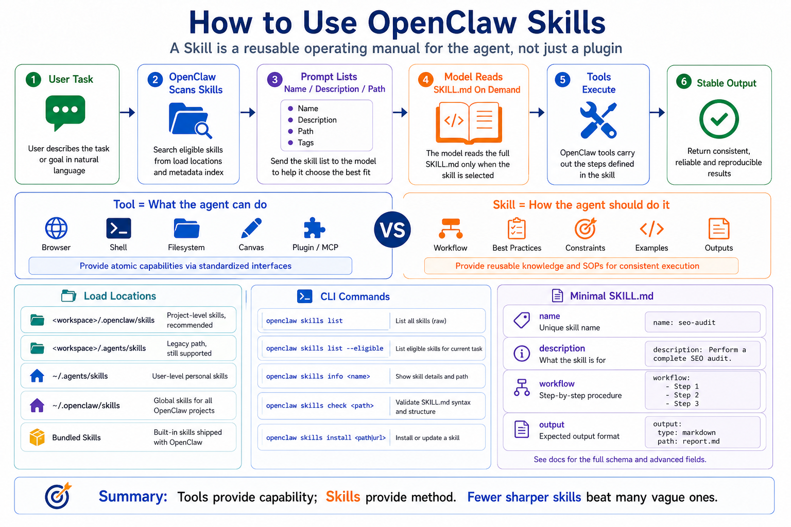

# How to Use OpenClaw Skills



Many people hear "OpenClaw Skill" and immediately think "plugin."

That is only half right.

A plugin usually adds a capability: a tool, a channel, a provider, or an integration.

A skill is closer to an operating manual for the agent.

It tells the agent:

```text
When this type of task appears,
follow these steps,
check these conditions,
use these tools,
avoid these mistakes,
and return the result in this shape.
```

So the value of a skill is not that it creates a new button.

The value is that it gives the agent a reusable way to work.

## The Short Version

OpenClaw uses AgentSkills-compatible skill folders.

The core file inside a skill folder is:

```text
SKILL.md
```

`SKILL.md` contains YAML frontmatter for metadata and Markdown instructions for the workflow.

OpenClaw does not inject the full text of every skill into every prompt.

The flow is:

```text
OpenClaw scans eligible skills
  ↓
The system prompt receives a compact list: name, description, location
  ↓
The model sees which skills are available
  ↓
When a task matches a skill
  ↓
The model reads that skill's SKILL.md
  ↓
The agent follows the workflow
```

That is the key idea.

Skills are loaded on demand.

This keeps the context window under control. If every skill body were injected all the time, a large skill library would consume the model's window before the task even started.

## Skill vs Tool

Tools answer:

```text
What can the agent do?
```

Skills answer:

```text
How should the agent do it?
```

Example:

```text
Browser tool = open pages, click, inspect, screenshot
browser automation skill = how to plan, inspect page state, avoid wrong clicks, and report results
```

Another example:

```text
exec tool = run commands
deployment skill = check environment, back up config, deploy, verify, and write a report
```

Good agents need both.

Tools provide capability.

Skills provide procedure.

## Where Skills Load From

OpenClaw loads skills from several locations with precedence:

```text
1. <workspace>/skills
2. <workspace>/.agents/skills
3. ~/.agents/skills
4. ~/.openclaw/skills
5. bundled skills shipped with OpenClaw
6. extra folders configured through skills.load.extraDirs
```

If the same skill name appears in multiple places, the higher-precedence source wins.

This lets you separate:

```text
workspace-specific skills
project-agent skills
personal reusable skills
shared managed skills
bundled defaults
```

For example, an SEO automation workspace can define its own `seo-content-pipeline` skill, and that local version can override a more generic shared one.

## How to Inspect Skills

Useful commands:

```bash
openclaw skills list
openclaw skills list --eligible
openclaw skills list --verbose
openclaw skills info <name>
openclaw skills check
```

Think of them this way:

```text
list       = what OpenClaw can scan
eligible   = what the current agent can actually see
verbose    = sources, paths, and filtering detail
info       = metadata for one skill
check      = validation and visibility checks
```

A folder existing on disk does not guarantee that the agent can use it.

A skill may be hidden because a required environment variable is missing, a binary is unavailable, the owning plugin is disabled, or the current agent allowlist excludes it.

## How to Install Skills

Common install paths:

```bash
openclaw skills search "calendar"
openclaw skills install <slug>
openclaw skills install <slug> --version <version>
openclaw skills install git:owner/repo
openclaw skills install git:owner/repo@main
openclaw skills install ./path/to/skill --as custom-name
openclaw skills install <slug> --global
openclaw skills update <slug>
openclaw skills update --all
```

By default, install and update target the active workspace's `skills/` directory.

`--global` installs into the shared managed skill directory.

`--agent <id>` targets a specific agent workspace.

A good beginner workflow is:

```text
search
  ↓
inspect with info
  ↓
install into the current workspace
  ↓
run check
  ↓
try a small task
```

Do not install a large number of global skills just because they look useful.

Skills affect behavior. More is not always better.

## How Skills Are Triggered

A skill is not a traditional menu item.

OpenClaw exposes available skill metadata to the model, and the model decides whether a task matches a skill.

Example user request:

```text
Check the product prices in this admin page, save screenshots, and produce a report.
```

If a browser automation skill is available, the agent may read it before planning:

```text
1. Open the page
2. Inspect page state
3. Identify tables or product cards
4. Handle clicks and pagination
5. Save screenshots
6. Write the report
```

You can also name a skill explicitly:

```text
Use the browser-automation skill for this task.
```

But a well-described skill should be discoverable from the task itself.

## A Minimal Skill

A small skill can look like this:

```md
---
name: seo-report
description: Generate a structured SEO analysis report from a webpage or keyword list.
---

# SEO Report Skill

Use this skill when the user asks for SEO analysis, content gaps, keyword planning, or page optimization.

## Workflow

1. Confirm the target page or keyword.
2. Fetch or inspect the content.
3. Extract title, headings, links, metadata, and visible text.
4. Identify SEO risks and opportunities.
5. Produce a prioritized report.

## Output

Return:

- Summary
- Issues
- Recommendations
- Next actions
```

It does not create a new tool.

It creates a reliable procedure.

## The Right Way to Use Skills

Use this sequence:

```text
1. Define the task type
2. Check whether a matching skill exists
3. Install it into the current workspace
4. Confirm it is eligible
5. Run a small task
6. Observe whether the agent reads SKILL.md
7. Improve the skill based on failures
8. Use it for more complex work
```

Do not start by writing a giant skill.

A skill should be a procedure, not an encyclopedia.

A good skill has:

- clear trigger conditions
- short concrete steps
- explicit tool expectations
- predictable output
- common failure handling
- minimal background

## Common Misunderstandings

### Misunderstanding 1: If a skill is installed, the agent will use it

Not necessarily.

It must be loaded, eligible, visible to the agent, and relevant to the task.

Check visibility with `openclaw skills list --eligible` and `openclaw skills check`.

### Misunderstanding 2: More skills means a smarter agent

Not always.

The skills list itself has prompt overhead, and similar skill descriptions can confuse selection.

Prefer fewer, sharper skills.

### Misunderstanding 3: Skills replace permissions

They do not.

Skills guide behavior. They do not enforce hard security boundaries.

Use tool policy, approvals, sandboxing, allowlists, and channel restrictions for enforcement.

## Final Summary

OpenClaw Skills teach the agent how to work.

Tools provide capability.

Skills provide method.

OpenClaw keeps the base prompt small by listing skill metadata first and letting the model read `SKILL.md` only when needed.

The goal is not to install many skills. The goal is to give the agent precise, reusable procedures for real tasks.

## Lesson Homework

1. Run `openclaw skills list` and `openclaw skills list --eligible`, then compare the output.
2. Pick one recurring task and write five steps that would make a useful skill.
3. Draft a minimal `SKILL.md` with name, description, workflow, and output.
4. Identify one dangerous tool the skill might encourage and decide how to restrict it.
5. Run a small task and observe whether the agent follows the skill.

## Next Lesson Preview

The next lesson answers: where do OpenClaw Skills come from?

Now that you know how to use a skill, we will look at ClawHub, Git skills, local folders, bundled skills, and how to judge whether a skill is safe to install.

## References

- [OpenClaw Skills](https://docs.openclaw.ai/tools/skills)
- [OpenClaw skills CLI](https://docs.openclaw.ai/cli/skills)
- [OpenClaw System prompt](https://docs.openclaw.ai/concepts/system-prompt)
- [OpenClaw Context](https://docs.openclaw.ai/concepts/context)

