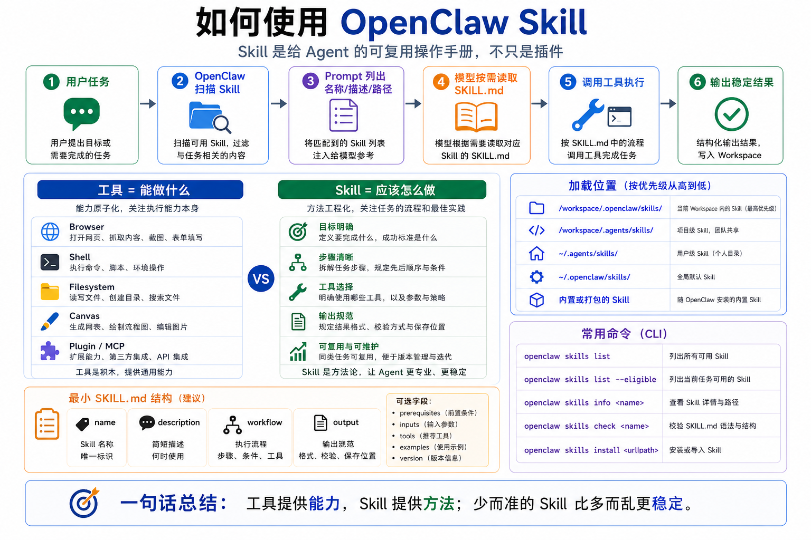

# 如何使用 OpenClaw Skill



很多人第一次听到 OpenClaw Skill，会把它理解成“插件”。

这个理解只对了一半。

插件通常给 Agent 增加新的能力，比如新的工具、新的消息渠道、新的模型 Provider。

Skill 更像是给 Agent 一份“操作手册”。

它不一定创造新工具，但会告诉 Agent：

```text
遇到某类任务时，应该按什么步骤做；
需要先检查什么；
应该调用哪些工具；
哪些坑不能踩；
结果应该怎么交付。
```

所以 Skill 的核心不是“多一个按钮”，而是“把一套可复用工作方法交给 Agent”。

这一篇我们讲清楚：OpenClaw Skill 是什么、怎么被加载、怎么触发、怎么使用，以及新手最容易误解的地方。

## 先说结论：Skill 是方法，不是魔法

OpenClaw 使用兼容 AgentSkills 的 skill 文件夹。

一个 Skill 通常是一个目录，里面最核心的文件是：

```text
SKILL.md
```

`SKILL.md` 里会有 YAML frontmatter，写明技能名称、描述、要求、环境条件等信息，正文部分写具体操作流程。

OpenClaw 不会把每个 Skill 的全文都塞进系统提示词。

更准确的流程是：

```text
OpenClaw 扫描可用 Skill
  ↓
把 Skill 的名称、描述、路径放进系统提示词
  ↓
模型看到“有哪些 Skill 可用”
  ↓
当任务匹配某个 Skill 时
  ↓
模型读取该 Skill 的 SKILL.md
  ↓
按里面的步骤执行
```

这就是 Skill 的真正位置。

它不是每次都完整进入上下文。

它是“按需加载”的操作说明。

这样设计有一个很现实的好处：不浪费上下文窗口。

如果你装了 30 个 Skill，每个几千字，全部塞进 Prompt，模型还没开始做任务，上下文就已经被挤爆了。

OpenClaw 只把 Skill 列表放进去，让模型需要时再读详细说明。

## Skill 和工具有什么区别

新手最容易混淆这两个词。

工具是 Agent 可以调用的能力。

Skill 是 Agent 使用这些能力的方法。

比如：

```text
Browser 工具 = 打开网页、截图、点击、读取页面
browser-automation Skill = 遇到网页自动化任务时，如何规划步骤、如何确认页面状态、如何避免误点
```

再比如：

```text
exec 工具 = 运行命令
deploy Skill = 部署前检查环境、备份配置、执行部署、验证服务、写回报告
```

工具回答的是：

```text
能做什么？
```

Skill 回答的是：

```text
应该怎么做？
```

真正稳定的 Agent，不能只靠工具。

因为工具越多，模型越容易乱选。

Skill 的价值，就是把“某类任务的正确操作路径”固定下来。

## OpenClaw 从哪里加载 Skill

OpenClaw 会从多个位置加载 Skill，而且有优先级。

从高到低大致是：

```text
1. <workspace>/skills
2. <workspace>/.agents/skills
3. ~/.agents/skills
4. ~/.openclaw/skills
5. 安装包自带的 bundled skills
6. 配置里的 skills.load.extraDirs
```

如果同名 Skill 在多个位置都存在，优先级高的位置会覆盖低的位置。

这个设计很重要。

因为它允许你做三件事：

```text
项目级定制：某个 workspace 有自己的专用 Skill
个人级复用：你自己的机器上有一套通用 Skill
系统级兜底：OpenClaw 自带一些默认能力说明
```

比如你做一个“SEO 工厂”项目，可以在当前 workspace 的 `skills/` 里放一个 `seo-content-pipeline`。

这样这个项目的 Agent 会优先使用项目里的 SEO 工作流，而不会误用别处同名 Skill。

## 如何查看当前有哪些 Skill

最常用的是 CLI：

```bash
openclaw skills list
openclaw skills list --eligible
openclaw skills list --verbose
openclaw skills info <name>
openclaw skills check
```

你可以这样理解：

```text
list       = 当前能扫描到哪些 Skill
eligible   = 当前 Agent 真正符合条件、能出现在提示词里的 Skill
info       = 看某个 Skill 的详细信息
check      = 检查 Skill 是否可见、格式是否正常
verbose    = 看更多路径、来源和过滤原因
```

这里有一个细节：

“文件存在”不等于“Agent 能用”。

一个 Skill 可能因为环境变量缺失、二进制不存在、插件未启用、allowlist 限制、当前 agent 不匹配而不可用。

所以排查 Skill 时，不要只看文件夹。

要看 eligible。

## 如何安装 Skill

OpenClaw 支持几种安装方式：

```bash
openclaw skills search "calendar"
openclaw skills install <slug>
openclaw skills install <slug> --version <version>
openclaw skills install git:owner/repo
openclaw skills install git:owner/repo@main
openclaw skills install ./path/to/skill --as custom-name
openclaw skills install <slug> --global
openclaw skills update <slug>
openclaw skills update --all
```

默认情况下，`install` 和 `update` 会面向当前 Agent 的 workspace `skills/` 目录。

如果加 `--global`，则安装到共享 managed skills 目录。

如果加 `--agent <id>`，则安装到指定 Agent 的 workspace。

最安全的新手路径是：

```text
先 search
再 info
再 install 到当前 workspace
最后 check
```

不要一上来就全局安装一堆 Skill。

Skill 是会影响 Agent 行为的。

装得越多，不代表越聪明；有时反而会让模型更难判断该按哪套方法做。

## Skill 是怎么被触发的

Skill 不是传统软件里的“手动点击执行”。

OpenClaw 会在系统提示词里列出可用 Skill 的名称、描述和路径。

模型根据用户任务判断：

```text
这个任务是否匹配某个 Skill？
如果匹配，需要读取哪个 SKILL.md？
读完之后要按哪些步骤调用工具？
```

比如你说：

```text
帮我把这个网页后台的商品价格检查一遍，截图并输出报告。
```

如果当前环境有 browser automation 相关 Skill，模型可能会先读取该 Skill，再开始规划：

```text
1. 打开目标页面
2. 获取页面快照
3. 识别表格或商品卡片
4. 执行点击或分页
5. 截图保存
6. 生成报告
```

你也可以显式点名：

```text
使用 browser-automation skill 完成这个任务。
```

但更好的 Skill 应该是：即使你不点名，模型也能从描述中判断什么时候该用。

## 一个最小 Skill 长什么样

一个很小的 Skill 可以像这样：

```md
---
name: seo-report
description: Generate a structured SEO analysis report from a webpage or keyword list.
---

# SEO Report Skill

Use this skill when the user asks for SEO analysis, content gap analysis, keyword planning, or page optimization advice.

## Workflow

1. Confirm the target page or keyword.
2. Fetch or inspect the content.
3. Extract title, headings, links, metadata, and visible content.
4. Identify SEO risks and opportunities.
5. Produce a report with prioritized recommendations.

## Output

Return:

- Summary
- Issues
- Recommendations
- Next actions
```

它没有创建任何新工具。

但它让 Agent 知道：遇到 SEO 报告任务时，不要随便写一段建议，而要按固定结构完成。

这就是 Skill 的力量。

## 使用 Skill 的正确姿势

我建议你按下面顺序使用：

```text
第一步：先明确任务类型
第二步：查看是否已有合适 Skill
第三步：安装到当前 workspace
第四步：用 check 确认可见
第五步：让 Agent 执行一个小任务
第六步：观察它是否真的读取 SKILL.md
第七步：根据失败点修改 Skill
第八步：再用于更复杂任务
```

不要一开始就写一个超级 Skill。

新手最常犯的错是把 Skill 写成一本百科全书。

Skill 应该像“操作规程”，不是像“产品说明书”。

一个好 Skill 通常满足：

- 触发条件清晰
- 步骤短而具体
- 工具选择明确
- 输出格式固定
- 有常见失败处理
- 不塞太多无关背景

## 常见误解

### 误解一：装了 Skill，Agent 一定会用

不一定。

它必须被加载、符合条件、出现在可用 Skill 列表里，并且模型判断任务匹配。

所以排查时要看 `openclaw skills list --eligible` 和 `openclaw skills check`。

### 误解二：Skill 越多越好

不是。

Skill 列表本身也会占上下文。

更重要的是，描述太相似的 Skill 会增加模型选择成本。

宁愿少而准，不要多而乱。

### 误解三：Skill 可以代替权限控制

不能。

Skill 是行为指导，不是硬限制。

真正的安全边界仍然要靠 tool policy、审批、沙箱、allowlist、channel 限制。

### 误解四：Skill 必须很复杂才有价值

错。

很多高价值 Skill 只有几十行。

它把“我希望 Agent 每次都这样做”的经验固化下来，就已经很有价值。

## 最后总结

OpenClaw Skill 是让 Agent 学会“怎么做事”的机制。

工具提供能力，Skill 提供方法。

OpenClaw 不会把所有 Skill 全文都塞进 Prompt，而是把名称、描述和路径放进去，模型需要时再读取 `SKILL.md`。

使用 Skill 时，最重要的不是装得多，而是让每个 Skill 都有清晰触发条件、稳定流程和明确输出。

如果你想把 OpenClaw 从“能调用工具”推进到“稳定完成某类任务”，Skill 是必学的一层。

## 本节作业

1. 运行 `openclaw skills list` 和 `openclaw skills list --eligible`，比较两者差别。
2. 找一个你常做的任务，写出它适合变成 Skill 的 5 个步骤。
3. 设计一个最小 `SKILL.md`，只包含 name、description、workflow、output。
4. 思考一个安全问题：这个 Skill 会不会引导 Agent 调用危险工具？应该用什么策略限制？
5. 让 Agent 执行一个小任务，观察它是否会按 Skill 的流程输出。

## 下一节预告

下一节我们继续讲：OpenClaw Skill 从哪里找。

这一节解决“怎么用”，下一节解决“去哪里找、怎么判断能不能装、装之前怎么看风险”。这会直接影响你后面搭建企业助手、浏览器自动化和数据分析工作流的效率。

## 参考资料

- [OpenClaw Skills](https://docs.openclaw.ai/tools/skills)
- [OpenClaw skills CLI](https://docs.openclaw.ai/cli/skills)
- [OpenClaw System prompt](https://docs.openclaw.ai/concepts/system-prompt)
- [OpenClaw Context](https://docs.openclaw.ai/concepts/context)

