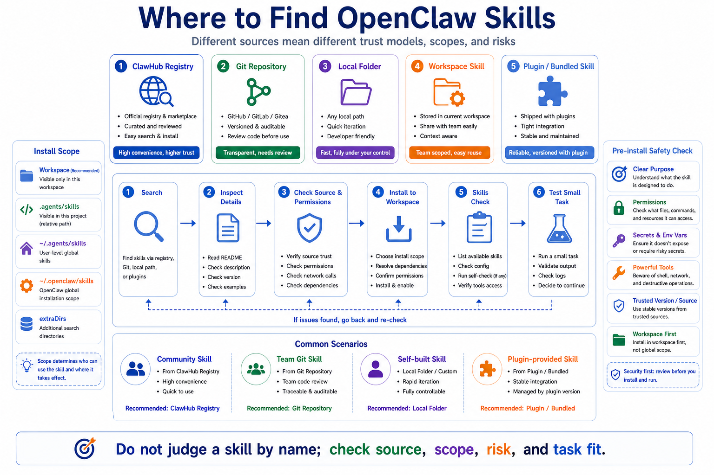

# Where to Find OpenClaw Skills



Once you know how to use skills, the next question is obvious:

Where do you find them?

Is there a skill marketplace?

Can you install from GitHub?

Can you use a local folder?

Can plugin-provided skills be customized?

The answer is yes, but the source matters.

Finding a skill is not just about downloading something. You need to know where it comes from, where it gets installed, who can see it, how it updates, and what risk it adds.

## The Five Main Sources

OpenClaw Skills usually come from:

```text
1. ClawHub: the public registry for discovering community skills
2. Git repositories: good for team-maintained and versioned skills
3. Local folders: good for developing and testing your own skills
4. Workspace skills: good for project-specific workflows
5. Bundled or plugin skills: shipped with OpenClaw or plugins
```

Do not treat these sources as identical.

Different sources have different trust models.

ClawHub listings should be inspected for metadata, versions, source attribution, and scan status.

Git skills should be reviewed like code.

Local skills are only as good as your own instructions.

Plugin-provided skills depend on whether the plugin is enabled and trusted.

## ClawHub: The Registry Layer

ClawHub is the registry layer for OpenClaw skills and plugins.

It gives users a place to discover packages and publishers a place to release versions.

A public listing can include:

- owner and slug
- published versions
- metadata and summary
- files and source attribution
- changelog
- tags such as `latest`
- download, install, star, and comment signals
- security scan and moderation status

So do not judge a skill by name alone.

Before installing, ask:

```text
What does it claim to do?
What tools, environment variables, or binaries does it need?
Do I trust the publisher, source, and version?
```

## Search and Install with CLI

Common commands:

```bash
openclaw skills search "calendar"
openclaw skills search --limit 20
openclaw skills search --limit 20 --json
openclaw skills install <slug>
openclaw skills install <slug> --version <version>
openclaw skills info <name>
openclaw skills check
```

A safe workflow:

```text
search candidates
  ↓
inspect details
  ↓
judge source and use case
  ↓
install into the current workspace
  ↓
run check
  ↓
test with a small task
```

If you are not sure a skill should affect all agents, do not install it globally.

Start with the current workspace.

## Install from Git

OpenClaw supports Git skill sources:

```bash
openclaw skills install git:owner/repo
openclaw skills install git:owner/repo@main
openclaw skills install git:owner/repo@feature/foo
```

The root of the source must contain `SKILL.md`.

The skill name usually comes from the frontmatter `name`.

You can override it:

```bash
openclaw skills install git:owner/repo --as custom-name
```

Git is a strong option for teams.

For example, your company may have a release workflow:

```text
check configuration
back up service state
deploy
run health checks
notify WeCom
write a release record
```

That skill belongs in an internal repository, reviewed like code.

## Install from Local Folders

For local development:

```bash
openclaw skills install ./path/to/skill
openclaw skills install ./path/to/skill --as my-skill
```

The source root must contain `SKILL.md`.

Local install is useful for iteration:

```text
write a skill
  ↓
install into workspace
  ↓
run check
  ↓
try a small task
  ↓
fix the workflow
  ↓
install again
```

If the same name already exists:

```bash
openclaw skills install ./path/to/skill --force
```

Use `--force` carefully. Replacing a skill changes agent behavior.

## Workspace, Personal, and Global Scope

Skill location controls who sees it:

```text
<workspace>/skills           current workspace only
<workspace>/.agents/skills   the agent for this workspace
~/.agents/skills             agents on this machine
~/.openclaw/skills           shared managed/local skills
bundled skills               shipped with OpenClaw
skills.load.extraDirs        extra configured directories
```

Recommended mental model:

```text
project-specific skill → workspace
personal reusable skill → personal or managed local folder
team-shared skill → Git repository with review
community skill → ClawHub, after inspection
```

This avoids a common mistake: installing an aggressive project-specific skill globally and accidentally changing every agent's behavior.

## Plugin-Provided Skills

Plugins can ship skills.

This is useful because tool descriptions should stay short, while complex operating procedures belong in a skill.

For example, a browser plugin may provide a browser automation skill that explains how to plan, inspect, click, verify, and report.

Plugin skills:

```text
are visible only when the plugin is enabled
are good for tool-specific operating guides
can be overridden by higher-precedence workspace skills
```

When debugging, check:

```text
Is the plugin enabled?
Is the skill eligible?
Is a same-name skill overriding it?
```

## Security Checks Before Installing

A skill may be "just text," but it changes how the agent behaves.

A risky skill may guide the agent to:

- read files it should not read
- call powerful shell commands
- send data to external APIs
- bypass approval workflows
- operate web pages dangerously
- produce confident but wrong business reports

Before installing, inspect:

```text
1. Is the purpose clear?
2. Does it require secrets, env vars, or external binaries?
3. Does it encourage exec, browser, message, or other powerful tools?
4. Could outputs leak sensitive data?
5. Is the publisher or repository trusted?
6. Is there a version, changelog, scan, or moderation signal?
7. Should this be workspace-scoped instead of global?
```

Skills are soft guidance.

Hard enforcement still comes from tool policy, approvals, sandboxing, and allowlists.

## What Makes a Skill Worth Installing?

A good skill has:

- a clear description
- concrete steps
- limited tool expectations
- failure handling
- predictable output
- no unrelated secrets
- no suggestion to bypass policy
- a small task you can test it with

A weak skill says something like:

```text
You are an expert. Solve every task perfectly.
```

That is not much of a skill.

A useful skill is closer to an SOP.

It makes repeated work stable.

## Final Summary

OpenClaw Skills can come from ClawHub, Git repositories, local folders, workspace directories, bundled packages, and plugins.

When choosing a skill, look at:

```text
source
install location
visibility scope
permission risk
update path
task fit
```

For trials, install into the current workspace first.

For team use, prefer Git with review.

For community skills, inspect the ClawHub listing, version, source, and safety signals.

Good skill discovery leads to stable agent behavior.

## Lesson Homework

1. Search for one skill keyword with `openclaw skills search`.
2. Pick one candidate and write down its purpose, source, required capabilities, and risks.
3. Decide whether it belongs in workspace scope, global scope, or should not be installed yet.
4. Design one internal team skill that should live in a Git repository.
5. Write your own pre-install checklist.

## Next Lesson Preview

The next lesson explains how Agent Prompts shape behavior.

Skills are on-demand methods. Prompts are the runtime rules that shape every agent run. Once you understand prompts, you will see why the same model can behave very differently under different OpenClaw configurations.

## References

- [OpenClaw Skills](https://docs.openclaw.ai/tools/skills)
- [OpenClaw skills CLI](https://docs.openclaw.ai/cli/skills)
- [How ClawHub Works](https://docs.openclaw.ai/clawhub/how-it-works)
- [OpenClaw System prompt](https://docs.openclaw.ai/concepts/system-prompt)

