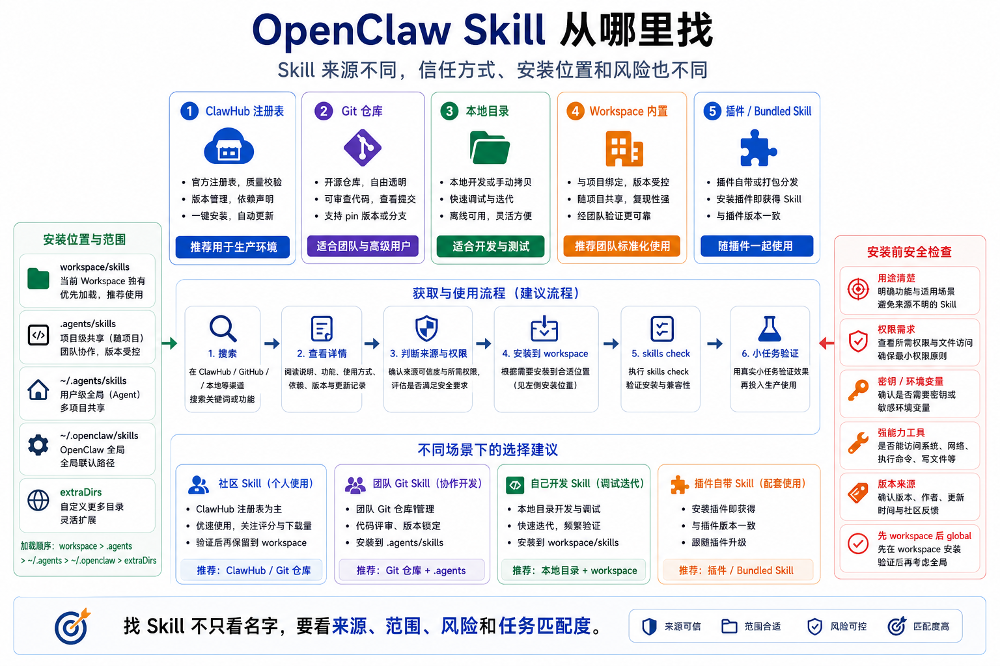

# OpenClaw Skill 从哪里找



学会使用 Skill 之后，下一件事就是：去哪里找 Skill。

很多人会直接问：

“有没有一个 Skill 市场？”

“能不能从 GitHub 装？”

“本地自己写的 Skill 放哪里？”

“OpenClaw 自带的 Skill 能不能改？”

答案是：都可以，但要分清来源、优先级和风险。

这篇不只是列几个命令。

我们要建立一个判断框架：

```text
Skill 从哪里来？
装到哪里？
谁能看到？
怎么更新？
装之前怎么判断风险？
```

## 先说结论：Skill 来源有五类

OpenClaw Skill 常见来源可以分成五类：

```text
1. ClawHub：公开注册表，适合搜索和安装社区 Skill
2. Git 仓库：适合团队维护、版本可控的 Skill
3. 本地目录：适合自己开发和测试 Skill
4. Workspace 内置：适合项目专用工作流
5. Bundled / Plugin Skill：OpenClaw 或插件自带的操作说明
```

不要把它们混成一件事。

因为来源不同，意味着信任方式不同。

ClawHub 要看发布者、版本、元数据、扫描状态。

Git 仓库要看代码和提交历史。

本地目录要看你自己写得是否清楚。

插件自带 Skill 要看插件是否启用，以及插件本身是否可信。

## ClawHub：Skill 和插件的注册表

ClawHub 是 OpenClaw Skill 和插件的注册表层。

它解决两个问题：

```text
用户：在哪里发现可安装的 Skill？
发布者：在哪里发布版本、描述能力、提供更新？
```

一个 ClawHub listing 通常会包含：

- owner 和 slug
- 已发布版本
- 元数据和摘要
- 文件和来源说明
- changelog
- 标签和 latest 信息
- 下载、安装、收藏、评论信号
- 安全扫描和审核状态

所以你不要只看 Skill 名字。

安装之前至少看三件事：

```text
它声称解决什么问题？
它需要哪些权限、环境变量或外部工具？
它的来源和版本是否可信？
```

## 用 CLI 搜索和安装

最常见命令是：

```bash
openclaw skills search "calendar"
openclaw skills search --limit 20
openclaw skills search --limit 20 --json
openclaw skills install <slug>
openclaw skills install <slug> --version <version>
openclaw skills info <name>
openclaw skills check
```

一个比较稳的流程是：

```text
搜索候选
  ↓
查看详情
  ↓
判断来源和用途
  ↓
安装到当前 workspace
  ↓
运行 check
  ↓
用小任务验证
```

如果你还不确定一个 Skill 是否适合全局使用，先不要 `--global`。

先装到当前 workspace。

让它只影响当前项目。

## 从 Git 仓库安装

OpenClaw 支持 Git 来源：

```bash
openclaw skills install git:owner/repo
openclaw skills install git:owner/repo@main
openclaw skills install git:owner/repo@feature/foo
```

Git Skill 的源目录根部需要有 `SKILL.md`。

Skill 名称通常来自 `SKILL.md` frontmatter 里的 `name`。

如果需要改名，可以用：

```bash
openclaw skills install git:owner/repo --as custom-name
```

Git 来源适合团队内部维护。

比如你们公司有一套固定的发布流程：

```text
检查配置
备份服务
执行部署
验证健康检查
通知企业微信
写入发布记录
```

这套流程可以放在内部 Git 仓库里。

每次更新 Skill，都走代码评审。

这样比在个人机器上随手改一份 `SKILL.md` 稳得多。

## 从本地目录安装

如果你正在开发自己的 Skill，可以从本地目录安装：

```bash
openclaw skills install ./path/to/skill
openclaw skills install ./path/to/skill --as my-skill
```

本地目录的根部也需要 `SKILL.md`。

本地安装适合快速迭代：

```text
写一个 Skill
  ↓
安装到 workspace
  ↓
运行 check
  ↓
让 Agent 做一个小任务
  ↓
根据失败点修改
  ↓
再安装或覆盖
```

如果已经存在同名 Skill，可以用：

```bash
openclaw skills install ./path/to/skill --force
```

但要谨慎。

覆盖同名 Skill 会改变 Agent 行为。

## Workspace、个人、全局：装到哪里

Skill 的位置会影响可见范围。

可以按这个表理解：

```text
<workspace>/skills           只影响当前 workspace
<workspace>/.agents/skills   只影响当前 workspace 的 agent
~/.agents/skills             影响这台机器上的 agent
~/.openclaw/skills           共享 managed/local skills
bundled skills               OpenClaw 自带
skills.load.extraDirs        配置里的额外目录
```

新手建议：

```text
项目专用 Skill → 放 workspace
个人常用 Skill → 放 ~/.agents/skills 或 managed/local
团队共享 Skill → Git 仓库 + 明确安装流程
通用社区 Skill → 从 ClawHub 安装，但先看详情
```

这能避免一个常见事故：

你为了某个项目安装了一个很激进的 Skill，结果它影响了所有 Agent。

## Plugin 自带 Skill

插件也可以带 Skill。

比如一个浏览器插件可能带一个浏览器自动化 Skill。

原因很简单：

工具说明通常不适合写太长。

浏览器工具只需要说清楚参数和返回值。

但“复杂网页自动化应该如何分步执行”，更适合写进 Skill。

插件自带 Skill 的特点是：

```text
插件启用时才可见
适合工具专属操作指南
可以被更高优先级的 workspace skill 覆盖
```

这也是为什么排查时要看：

```text
插件是否启用？
Skill 是否 eligible？
同名 Skill 是否被更高优先级来源覆盖？
```

## 安装前的安全检查

Skill 看起来只是文本，但它会影响 Agent 行为。

所以它有风险。

一个危险 Skill 可能不会直接执行恶意代码，但它可能引导 Agent：

- 读取不该读的文件
- 调用高权限 Shell
- 把数据发给外部 API
- 忽略审批流程
- 对网页执行危险操作
- 生成错误但自信的业务报告

安装前建议检查：

```text
1. SKILL.md 是否清楚说明用途
2. 是否要求特殊环境变量或密钥
3. 是否鼓励调用 exec、browser、message 等强能力工具
4. 输出是否会包含敏感数据
5. 是否来自可信发布者或可信 Git 仓库
6. 是否有版本、changelog、扫描或审核信息
7. 是否应该先装在 workspace 而不是 global
```

记住：

```text
Skill 是软约束。
真正的硬边界还是 tool policy、审批、沙箱、allowlist。
```

## 如何判断一个 Skill 值不值得装

好的 Skill 通常有几个特征：

- 描述明确，一看就知道什么时候用
- 步骤具体，不只是口号
- 不把工具权限说得太宽
- 有失败处理
- 有输出格式
- 不要求无关密钥
- 不鼓励绕过系统策略
- 能用小任务验证

差的 Skill 通常是：

```text
“你是最强专家，请完成所有任务。”
```

这种 Skill 没什么用。

它只是换一种方式写 Prompt，没有提供真正可复用的方法。

真正有价值的 Skill 应该像一份 SOP。

它让 Agent 在重复任务上更稳定。

## 最后总结

OpenClaw Skill 可以从 ClawHub、Git 仓库、本地目录、workspace、bundled skills、插件自带 Skill 中来。

找 Skill 时，不要只看名字和热度。

你要同时看：

```text
来源
安装位置
可见范围
权限风险
更新方式
是否真的符合你的任务
```

如果只是试用，优先安装到当前 workspace。

如果团队长期使用，优先放进 Git 仓库并走评审。

如果是社区 Skill，优先看 ClawHub listing、版本、来源和安全状态。

Skill 找得准，Agent 才会做得稳。

## 本节作业

1. 使用 `openclaw skills search` 搜索一个你感兴趣的关键词。
2. 选一个候选 Skill，写下它的用途、来源、需要的权限和你担心的风险。
3. 判断它应该装到 workspace、global，还是先不装。
4. 找一个你团队可以内部维护的 Skill 场景，设计 Git 仓库安装方式。
5. 写一份安装前检查清单，放进你的课程笔记。

## 下一节预告

下一节我们讲 Agent Prompt 是怎么影响行为的。

Skill 是“按需加载的方法”，Prompt 则是每次运行都在塑造模型行为的底层规则。理解 Prompt 之后，你会更清楚为什么同一个模型，在不同 OpenClaw 配置下会表现得完全不同。

## 参考资料

- [OpenClaw Skills](https://docs.openclaw.ai/tools/skills)
- [OpenClaw skills CLI](https://docs.openclaw.ai/cli/skills)
- [How ClawHub Works](https://docs.openclaw.ai/clawhub/how-it-works)
- [OpenClaw System prompt](https://docs.openclaw.ai/concepts/system-prompt)

