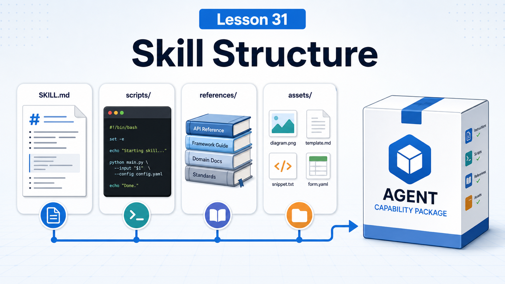

# Skill Structure: When to Use Instructions, Scripts, or Resource Files



The most common mistake when writing a Skill is putting everything into `SKILL.md`.

It feels convenient at first.

But once the workflow grows, the file becomes long, hard to read, and expensive for the model to inspect.

This lesson answers:

```text
What belongs in instructions?
What belongs in scripts?
What belongs in references, assets, or templates?
```

## The Key Idea: A Skill Is a Small Capability Package

OpenClaw uses AgentSkills-compatible skill folders. The smallest structure is:

```text
my-skill/
  SKILL.md
```

A mature skill often looks like:

```text
my-skill/
  SKILL.md
  scripts/
    check.sh
    export.ts
  references/
    api-notes.md
    examples.md
  assets/
    template.json
    sample.png
```

Roles:

```text
SKILL.md
  when to use the skill, how to start, and what boundaries apply

scripts/
  repeatable, testable execution logic with clear parameters

references/
  longer background docs, API notes, examples, troubleshooting tables

assets/
  templates, samples, static resources, prompt fragments, test inputs
```

## `SKILL.md` Should Be Short and Precise

Frontmatter should include:

```yaml
---
name: my-skill
description: One-line trigger description.
---
```

`name` should be lowercase with digits and hyphens. `description` matters because it appears in the compact skill list the model sees.

The body should answer:

```text
when to use
first step
required tools
risks and limits
common failures
which references to read when needed
```

Do not paste long API docs, logs, or full code into it.

## When to Write Instructions

Put this in `SKILL.md`:

```text
workflow decisions
usage boundaries
safety warnings
call order
small command snippets
when not to use the skill
```

Example:

```text
When exporting finance reports, confirm date range first, then read references/export-fields.md.
Do not send production data to group chats without confirmation.
```

This is decision guidance.

## When to Write Scripts

Use `scripts/` when the logic is:

```text
long
fixed
parameterized
repeated often
testable
easy for the model to mistype
```

Examples:

```text
scripts/export-orders.ts
scripts/validate-report.py
scripts/check-env.sh
```

Scripts help by:

```text
reducing command mistakes
making logic testable
keeping versions clear
reducing prompt size
```

`SKILL.md` can simply say:

```text
Run scripts/export-orders.ts with --from and --to.
```

## When to Use Resource Files

Use `references/` or `assets/` for:

```text
API field tables
long examples
template files
troubleshooting checklists
screenshot samples
JSON schemas
prompt templates
```

These should not always enter context.

Better:

```text
In SKILL.md, say "read references/field-map.md when field mapping is needed."
```

## `{baseDir}` and Portable Paths

Skill scripts and assets should be referenced relative to the skill folder.

OpenClaw docs recommend using `{baseDir}` in `SKILL.md` when referencing files inside the skill.

That keeps the skill portable across workspace, managed, or plugin-shipped locations.

## Skill Locations and Precedence

OpenClaw loads skills from several roots:

```text
<workspace>/skills
<workspace>/.agents/skills
~/.agents/skills
~/.openclaw/skills
bundled skills
skills.load.extraDirs
```

When names conflict, higher precedence wins.

Workspace skills are good for project-local rules. Managed skills are good for general capabilities.

## A Real Scenario

You want a support-ticket report skill.

Avoid:

```text
SKILL.md contains login steps, SQL, field table, classifications, and export code.
```

Better:

```text
support-report/
  SKILL.md
  scripts/
    export-tickets.ts
    classify-tickets.ts
  references/
    fields.md
    escalation-rules.md
  assets/
    report-template.xlsx
```

`SKILL.md` says:

```text
1. confirm date range
2. run scripts/export-tickets.ts
3. classify using references/escalation-rules.md
4. generate report and ask before sending sensitive data
```

## Common Misunderstandings

### Misunderstanding 1: A Skill Is Just Markdown

The minimum is Markdown, but a mature skill is a package.

### Misunderstanding 2: Scripts Make Skills Complicated

For fixed logic, scripts make skills more reliable.

### Misunderstanding 3: References Automatically Enter Context

They do not. The agent reads them when needed.

### Misunderstanding 4: Same Skill Names Do Not Matter

They do. Precedence decides which one is visible.

## Final Summary

Skill structure is context engineering.

In one sentence:

```text
Put decisions in SKILL.md, repeatable execution in scripts, long material in references, and reusable templates in assets.
```

## Lesson Homework

1. Split a repeated task into `SKILL.md`, `scripts/`, and `references/`.
2. Write a skill frontmatter and trigger note under 10 lines.
3. Identify one long reference that should not live in `SKILL.md`.
4. Decide whether your skill belongs in workspace or managed skills.

## Next Lesson Preview

Next: skill triggering and how to make the agent use the right capability at the right time.

## References

- OpenClaw Docs: [Skills](https://docs.openclaw.ai/tools/skills)
- OpenClaw Docs: [Creating skills](https://docs.openclaw.ai/tools/creating-skills)
- OpenClaw Docs: [Skills config](https://docs.openclaw.ai/tools/skills-config)
- OpenClaw Docs: [ClawHub skill format](https://docs.openclaw.ai/clawhub/skill-format)
