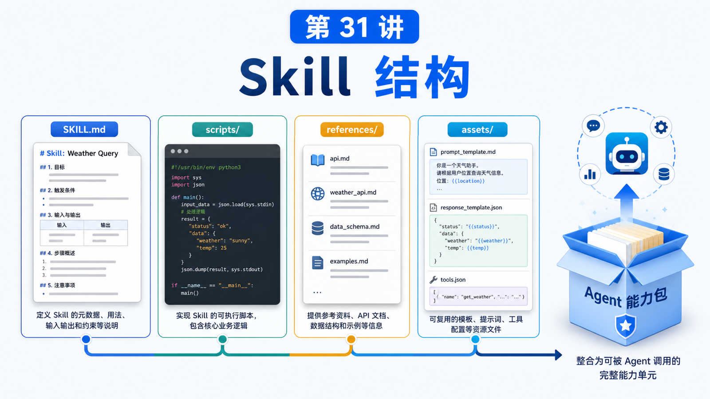

# Skill 的结构：什么时候该写成说明、脚本或资源文件



写 Skill 最常见的误区，是把所有东西都塞进 `SKILL.md`。

一开始这很方便。

但当流程变长、命令变多、示例变复杂以后，`SKILL.md` 会变成一坨难读的长文：模型读不完，人也维护不动。

所以这一讲要解决的问题是：

```text
一个 Skill 里，什么应该写成说明？
什么应该写成脚本？
什么应该放到 references / assets / templates？
```

## 先说结论：Skill 是一个小型能力包

OpenClaw 使用 AgentSkills-compatible skill folders。最小结构是：

```text
my-skill/
  SKILL.md
```

但一个成熟 Skill 往往会变成：

```text
my-skill/
  SKILL.md
  scripts/
    check.sh
    export.ts
  references/
    api-notes.md
    examples.md
  assets/
    template.json
    sample.png
```

其中：

```text
SKILL.md
  告诉 Agent 什么时候用、怎么用、边界是什么

scripts/
  放可重复、可测试、参数明确的执行逻辑

references/
  放较长的背景资料、API 说明、示例、排错表

assets/
  放模板、样例、静态资源、提示词片段、测试输入
```

## `SKILL.md` 应该短而准

`SKILL.md` 的 frontmatter 至少包含：

```yaml
---
name: my-skill
description: One-line trigger description.
---
```

`name` 应使用小写字母、数字和连字符。`description` 很关键，因为它会进入模型看到的技能列表，影响模型是否知道该用它。

正文应该回答：

```text
什么时候使用
第一步做什么
需要哪些工具
风险和限制
常见失败如何处理
必要时读取哪些 references
```

不要把大段 API 文档、长日志、完整代码塞进去。它们应该放到 references 或 scripts。

## 什么时候写成说明

适合写在 `SKILL.md` 的内容：

```text
流程判断
使用边界
安全提醒
调用顺序
少量关键命令
什么时候不要用
```

例如：

```text
当用户要求导出财务报表时，先确认日期范围，再读取 references/export-fields.md。
如果涉及生产数据，不要自动发送到群聊。
```

这类内容是“让 Agent 做正确决策”的说明。

## 什么时候写成脚本

适合放进 `scripts/` 的内容：

```text
命令长
步骤固定
参数明确
需要重复执行
需要测试
容易被模型抄错
```

例如：

```text
scripts/export-orders.ts
scripts/validate-report.py
scripts/check-env.sh
```

脚本的好处是：

```text
减少模型手写命令错误
让逻辑可测试
让版本控制更清晰
降低 prompt 体积
```

`SKILL.md` 只需要告诉 Agent：

```text
运行 scripts/export-orders.ts，传入 --from 和 --to。
```

## 什么时候放资源文件

适合放到 `references/` 或 `assets/`：

```text
API 字段表
长示例
模板文件
排错清单
截图样例
JSON schema
用户要复用的 prompt 模板
```

这些内容不一定每次都要读。

更好的做法是：

```text
SKILL.md 里写“需要字段映射时读取 references/field-map.md”
```

这样日常触发成本低，复杂任务又有资料可查。

## `{baseDir}` 和可移植路径

Skill 里的脚本和资源应该尽量使用相对 skill 目录的路径。

OpenClaw 文档建议在 `SKILL.md` 中引用 skill 内文件时使用 `{baseDir}`。

这样 Skill 从 workspace 移到 managed skills 或插件里时，不容易因为绝对路径失效。

## Skill 位置和优先级

OpenClaw 会从多个位置加载 Skill，并按优先级选择同名 Skill：

```text
<workspace>/skills
<workspace>/.agents/skills
~/.agents/skills
~/.openclaw/skills
bundled skills
skills.load.extraDirs
```

同名冲突时，高优先级位置胜出。

所以 workspace skill 很适合放项目本地规则；全局 managed skill 适合放通用能力。

## 一个真实场景

你要写一个“导出客服工单报表”的 Skill。

不要这样：

```text
SKILL.md 里塞满登录步骤、SQL、字段表、异常分类、导出脚本。
```

更合理：

```text
support-report/
  SKILL.md
  scripts/
    export-tickets.ts
    classify-tickets.ts
  references/
    fields.md
    escalation-rules.md
  assets/
    report-template.xlsx
```

`SKILL.md` 只讲流程：

```text
1. 确认日期范围
2. 用 scripts/export-tickets.ts 导出数据
3. 根据 references/escalation-rules.md 分类
4. 生成报告，敏感数据发送前请求确认
```

## 常见误解

### 误解一：Skill 就是一个 Markdown 文件

最小是，但成熟 Skill 是一个能力包。

### 误解二：脚本会让 Skill 变复杂

恰恰相反。固定逻辑写脚本，可以让说明更短、更可靠。

### 误解三：references 会自动进入上下文

不会。通常需要 Agent 在需要时读取。

### 误解四：同名 Skill 无所谓

有影响。OpenClaw 会按优先级选择一个可见 Skill。

## 最后总结

Skill 的结构设计，本质是上下文工程。

一句话总结：

```text
把决策写进 SKILL.md，把重复执行写进 scripts，把长资料放进 references，把可复用模板放进 assets。
```

## 本节作业

1. 选一个你常做的任务，拆成 `SKILL.md`、`scripts/`、`references/`。
2. 写一个不超过 10 行的 Skill frontmatter 和触发说明。
3. 找出一个不应该塞进 `SKILL.md` 的长资料。
4. 思考这个 Skill 应该放 workspace 还是全局 managed 目录。

## 下一节预告

下一节讲 Skill 的触发：如何让 Agent 在正确场景使用正确能力。

## 参考资料

- OpenClaw Docs：[Skills](https://docs.openclaw.ai/tools/skills)
- OpenClaw Docs：[Creating skills](https://docs.openclaw.ai/tools/creating-skills)
- OpenClaw Docs：[Skills config](https://docs.openclaw.ai/tools/skills-config)
- OpenClaw Docs：[ClawHub skill format](https://docs.openclaw.ai/clawhub/skill-format)
