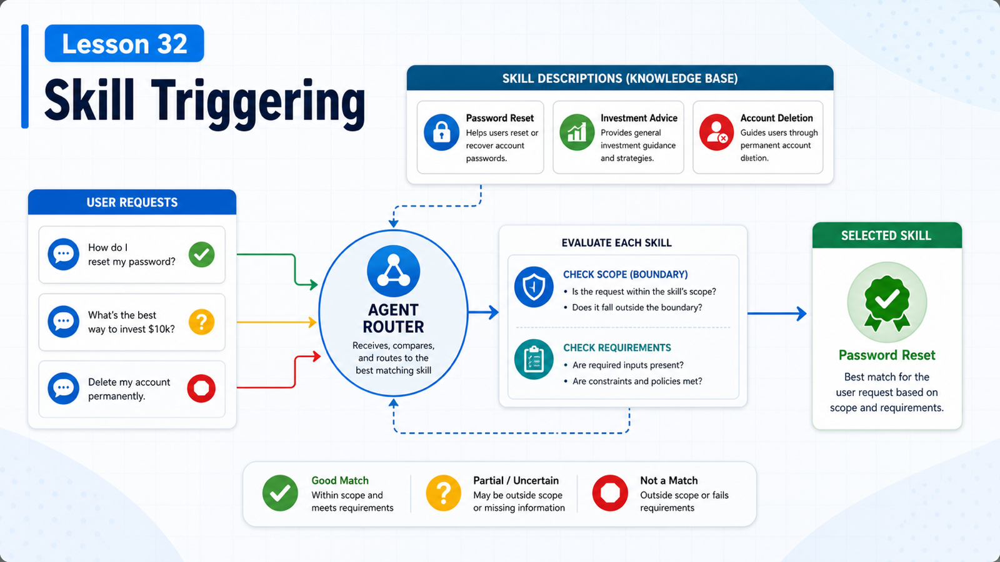

# Skill Triggering: Helping the Agent Use the Right Capability at the Right Time



A well-written Skill is not automatically used.

Many Skill failures come from weak trigger signals:

```text
description is too vague
name does not match the task
allowlist hides it
dependencies are missing
instructions do not say when to read references
```

This lesson is about making the right Skill appear at the right moment.

## The Key Idea: Triggering Depends on Visibility, Description, and Context

For a Skill to be used:

```text
1. it must load
2. it must be visible to the current agent
3. the model must infer relevance from name, description, and context
```

If any step fails, the Skill might as well not exist.

## Step 1: Did It Load?

OpenClaw loads skills from multiple roots and resolves same-name conflicts by precedence.

Loading can also depend on:

```text
metadata.openclaw.os
metadata.openclaw.requires.bins
metadata.openclaw.requires.config
skills.entries.<name>.enabled
skills.allowBundled
```

So:

```text
file exists
  does not mean
skill loaded for this run
```

Check:

```bash
openclaw skills list
```

## Step 2: Can This Agent See It?

Agent skill allowlists decide which skills an agent can see.

Example:

```json5
{
  agents: {
    defaults: { skills: ["github", "weather"] },
    list: [
      { id: "docs", skills: ["docs-search"] },
      { id: "locked-down", skills: [] }
    ]
  }
}
```

Rules:

```text
omit defaults.skills
  unrestricted by default

omit agents.list[].skills
  inherit defaults

non-empty agents.list[].skills
  final set, not merged with defaults

agents.list[].skills: []
  no skills for that agent
```

Many "why did it not use the skill" bugs are allowlist bugs.

## Step 3: Is the Description Clear?

`description` is not decoration.

It is the main clue the model sees in the skill list.

Weak:

```text
Helpful utility.
Use this for work.
A tool for reports.
```

Better:

```text
Use when exporting support-ticket reports, classifying ticket anomalies, or generating the daily support summary.
```

Good descriptions include:

```text
task type
key verbs
domain terms
boundaries
```

## Slash Command vs Model-Selected Use

Skills can be used through:

```text
explicit user invocation
  /skill-name

model-selected use
  model reads SKILL.md when description matches
```

Some skills are good commands:

```text
/release-check
/daily-report
```

Some are better as operating guidance:

```text
browser-automation
github-review
pdf-analysis
```

Choose based on the workflow.

## Avoid Greedy Skills

If a description says "use for all development tasks", the model may overuse it.

Costs:

```text
larger context
longer paths
irrelevant references
wrong tool use
```

Prefer narrow and precise:

```text
Use when reconciling Stripe payouts with internal orders.
Do not use for generic spreadsheet analysis.
```

## Dependencies and Failure Hints

If a Skill needs binaries, config, or API keys, declare gating:

```yaml
metadata:
  openclaw:
    requires:
      bins: ["gh"]
      config: ["github.token"]
```

Then the Skill will not load in environments where it cannot work.

Also explain recovery:

```text
If gh is not authenticated, ask the user to run gh auth login.
```

## A Real Scenario

You have:

```text
github-pr-review
release-notes
```

User says:

```text
Review this PR for risk.
```

Good description:

```text
Use when reviewing GitHub pull requests for risks, tests, regressions, and deployment concerns.
```

Weak description:

```text
GitHub helper.
```

The first one triggers reliably. The second one may be missed.

## Common Misunderstandings

### Misunderstanding 1: Directory Presence Means Use

No. The Skill must load, be visible, and match the task.

### Misunderstanding 2: Broader Descriptions Are Better

No. Broad descriptions cause false positives.

### Misunderstanding 3: Allowlists Are Only Security Details

No. They directly control skill visibility.

### Misunderstanding 4: Every Skill Needs a Slash Command

No. Many Skills are better as on-demand operating guides.

## Final Summary

Skill triggering is about giving the model the right signal in the right context.

In one sentence:

```text
Loading decides whether it exists, allowlists decide whether it is visible, and description decides whether the model remembers it.
```

## Lesson Homework

1. Rewrite one Skill description to be narrower and clearer.
2. Run `openclaw skills list` and confirm visibility.
3. Design separate allowlists for a writing agent and an ops agent.
4. Add a "do not use when..." boundary to one Skill.

## Next Lesson Preview

Next: MCP basics, including Server, Tool, Resource, and Prompt.

## References

- OpenClaw Docs: [Skills](https://docs.openclaw.ai/tools/skills)
- OpenClaw Docs: [Skills config](https://docs.openclaw.ai/tools/skills-config)
- OpenClaw Docs: [Creating skills](https://docs.openclaw.ai/tools/creating-skills)
- OpenClaw Docs: [Skill Workshop plugin](https://docs.openclaw.ai/plugins/skill-workshop)
