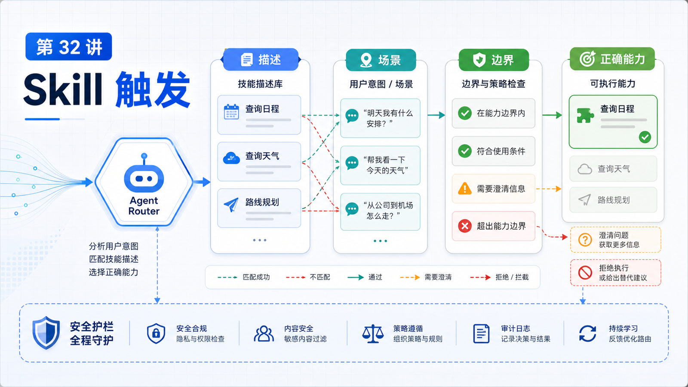

# Skill 的触发：如何让 Agent 在正确场景使用正确能力



Skill 写得好，不代表 Agent 一定会用。

很多 Skill 失败不是因为内容差，而是因为触发信号不清楚：

```text
description 太泛
名字和任务不匹配
allowlist 没放开
依赖条件没满足
正文没有告诉 Agent 何时读取 references
```

这一讲讲的不是“怎么写更多 Skill”，而是“怎么让正确 Skill 在正确时机出现”。

## 先说结论：触发由可见性、描述和上下文共同决定

Agent 能使用 Skill，至少要过三关：

```text
1. Skill 被加载
2. Skill 对当前 agent 可见
3. 模型从 name / description / 上下文判断它适用
```

如果任何一关失败，Skill 就像不存在。

## 第一关：它有没有被加载

OpenClaw 会从多个 skill root 加载技能，并按优先级处理同名冲突。

加载还会受这些条件影响：

```text
metadata.openclaw.os
metadata.openclaw.requires.bins
metadata.openclaw.requires.config
skills.entries.<name>.enabled
skills.allowBundled
```

这意味着：

```text
Skill 文件存在
  不等于
本次运行已加载
```

你可以用：

```bash
openclaw skills list
```

确认它是否可见。

## 第二关：当前 Agent 是否允许使用

Agent skill allowlist 会决定某个 agent 能看到哪些 Skill。

例如：

```json5
{
  agents: {
    defaults: { skills: ["github", "weather"] },
    list: [
      { id: "docs", skills: ["docs-search"] },
      { id: "locked-down", skills: [] }
    ]
  }
}
```

规则很重要：

```text
省略 defaults.skills
  默认不限制

agents.list[].skills 省略
  继承 defaults

agents.list[].skills 非空
  是最终集合，不和 defaults 合并

agents.list[].skills: []
  这个 agent 没有 Skill
```

很多“为什么它不用 Skill”的问题，其实是 allowlist 问题。

## 第三关：description 是否清楚

`description` 不是装饰。

它是模型在技能列表里判断是否加载 Skill 的主要线索。

差的 description：

```text
Helpful utility.
Use this for work.
A tool for reports.
```

好的 description：

```text
Use when exporting support-ticket reports, classifying ticket anomalies, or generating the daily support summary.
```

好的触发描述应该包含：

```text
任务类型
关键动词
领域名词
不该使用的边界
```

## slash command 和模型自主触发

Skill 可以有两种使用路径：

```text
用户显式调用
  /skill-name

模型自主选择
  根据 description 判断该读取 SKILL.md
```

有些 Skill 适合用户显式调用，比如：

```text
/release-check
/daily-report
```

有些 Skill 更适合模型自主触发，比如：

```text
browser-automation
github-review
pdf-analysis
```

你要根据场景决定触发方式。

## 不要让 Skill 太贪心

一个 Skill 如果 description 写成“所有开发任务都用我”，模型会过度使用它。

后果是：

```text
上下文变大
任务路径变绕
无关 references 被读取
工具被误用
```

触发要“窄而准”。

更好的写法是：

```text
Use when the user asks to reconcile Stripe payouts with internal orders.
Do not use for generic spreadsheet analysis.
```

## 依赖条件和失败提示

如果 Skill 依赖外部命令、配置或 API key，应在 frontmatter 中声明 gating。

例如：

```yaml
metadata:
  openclaw:
    requires:
      bins: ["gh"]
      config: ["github.token"]
```

这样缺依赖时，Skill 不会被错误加载。

同时，`SKILL.md` 里也应该说明：

```text
如果 gh 未登录，先提示用户运行 gh auth login。
```

## 一个真实场景

你有两个 Skill：

```text
github-pr-review
release-notes
```

用户说：

```text
帮我看这个 PR 有没有风险。
```

如果 `github-pr-review` 的 description 包含：

```text
Use when reviewing GitHub pull requests for risks, tests, regressions, and deployment concerns.
```

模型很容易选中它。

如果它只写：

```text
GitHub helper.
```

模型可能根本不知道该用。

## 常见误解

### 误解一：Skill 放进目录就一定会用

不一定。它要被加载、可见、且触发描述匹配。

### 误解二：description 越宽越好

不是。越宽越容易误触发。

### 误解三：allowlist 是安全细节，不影响能力

它直接决定 Skill 是否进入可见集合。

### 误解四：所有 Skill 都应该有 slash command

不一定。很多操作指南更适合模型按需读取。

## 最后总结

Skill 触发的关键，是让模型在正确上下文里看到正确线索。

一句话总结：

```text
加载决定有没有，allowlist 决定能不能看见，description 决定会不会想起它。
```

## 本节作业

1. 重写一个现有 Skill 的 description，让它更窄、更准。
2. 用 `openclaw skills list` 检查 Skill 是否加载。
3. 设计一个 agent allowlist，让写作 agent 和运维 agent 看到不同 Skill。
4. 给一个 Skill 增加“不应该使用”的边界说明。

## 下一节预告

下一节讲 MCP 基础：Server、Tool、Resource 和 Prompt。

## 参考资料

- OpenClaw Docs：[Skills](https://docs.openclaw.ai/tools/skills)
- OpenClaw Docs：[Skills config](https://docs.openclaw.ai/tools/skills-config)
- OpenClaw Docs：[Creating skills](https://docs.openclaw.ai/tools/creating-skills)
- OpenClaw Docs：[Skill Workshop plugin](https://docs.openclaw.ai/plugins/skill-workshop)
