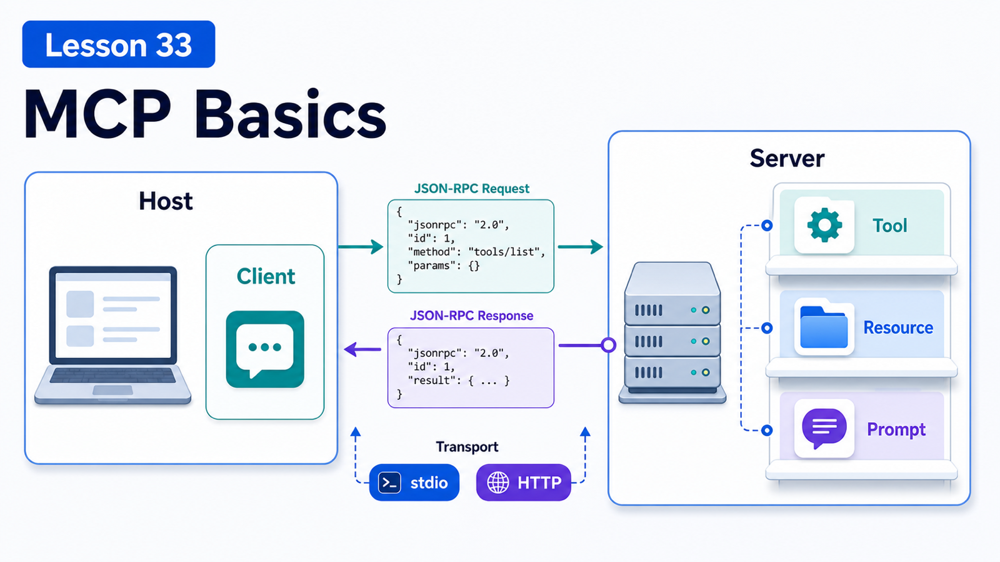

# MCP Basics: Server, Tool, Resource, and Prompt



MCP is often described as "USB-C for AI applications".

That metaphor is useful, but to build with it you need four ideas:

```text
Host
Client
Server
Primitives: Tool / Resource / Prompt
```

OpenClaw can expose sessions through MCP and can also consume external MCP servers.

## The Key Idea: MCP Standardizes AI-to-System Connections

The official MCP docs describe it as an open standard for connecting AI applications to external systems such as local files, databases, search engines, calculators, workflows, and prompt templates.

It does not define how a model reasons or how an agent plans.

It defines:

```text
how AI apps discover external capabilities
how they read context
how they call tools
how they retrieve prompt templates
how they communicate through standard transports
```

## Participants: Host, Client, Server

MCP uses a client-server architecture.

```text
MCP Host
  the AI application, such as an IDE, desktop assistant, or agent platform

MCP Client
  the component inside the host that maintains a connection to one server

MCP Server
  the program that provides context and capabilities, locally or remotely
```

One Host can connect to many Servers, usually with one Client per Server connection.

In OpenClaw, some runtimes or bridges may act as host/client surfaces, and `openclaw mcp serve` lets OpenClaw act as an MCP server for channel-backed sessions.

## Transports: stdio and Streamable HTTP

MCP defines two main standard transports:

```text
stdio
  client launches a local server process and exchanges JSON-RPC over stdin/stdout

Streamable HTTP
  server runs as an HTTP service with remote access, authentication, and streaming
```

Important detail:

```text
stdio servers must not write normal logs to stdout
stdout is for MCP JSON-RPC messages only
logs should go to stderr
```

This is a common beginner bug.

## Server Primitives: Tool, Resource, Prompt

MCP Servers expose three core server primitives.

### Tool

Tools are executable functions the model can invoke:

```text
get_weather
query_database
create_ticket
send_message
```

Tools are model-controlled, but the spec recommends human-visible approval and denial capability for trust and safety.

### Resource

Resources are context data:

```text
file:///project/schema.sql
db://customers/table-schema
notion://page/123
```

Resources are more application-driven. The host may let users pick, search, or automatically include them.

### Prompt

Prompts are reusable templates:

```text
code_review
incident_summary
release_checklist
```

Prompts are more user-controlled and often appear as commands or selectable templates.

## MCP vs OpenClaw Skill

A Skill teaches the agent how to use capabilities.

MCP exposes external capabilities through a protocol.

Comparison:

```text
Skill
  instructions, workflows, scripts, experience, operating guide

MCP
  standard protocol, tools, resources, prompts, external system connection
```

They often work together:

```text
MCP server exposes GitHub / Jira / Notion tools
Skill teaches the agent when and how to combine them
```

## A Real Scenario

You want to connect an internal ticketing system.

MCP Server can expose:

```text
Tools:
  ticket.search
  ticket.create
  ticket.update_status

Resources:
  ticket://schema
  ticket://queue/today

Prompts:
  incident_summary
  escalation_review
```

Skill adds:

```text
when to search tickets
when to escalate
which fields cannot go to group chat
what to confirm before creating a ticket
```

## Common Misunderstandings

### Misunderstanding 1: MCP Is Just Tool Calling

No. It also has Resources, Prompts, lifecycle, transports, and capability negotiation.

### Misunderstanding 2: MCP Server Must Be Remote

No. Local stdio servers are common.

### Misunderstanding 3: Resources Automatically Enter Context

Not necessarily. The application decides how to select, read, and inject them.

### Misunderstanding 4: Prompt Means System Prompt

Not exactly. MCP Prompts are reusable templates exposed by a server.

## Final Summary

MCP lets external systems enter AI applications through a standard interface.

In one sentence:

```text
Tool is action, Resource is context, Prompt is template, and Server exposes them to Clients through the protocol.
```

## Lesson Homework

1. Explain Host, Client, and Server in your own words.
2. Design one Tool, Resource, and Prompt for an external system.
3. Explain why stdio MCP servers must not log to stdout.
4. Distinguish Skill from MCP.

## Next Lesson Preview

Next: turning an external system into an MCP tool.

## References

- MCP Docs: [What is MCP?](https://modelcontextprotocol.io/docs/getting-started/intro)
- MCP Docs: [Architecture overview](https://modelcontextprotocol.io/docs/learn/architecture)
- MCP Spec: [Tools](https://modelcontextprotocol.io/specification/2025-11-25/server/tools)
- MCP Spec: [Resources](https://modelcontextprotocol.io/specification/2025-11-25/server/resources)
- MCP Spec: [Prompts](https://modelcontextprotocol.io/specification/2025-11-25/server/prompts)
- OpenClaw Docs: [MCP CLI](https://docs.openclaw.ai/cli/mcp)
