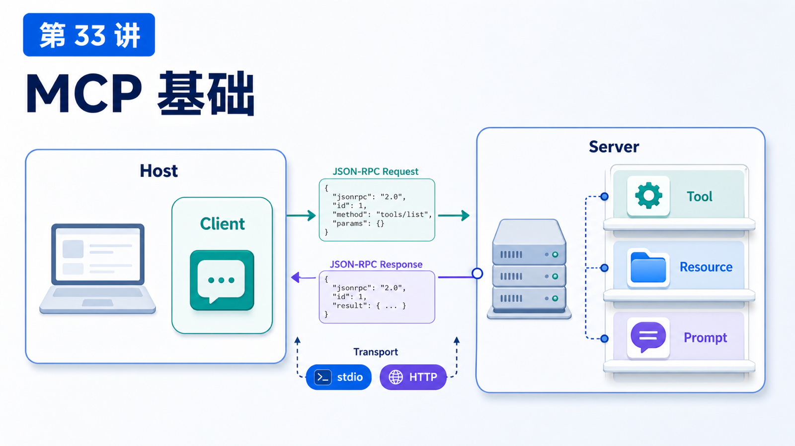

# MCP 基础：Server、Tool、Resource 和 Prompt



MCP 经常被一句话概括成“AI 应用的 USB-C 接口”。

这个比喻有用，但如果你要真的把系统接进去，还要理解四个核心词：

```text
Host
Client
Server
Primitives: Tool / Resource / Prompt
```

OpenClaw 也可以通过 MCP 暴露会话，或者消费外部 MCP server 提供的工具和上下文。

## 先说结论：MCP 是 AI 应用和外部系统之间的标准协议

官方 MCP 文档说，MCP 是一个开源标准，用来把 AI 应用连接到外部系统，例如本地文件、数据库、搜索引擎、计算器、工作流和提示模板。

它不规定模型怎么推理，也不规定 Agent 怎么规划。

它规定的是：

```text
AI 应用如何发现外部能力
如何读取上下文
如何调用工具
如何获取 prompt 模板
如何通过标准 transport 通信
```

## 参与者：Host、Client、Server

MCP 是 client-server 架构。

```text
MCP Host
  AI 应用本体，例如 IDE、桌面助手、Agent 平台

MCP Client
  Host 内部维护到某个 MCP Server 的连接

MCP Server
  提供上下文和能力的程序，可以本地运行，也可以远程运行
```

一个 Host 可以连接多个 Server，每个连接通常有一个 MCP Client。

在 OpenClaw 语境下，你可以把 OpenClaw 的某些 runtime 或桥接层理解为 MCP host/client 的一部分，也可以用 `openclaw mcp serve` 让 OpenClaw 作为 MCP server 暴露会话能力。

## Transport：stdio 和 Streamable HTTP

MCP 标准 transport 主要有两类：

```text
stdio
  客户端启动本地 server 进程，通过 stdin/stdout 交换 JSON-RPC 消息

Streamable HTTP
  server 作为独立 HTTP 服务，支持远程连接、认证和流式能力
```

重要细节：

```text
stdio server 不要向 stdout 打普通日志
stdout 只能写 MCP JSON-RPC 消息
日志应该写 stderr
```

这是很多新手写 MCP server 会踩的坑。

## Server primitives：Tool、Resource、Prompt

MCP Server 能暴露三类核心能力。

### Tool

Tool 是模型可以调用的可执行函数。

例如：

```text
get_weather
query_database
create_ticket
send_message
```

Tool 是 model-controlled：模型可以根据上下文决定调用哪个工具。但官方规范也强调，安全上应该有人能看到和拒绝工具调用。

### Resource

Resource 是给模型看的上下文数据。

例如：

```text
file:///project/schema.sql
db://customers/table-schema
notion://page/123
```

Resource 更偏 application-driven：应用可以让用户选择、搜索或自动加入资源。

### Prompt

Prompt 是可复用的提示模板。

例如：

```text
code_review
incident_summary
release_checklist
```

Prompt 更偏 user-controlled：通常像 slash command 一样由用户显式选择。

## MCP 和 OpenClaw Skill 的区别

Skill 是教 Agent 如何使用能力。

MCP 是把外部能力通过协议暴露出来。

对比：

```text
Skill
  说明、流程、脚本、经验、操作指南

MCP
  标准协议、工具、资源、提示模板、外部系统连接
```

很多时候二者会一起用：

```text
MCP server 暴露 GitHub / Jira / Notion 工具
Skill 教 Agent 在什么场景如何组合这些工具
```

## 一个真实场景

你要把公司内部工单系统接给 OpenClaw。

MCP Server 可以暴露：

```text
Tools:
  ticket.search
  ticket.create
  ticket.update_status

Resources:
  ticket://schema
  ticket://queue/today

Prompts:
  incident_summary
  escalation_review
```

Skill 则可以补充：

```text
什么情况下查工单
什么情况下升级
哪些字段不能发到群聊
创建工单前要确认什么
```

## 常见误解

### 误解一：MCP 就是工具调用

不只是。它还有 Resource、Prompt、生命周期、transport 和能力协商。

### 误解二：MCP Server 一定是远程服务

不是。stdio 本地 server 很常见。

### 误解三：Resource 会自动进入模型上下文

不一定。应用决定如何选择、读取和注入。

### 误解四：Prompt 等于系统提示词

不完全。MCP Prompt 更像服务器提供的可复用模板，通常由用户或客户端选择。

## 最后总结

MCP 让外部系统用标准方式进入 AI 应用。

一句话总结：

```text
Tool 负责动作，Resource 负责上下文，Prompt 负责模板，Server 负责把这些能力通过协议暴露给 Client。
```

## 本节作业

1. 用自己的话解释 Host、Client、Server。
2. 给一个外部系统分别设计一个 Tool、Resource、Prompt。
3. 解释 stdio MCP server 为什么不能随便写 stdout。
4. 区分 Skill 和 MCP 的职责。

## 下一节预告

下一节讲把一个外部系统接成 MCP 工具。

## 参考资料

- MCP Docs：[What is MCP?](https://modelcontextprotocol.io/docs/getting-started/intro)
- MCP Docs：[Architecture overview](https://modelcontextprotocol.io/docs/learn/architecture)
- MCP Spec：[Tools](https://modelcontextprotocol.io/specification/2025-11-25/server/tools)
- MCP Spec：[Resources](https://modelcontextprotocol.io/specification/2025-11-25/server/resources)
- MCP Spec：[Prompts](https://modelcontextprotocol.io/specification/2025-11-25/server/prompts)
- OpenClaw Docs：[MCP CLI](https://docs.openclaw.ai/cli/mcp)
