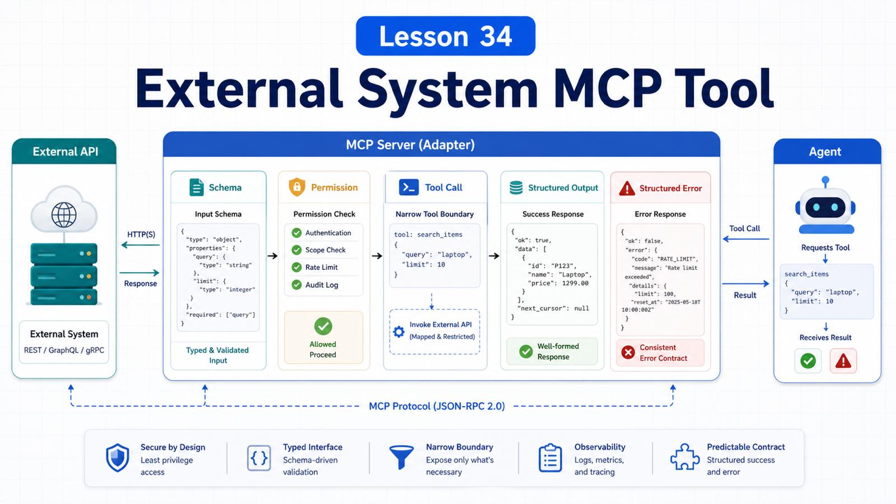

# Turning an External System Into an MCP Tool



Once you understand MCP concepts, the next step is connecting a real system:

```text
internal ticketing
CRM
order backend
deployment platform
knowledge base
self-hosted search
```

This lesson gives a general method for wrapping an external system as MCP tools.

## The Key Idea: Design the Boundary Before the Tool

Do not start with `call_api()`.

First answer:

```text
Who can use this MCP server?
Which operations are read-only?
Which operations have side effects?
What authentication is required?
Which data must not be returned to the model?
Which actions need human confirmation?
```

The hard part is not making HTTP requests. It is slicing system capability into safe, clear, callable interfaces.

## Step 1: Choose a Narrow Scenario

Do not expose the whole system at once.

Start narrow:

```text
list today's open tickets
lookup order status
create a low-risk internal note
read one knowledge base page
generate release candidates
```

Narrow scenarios make input, output, permission, and tests easier.

## Step 2: Split Tool / Resource / Prompt

One system may need all three primitives.

Ticketing example:

```text
Tool
  ticket.search
  ticket.add_comment
  ticket.update_status

Resource
  ticket://schema
  ticket://queue/today

Prompt
  ticket_triage
  incident_summary
```

Not everything should be a Tool.

Static schemas and background data are Resources. Reusable analysis templates are Prompts. Actions become Tools.

## Step 3: Design Tool Schemas

Tool schemas should tell the model:

```text
what the tool does
what arguments exist
which fields are required
field formats
result shape
failure shape
```

Bad:

```text
do_ticket_action(action, data)
```

Better:

```text
ticket_search({
  query: string,
  status?: "open" | "closed" | "pending",
  limit?: number
})
```

Specific schemas reduce misuse.

## Step 4: Auth and Least Privilege

External systems need tokens, OAuth, or service accounts.

Principles:

```text
do not return secrets to the model
do not log secrets
use least-privilege tokens
separate read and write scopes
confirm production actions
```

For stdio servers, log to stderr, not stdout, so JSON-RPC stays valid.

## Step 5: Structure Errors

Do not only return:

```text
failed
```

Better:

```json
{
  "ok": false,
  "code": "TICKET_NOT_FOUND",
  "message": "No ticket matched the given id.",
  "retryable": false
}
```

Then the agent can decide:

```text
bad argument?
permission issue?
temporary failure?
retry?
ask user?
```

## Step 6: Connect to OpenClaw

OpenClaw can manage outbound MCP server definitions, and `openclaw mcp serve` can expose OpenClaw conversations as an MCP server.

For external systems, you usually write an MCP server and let OpenClaw runtime consume it.

Verify:

```text
server starts
tools/list shows tools
tools/call returns results
errors are clear
permissions work
long operations do not hang
```

## A Real Scenario

Internal order system:

```text
Tools:
  order.lookup
  order.refund_status
  order.add_internal_note

Resources:
  order://schema
  order://refund-policy

Prompts:
  refund_risk_review
```

Split:

```text
lookup is read-only
refund_status is read-only
add_internal_note has low-risk side effect
actual refund should not be an unconfirmed tool
```

That is capability design.

## Common Misunderstandings

### Misunderstanding 1: Expose Every API as a Tool

Do not. Expose only what agents need with clear boundaries.

### Misunderstanding 2: Short Tool Names Are Best

Not always. Specific, unique, intention-revealing names are better.

### Misunderstanding 3: MCP Server Can Trust Model Input

No. Validate parameters and permissions.

### Misunderstanding 4: Natural-Language Errors Are Enough

Structured errors support recovery and retry.

## Final Summary

Connecting an external system as MCP is interface design.

In one sentence:

```text
Narrow the scenario, split Tool / Resource / Prompt, then use clear schemas, least privilege, and structured errors.
```

## Lesson Homework

1. Pick an external system and list three capabilities.
2. Decide whether each should be Tool, Resource, or Prompt.
3. Write an input schema for one Tool.
4. Write a structured error response.

## Next Lesson Preview

Next: Plugin basics, packaging Skills, MCP, and frontend capabilities.

## References

- MCP Docs: [Build an MCP server](https://modelcontextprotocol.io/docs/develop/build-server)
- MCP Docs: [Architecture overview](https://modelcontextprotocol.io/docs/learn/architecture)
- MCP Spec: [Tools](https://modelcontextprotocol.io/specification/2025-11-25/server/tools)
- MCP Spec: [Transports](https://modelcontextprotocol.io/specification/2025-11-25/basic/transports)
- OpenClaw Docs: [MCP CLI](https://docs.openclaw.ai/cli/mcp)
