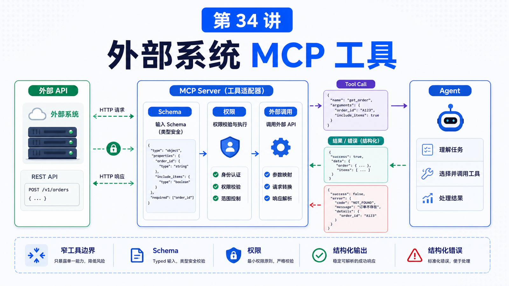

# 把一个外部系统接成 MCP 工具



理解 MCP 概念以后，下一步就是把真实系统接进去。

比如：

```text
公司工单系统
内部 CRM
订单后台
部署平台
知识库
自建搜索服务
```

这一讲我们用一个通用方法，讲清楚如何把外部系统包装成 MCP Tool。

## 先说结论：先设计边界，再写工具

不要一上来就写 `call_api()`。

先回答：

```text
这个 MCP Server 暴露给谁？
哪些操作是读？
哪些操作有副作用？
需要哪些认证？
哪些数据不能返回给模型？
哪些动作需要人工确认？
```

MCP Tool 的难点不在“HTTP 请求怎么发”，而在“把外部系统的能力切成安全、清晰、可调用的接口”。

## 第一步：选一个窄场景

不要把整个外部系统一次性接进来。

先选一个窄场景：

```text
查询今天待处理工单
根据订单号查状态
创建一条低风险内部备注
读取某个知识库页面
生成发布候选清单
```

窄场景更容易定义输入、输出、权限和测试。

## 第二步：把能力拆成 Tool / Resource / Prompt

同一个系统，可能需要三种 MCP primitive。

以工单系统为例：

```text
Tool
  ticket.search
  ticket.add_comment
  ticket.update_status

Resource
  ticket://schema
  ticket://queue/today

Prompt
  ticket_triage
  incident_summary
```

不是所有东西都应该做成 Tool。

静态背景和 schema 更适合 Resource；固定分析模板更适合 Prompt；会产生动作的才是 Tool。

## 第三步：设计 Tool schema

Tool schema 要让模型知道：

```text
工具做什么
参数有哪些
哪些字段必填
字段格式是什么
返回什么
失败时是什么样
```

坏 schema：

```text
do_ticket_action(action, data)
```

好 schema：

```text
ticket_search({
  query: string,
  status?: "open" | "closed" | "pending",
  limit?: number
})
```

越具体，模型越不容易误用。

## 第四步：实现认证和最小权限

外部系统通常需要 token、OAuth 或服务账号。

原则：

```text
不要把密钥返回给模型
不要在日志里打印密钥
给 MCP server 最小权限 token
读写权限分开
生产动作加确认
```

如果是 stdio server，日志写 stderr，不要写 stdout，避免破坏 JSON-RPC。

## 第五步：错误要结构化

不要只返回：

```text
failed
```

更好的错误：

```json
{
  "ok": false,
  "code": "TICKET_NOT_FOUND",
  "message": "No ticket matched the given id.",
  "retryable": false
}
```

这样 Agent 才能判断：

```text
是参数错？
是权限错？
是临时失败？
要不要重试？
要不要问用户？
```

## 第六步：接入 OpenClaw

OpenClaw 可以管理 outbound MCP server definitions，也可以通过 `openclaw mcp serve` 作为 MCP server 暴露 OpenClaw 会话。

在“把外部系统接成工具”这个方向，你通常是在写一个外部 MCP server，再让 OpenClaw runtime 消费它。

接入后要验证：

```text
server 是否能启动
tools/list 是否能看到工具
tools/call 是否能返回结果
错误是否清晰
权限是否生效
长任务是否不会卡死
```

## 一个真实场景

把内部订单系统接成 MCP：

```text
Tools:
  order.lookup
  order.refund_status
  order.add_internal_note

Resources:
  order://schema
  order://refund-policy

Prompts:
  refund_risk_review
```

其中：

```text
lookup 是读操作
refund_status 是读操作
add_internal_note 有副作用，但风险较低
真正退款不能直接做成无确认工具
```

这就是“能力切分”。

## 常见误解

### 误解一：把所有 API 都暴露成 Tool

不要。只暴露 Agent 真正需要、边界清楚的能力。

### 误解二：Tool 名越短越好

不一定。具体、唯一、表达意图更重要。

### 误解三：MCP server 可以直接信任模型输入

不行。参数仍要校验，权限仍要检查。

### 误解四：错误自然语言返回就够了

不够。结构化错误更利于恢复和重试。

## 最后总结

把外部系统接成 MCP 工具，本质是接口设计。

一句话总结：

```text
先缩小场景，再拆 Tool / Resource / Prompt，然后用清晰 schema、最小权限和结构化错误把系统接进 Agent。
```

## 本节作业

1. 选一个外部系统，列出三个适合暴露的能力。
2. 判断这些能力分别应该是 Tool、Resource 还是 Prompt。
3. 为一个 Tool 写出输入 schema。
4. 写出一个结构化错误返回格式。

## 下一节预告

下一节讲 Plugin 基础：把 Skill、MCP 和前端能力打包。

## 参考资料

- MCP Docs：[Build an MCP server](https://modelcontextprotocol.io/docs/develop/build-server)
- MCP Docs：[Architecture overview](https://modelcontextprotocol.io/docs/learn/architecture)
- MCP Spec：[Tools](https://modelcontextprotocol.io/specification/2025-11-25/server/tools)
- MCP Spec：[Transports](https://modelcontextprotocol.io/specification/2025-11-25/basic/transports)
- OpenClaw Docs：[MCP CLI](https://docs.openclaw.ai/cli/mcp)
