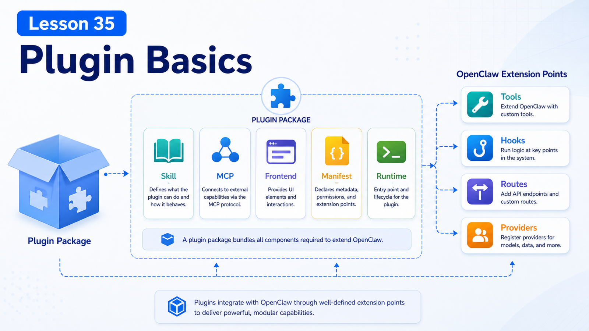

# Plugin Basics: Packaging Skills, MCP, and Frontend Capabilities



Skills teach the agent how to work.

MCP connects external systems as tools and context.

But when you want other people to install, configure, enable, disable, and upgrade a bundle of capabilities, you need a Plugin.

## The Key Idea: A Plugin Is an Installable Capability Package

OpenClaw docs describe plugins as a way to extend OpenClaw without changing core.

A plugin can add:

```text
Messaging channel
Model provider
Local CLI backend
Agent tool
Hook
Media provider
HTTP route / Gateway method
Plugin-owned skill
```

If Skill is an operating guide and MCP is an external protocol, Plugin is the packaging and runtime extension unit.

## What Lives in a Plugin

A native OpenClaw plugin needs:

```text
package.json
openclaw.plugin.json
runtime entry
```

Example:

```text
my-plugin/
  package.json
  openclaw.plugin.json
  src/
    index.ts
  skills/
    my-plugin-guide/
      SKILL.md
```

Roles:

```text
package.json
  npm package metadata and openclaw.extensions

openclaw.plugin.json
  cold-readable manifest, configSchema, contracts

runtime entry
  code that registers tools, providers, channels, hooks, routes

skills/
  operating guides shipped with the plugin
```

## Why Manifest Matters

`openclaw.plugin.json` is metadata OpenClaw can read before loading plugin code.

It supports:

```text
plugin identity
config validation
capability ownership
contracts.tools
providers / channels
activation hints
setup / onboarding metadata
```

OpenClaw can know what a plugin owns and whether config is valid without executing it.

## Tool-Only Plugin: Shortest Path

If you only add agent tools, use `defineToolPlugin`.

Flow:

```text
1. openclaw plugins init
2. write tools with defineToolPlugin
3. build dist and manifest
4. validate
5. install / publish
```

Good for:

```text
fixed tool names
fixed parameter schemas
no channel/provider/hook
```

## Mixed Plugin: Full Capability Package

If the plugin includes:

```text
tools
HTTP routes
hooks
providers
channels
plugin-owned skills
setup wizard
```

use `definePluginEntry` or another specialized SDK entrypoint.

This is closer to a small application.

A browser plugin might include:

```text
browser tool
browser CLI
control service
browser-automation skill
config schema
```

## Combining Plugin, Skill, and MCP

A full plugin can:

```text
register tools and config
provide install/enable/update entry points
ship Skills
connect to or expose MCP capabilities
provide frontend UI / HTTP routes / Canvas surfaces
```

Internal ticket plugin:

```text
tools:
  ticket.search
  ticket.create

skills:
  ticket-triage-guide

config:
  apiBaseUrl
  apiKey

hooks:
  before_tool_call approval for production changes
```

## Install and Verify

Useful commands:

```bash
openclaw plugins list
openclaw plugins search "calendar"
openclaw plugins install clawhub:<package>
openclaw plugins inspect <plugin-id> --runtime --json
openclaw plugins update <plugin-id>
openclaw plugins uninstall <plugin-id>
```

Remember:

```text
plugins list
  cold check: manifest, config, registry

inspect --runtime
  runtime proof: tools, hooks, routes actually registered
```

## Common Misunderstandings

### Misunderstanding 1: Plugin Is a Skill Zip

No. It may include Skills, but it can register runtime capabilities.

### Misunderstanding 2: Manifest Is Optional Metadata

No. It is key for validation and capability discovery.

### Misunderstanding 3: Installed Plugin Means Tool Visible

Not always. Enabled state, config, optional tools, and tool allowlists still apply.

### Misunderstanding 4: Every Extension Needs a Plugin

No. Use Skill for simple workflows, MCP for standard external tools, and Plugin when you need packaging, runtime code, and config.

## Final Summary

Plugin is OpenClaw's extension delivery unit.

In one sentence:

```text
Skill teaches the agent, MCP connects external systems, and Plugin packages capabilities into installable, configurable, upgradeable runtime extensions.
```

## Lesson Homework

1. Design a plugin folder for an internal system.
2. Decide whether it needs tool-only or mixed plugin shape.
3. Write its `contracts.tools` list.
4. Decide which instructions should ship as plugin skills.

## Next Lesson Preview

Next: plugin permissions, installation, updates, and compatibility.

## References

- OpenClaw Docs: [Building plugins](https://docs.openclaw.ai/plugins/building-plugins)
- OpenClaw Docs: [Tool plugins](https://docs.openclaw.ai/plugins/tool-plugins)
- OpenClaw Docs: [Plugin manifest](https://docs.openclaw.ai/plugins/manifest)
- OpenClaw Docs: [Plugin SDK overview](https://docs.openclaw.ai/plugins/sdk-overview)
- OpenClaw Docs: [Manage plugins](https://docs.openclaw.ai/plugins/manage-plugins)
