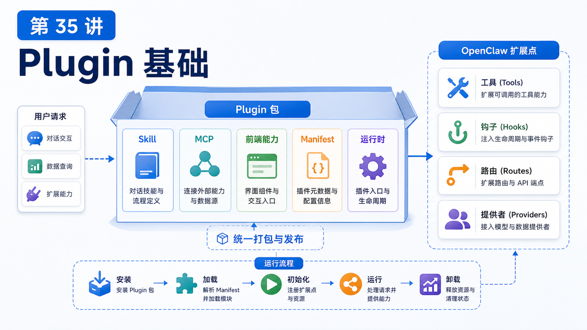

# Plugin 基础：把 Skill、MCP 和前端能力打包



Skill 能教 Agent 怎么做事。

MCP 能把外部系统接成工具和上下文。

但当你想把一组能力交付给别人安装、配置、升级、启用或禁用时，就需要 Plugin。

## 先说结论：Plugin 是可安装的能力包

OpenClaw 官方文档说，Plugin 可以在不修改 core 的情况下扩展 OpenClaw。

它可以添加：

```text
Messaging channel
Model provider
Local CLI backend
Agent tool
Hook
Media provider
HTTP route / Gateway method
Plugin-owned skill
```

如果 Skill 是操作指南，MCP 是外部连接协议，那么 Plugin 更像“发布和运行时封装”。

## 一个 Plugin 里有什么

原生 OpenClaw plugin 至少需要：

```text
package.json
openclaw.plugin.json
runtime entry
```

示意：

```text
my-plugin/
  package.json
  openclaw.plugin.json
  src/
    index.ts
  skills/
    my-plugin-guide/
      SKILL.md
```

其中：

```text
package.json
  npm 包信息和 openclaw.extensions

openclaw.plugin.json
  冷启动可检查的 manifest、configSchema、contracts

runtime entry
  真正注册 tool、provider、channel、hook、route 的代码

skills/
  插件随附的操作指南
```

## Manifest 为什么重要

`openclaw.plugin.json` 是 OpenClaw 在加载代码前就能读取的元数据。

它用于：

```text
插件身份
配置验证
能力 ownership
contracts.tools
providers / channels
activation hints
setup / onboarding metadata
```

这让 OpenClaw 不需要执行插件代码，就能知道插件大概拥有谁、需要什么配置、是否有效。

## Tool-only plugin：最短路径

如果你只是想加几个 Agent 工具，官方推荐 `defineToolPlugin`。

流程是：

```text
1. openclaw plugins init
2. 用 defineToolPlugin 写工具
3. build 生成 dist 和 manifest
4. validate
5. install / publish
```

这种 plugin 适合：

```text
固定工具名
固定参数 schema
不需要 channel/provider/hook
```

## Mixed plugin：更完整的能力包

如果插件同时有：

```text
工具
HTTP route
hook
provider
channel
plugin-owned skills
setup wizard
```

就应使用更通用的 `definePluginEntry` 或相关 SDK entry。

这种 plugin 更像一个小应用。

例如浏览器插件可能同时包含：

```text
browser tool
browser CLI
control service
browser-automation skill
config schema
```

## Plugin、Skill、MCP 的组合方式

一个完整插件可以这样组合：

```text
Plugin
  注册工具和配置
  提供安装/启用/升级入口
  打包随附 Skill
  连接外部 MCP server 或提供 MCP 相关能力
  提供前端 UI / HTTP route / Canvas surface
```

例如“内部工单插件”：

```text
tools:
  ticket.search
  ticket.create

skills:
  ticket-triage-guide

config:
  apiBaseUrl
  apiKey

hooks:
  before_tool_call 审批生产变更
```

## 安装和验证

常用命令：

```bash
openclaw plugins list
openclaw plugins search "calendar"
openclaw plugins install clawhub:<package>
openclaw plugins inspect <plugin-id> --runtime --json
openclaw plugins update <plugin-id>
openclaw plugins uninstall <plugin-id>
```

注意：

```text
plugins list
  冷检查：manifest、config、registry

inspect --runtime
  运行时证明：工具、hook、route 是否真的注册
```

## 常见误解

### 误解一：Plugin 就是 Skill 的压缩包

不是。Plugin 可以包含 Skill，但还能注册运行时能力。

### 误解二：Manifest 可以随便写

不能。它是冷启动验证和能力发现的关键。

### 误解三：装了 Plugin 就等于工具可见

不一定。还受 enabled、config、optional tools、tool allowlist 影响。

### 误解四：所有扩展都要写 Plugin

不一定。简单操作流程写 Skill；标准外部工具接 MCP；需要安装、运行时和配置管理时再写 Plugin。

## 最后总结

Plugin 是 OpenClaw 扩展的交付单元。

一句话总结：

```text
Skill 教会 Agent，MCP 连接外部系统，Plugin 把能力打包成可安装、可配置、可升级的运行时扩展。
```

## 本节作业

1. 为一个内部系统设计 Plugin 目录结构。
2. 判断它需要 tool-only plugin 还是 mixed plugin。
3. 写出它的 `contracts.tools` 清单。
4. 说明哪些说明应该随插件放进 skills。

## 下一节预告

下一节讲插件权限、安装、升级和版本兼容。

## 参考资料

- OpenClaw Docs：[Building plugins](https://docs.openclaw.ai/plugins/building-plugins)
- OpenClaw Docs：[Tool plugins](https://docs.openclaw.ai/plugins/tool-plugins)
- OpenClaw Docs：[Plugin manifest](https://docs.openclaw.ai/plugins/manifest)
- OpenClaw Docs：[Plugin SDK overview](https://docs.openclaw.ai/plugins/sdk-overview)
- OpenClaw Docs：[Manage plugins](https://docs.openclaw.ai/plugins/manage-plugins)
