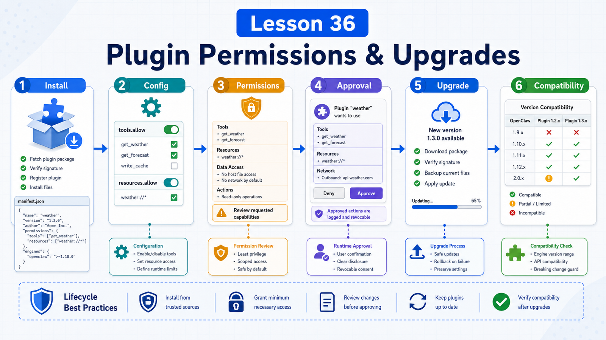

# Plugin Permissions, Installation, Updates, and Compatibility



Plugins make OpenClaw extensible.

They also introduce risk:

```text
Who wrote this plugin?
Which tools does it register?
Can it read sensitive config?
Can it send messages, deploy, or call external APIs?
Will an update break old config?
```

Using plugins means understanding permissions, enablement, updates, and compatibility.

## The Key Idea: Plugin Management Is Lifecycle Management

A plugin lifecycle includes:

```text
discovery
installation
configuration
enablement
runtime verification
permission control
updates
compatibility migration
disable / uninstall
```

Every step can fail.

## Installation Sources

OpenClaw supports several plugin sources:

```text
ClawHub
npm
git
local path
npm-pack
marketplace compatible bundles
```

Use:

```text
ClawHub
  public discovery, scan status, version hints

npm
  existing JavaScript package workflow

git/local
  development and testing

npm-pack
  proving a local packaged artifact
```

After install, restart/reload Gateway when needed and verify runtime registration.

## Cold Checks vs Runtime Checks

Do not stop at:

```bash
openclaw plugins list
```

That is mostly a cold inventory check: manifest, config, registry, dependency status.

To prove runtime surfaces registered:

```bash
openclaw plugins inspect <plugin-id> --runtime --json
```

This avoids "plugin installed but agent cannot see the tool" confusion.

## Optional Tools and tools.allow

Plugin tools can be required or optional.

Optional means:

```text
the plugin may be enabled,
but the tool is not exposed to the model until users allow it
```

Good for:

```text
side-effect tools
unusual capabilities
extra dependencies
higher-risk operations
```

Use optional tools for discovery-time control. Use plugin permission requests for per-call runtime approval.

## Plugin Permission Requests

Plugin permission requests let plugins ask before an action runs.

Use for:

```text
deploying services
sending external messages
writing production systems
paid operations
changing important config
```

Differences:

```text
exec approvals
  host shell command approval

plugin permission requests
  plugin-owned action or hook approval

optional tools
  whether the tool is exposed to the model
```

Sensitive tools can use both:

```text
optional tool opt-in
  +
per-call plugin approval
```

## Updates and Compatibility

Plugin update is not just replacing files.

Check:

```text
plugin API version
minGatewayVersion
manifest schema
config schema
contracts.tools changes
config migration
tool name compatibility
user allowlist validity
```

OpenClaw compatibility docs emphasize that old plugin contracts should not be removed in the same release that introduces a replacement.

Typical sequence:

```text
add new contract
keep old adapter
emit diagnostics or warnings
write migration docs
test old and new paths
wait through migration window
remove old path
```

Plugin authors should take this seriously.

## Disable and Uninstall

Uninstall may remove:

```text
config entry
install record
allow/deny entries
linked load paths
managed install files
```

If you only need to pause the plugin, disable it first.

Use `--keep-files` when retaining files for debugging.

## Safety Checklist

For third-party plugins:

```text
check source and scan status
read manifest and permission footprint
inspect tools / hooks / routes
enable in test first
use optional + approval for high-risk tools
read release notes and compatibility warnings before update
```

Plugins are not just prompts. They can register runtime capabilities.

## A Real Scenario

Deployment plugin:

```text
deploy_service
rollback_service
deployment_status
```

Reasonable configuration:

```text
deployment_status
  required or visible by default

deploy_service
  optional tool, requires tools.allow
  production requires plugin approval

rollback_service
  optional + approval
  no allow-always
```

Before update:

```text
tool names changed?
config schema migrated?
minGatewayVersion satisfied?
old allowlist still valid?
```

## Common Misunderstandings

### Misunderstanding 1: Installed Means Safe

No. Check source, manifest, permissions, config, and runtime registration.

### Misunderstanding 2: Optional Tool Equals Approval

No. Optional controls exposure; approval controls execution of one action.

### Misunderstanding 3: Updates Are Always Safe

No. Tool names, config, and SDK contracts can change.

### Misunderstanding 4: Uninstall Only Deletes Files

No. It may also clean config, records, and allow/deny state.

## Final Summary

The stronger the plugin, the more lifecycle management matters.

In one sentence:

```text
Check source before install, permissions before enablement, runtime registration after start, approvals before action, and compatibility before update.
```

## Lesson Homework

1. Pick one plugin and list tools, config, and permission risks.
2. Distinguish optional tool, plugin approval, and exec approval.
3. Design a production approval flow for a deployment plugin.
4. Write a plugin update checklist.

## Next Lesson Preview

Next section: deployment, configuration, and debugging, starting with local installation.

## References

- OpenClaw Docs: [Manage plugins](https://docs.openclaw.ai/plugins/manage-plugins)
- OpenClaw Docs: [Plugin permission requests](https://docs.openclaw.ai/plugins/plugin-permission-requests)
- OpenClaw Docs: [Plugin compatibility](https://docs.openclaw.ai/plugins/compatibility)
- OpenClaw Docs: [Plugin manifest](https://docs.openclaw.ai/plugins/manifest)
- OpenClaw Docs: [ClawHub security audits](https://docs.openclaw.ai/clawhub/security-audits)

---

Original link: [Plugin Permissions, Installation, Updates, and Compatibility](https://en.harries.blog/plugin-permissions-installation-updates-and-compatibility/)
