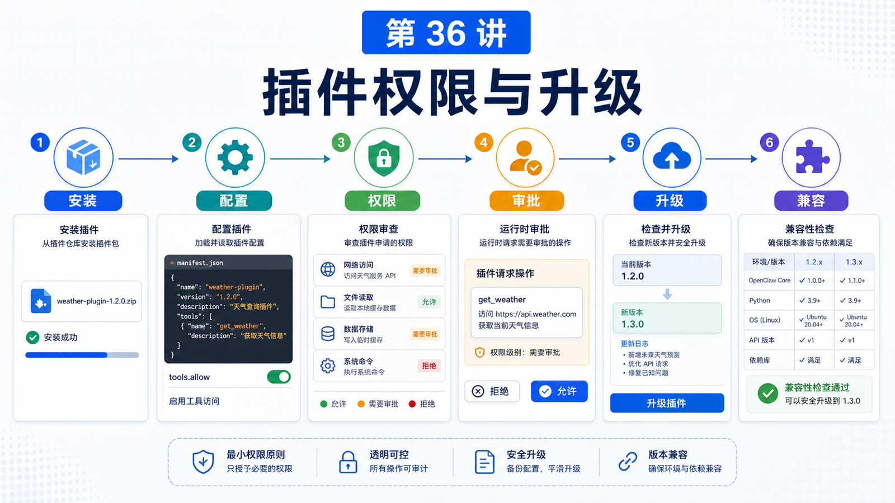

# 插件权限、安装、升级和版本兼容



插件让 OpenClaw 变得可扩展。

但插件也带来新的风险：

```text
谁写的插件？
它注册了哪些工具？
它会不会读取敏感配置？
它能不能发消息、部署、调用外部 API？
升级后会不会破坏旧配置？
```

所以使用 Plugin，不能只会 install，还要懂权限、启用、升级和兼容。

## 先说结论：插件管理是生命周期管理

一个插件的完整生命周期包括：

```text
发现
安装
配置
启用
运行时验证
权限控制
升级
兼容迁移
禁用 / 卸载
```

每一步都可能出问题。

## 安装来源

OpenClaw 支持多种插件来源：

```text
ClawHub
npm
git
local path
npm-pack
marketplace compatible bundles
```

选择原则：

```text
ClawHub
  适合公开发现、扫描状态、版本提示

npm
  适合已有 JS 包发布体系

git/local
  适合开发和测试

npm-pack
  适合验证本地打包产物
```

安装后通常要让 Gateway 重启或重新加载，再用 runtime inspect 验证。

## 冷检查和运行时检查

不要只看：

```bash
openclaw plugins list
```

它更多是冷检查：manifest、config、registry、dependency status。

要证明插件真的注册了工具、hook、route，应该用：

```bash
openclaw plugins inspect <plugin-id> --runtime --json
```

这能减少“插件看起来安装了，但 Agent 看不到工具”的困惑。

## Optional tools 和 tools.allow

插件工具可以是 required，也可以是 optional。

Optional tool 的意思是：

```text
插件启用后，工具不一定暴露给模型
用户需要通过 tools.allow 显式允许
```

这适合：

```text
有副作用的工具
不常用的能力
需要额外依赖的命令
风险较高的操作
```

发现期的控制用 optional tools；执行期的单次确认用 plugin permission requests。

## Plugin permission requests

Plugin permission requests 允许插件在动作执行前请求用户批准。

适用场景：

```text
部署服务
发送外部消息
写入生产系统
执行付费操作
修改重要配置
```

它和 exec approvals 不同：

```text
exec approvals
  控制 host shell command

plugin permission requests
  控制插件拥有的动作或 hook

optional tools
  控制工具是否暴露给模型
```

敏感工具可以同时使用：

```text
optional tool opt-in
  +
per-call plugin approval
```

## 升级和兼容

插件升级不是简单替换文件。

你要关注：

```text
plugin API version
minGatewayVersion
manifest schema
config schema
contracts.tools 是否变化
旧配置是否迁移
工具名是否兼容
用户 allowlist 是否还有效
```

OpenClaw 的 compatibility 文档强调：旧 plugin contract 不应在引入替代方案的同一版本立刻移除。通常流程是：

```text
添加新 contract
保留旧适配
发出诊断或警告
写迁移文档
测试新旧路径
经过迁移窗口
再移除旧路径
```

这对插件作者尤其重要。

## 卸载和禁用

卸载插件可能会移除：

```text
config entry
install record
allow/deny list entries
linked load paths
managed install files
```

如果只是临时停用，可以先 disable，而不是 uninstall。

如果保留文件用于调试，可以使用 `--keep-files`。

## 安全使用建议

使用第三方插件时：

```text
先看来源和扫描状态
阅读 manifest 和权限
检查它注册了哪些 tools / hooks / routes
优先在测试环境启用
对高风险工具使用 optional + approval
升级前看 release notes 和 compatibility warning
```

不要把插件当成“只是提示词”。插件可以注册运行时能力。

## 一个真实场景

你安装一个部署插件：

```text
deploy_service
rollback_service
deployment_status
```

合理配置：

```text
deployment_status
  required 或默认可见

deploy_service
  optional tool，需要 tools.allow
  production 环境触发 plugin approval

rollback_service
  optional + approval
  不提供 allow-always
```

升级前检查：

```text
工具名有没有改
config schema 有没有迁移
minGatewayVersion 是否满足
旧 allowlist 是否仍有效
```

## 常见误解

### 误解一：插件安装后就安全可用

不一定。还要看来源、manifest、权限、配置和运行时验证。

### 误解二：optional tool 等于 approval

不是。optional 控制是否暴露；approval 控制某次动作是否执行。

### 误解三：升级总是无风险

不是。工具名、配置、SDK contract 都可能变化。

### 误解四：卸载只会删除文件

不止。还可能清理配置、记录和 allow/deny 相关状态。

## 最后总结

插件能力越强，生命周期管理越重要。

一句话总结：

```text
安装前看来源，启用前看权限，运行时看注册，执行前看 approval，升级前看兼容。
```

## 本节作业

1. 选一个插件，列出它的 tools、config 和权限风险。
2. 区分 optional tool、plugin approval、exec approval。
3. 设计一个部署插件的 production approval 流程。
4. 写一份插件升级检查清单。

## 下一节预告

下一部分进入部署、配置与调试：本地安装与最小可运行配置。

## 参考资料

- OpenClaw Docs：[Manage plugins](https://docs.openclaw.ai/plugins/manage-plugins)
- OpenClaw Docs：[Plugin permission requests](https://docs.openclaw.ai/plugins/plugin-permission-requests)
- OpenClaw Docs：[Plugin compatibility](https://docs.openclaw.ai/plugins/compatibility)
- OpenClaw Docs：[Plugin manifest](https://docs.openclaw.ai/plugins/manifest)
- OpenClaw Docs：[ClawHub security audits](https://docs.openclaw.ai/clawhub/security-audits)
