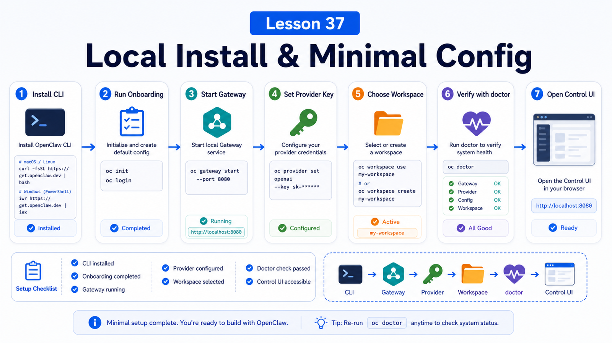

# Local Installation and Minimal Runnable Configuration



The first installation trap is confusing "the command finished" with "the system is runnable."

Installing the CLI is only the first step.

A minimal working OpenClaw setup means:

```text
CLI is available
Gateway starts
config validates
model provider authenticates
workspace path is clear
Control UI opens
doctor reports no blocking issues
```

This lesson keeps the target small: a reliable local loop.

## The Key Idea: Build the Local Loop First

Do not start by enabling every channel and plugin.

Start with:

```text
install CLI
  -> run onboarding / configuration
  -> start Gateway
  -> configure model
  -> choose workspace
  -> open Control UI
  -> verify with doctor and status
```

Once this loop works, Docker, reverse proxies, plugins, and messaging channels become much easier to reason about.

## Choosing an Install Method

The recommended path is the installer script:

```bash
curl -fsSL https://openclaw.ai/install.sh | bash
```

On Windows PowerShell:

```powershell
iwr -useb https://openclaw.ai/install.ps1 | iex
```

If you already manage Node yourself:

```bash
npm install -g openclaw@latest
openclaw onboard --install-daemon
```

For source development:

```bash
git clone https://github.com/openclaw/openclaw.git
cd openclaw
pnpm install && pnpm build && pnpm ui:build
pnpm link --global
openclaw onboard --install-daemon
```

Use this simple rule:

```text
normal user: installer
existing Node setup: npm / pnpm / bun
OpenClaw contributor: source checkout
isolated runtime: Docker
```

## The Minimal Config

OpenClaw reads:

```text
~/.openclaw/openclaw.json
```

It is JSON5, so comments and trailing commas are allowed.

A minimal local config can be very small:

```json5
{
  agents: {
    defaults: {
      workspace: "~/.openclaw/workspace",
    },
  },
}
```

Add channel settings later. First prove the Gateway and model path work locally.

## Understand the Gateway

The Gateway is the always-on process.

It owns:

```text
Control UI
HTTP and WebSocket APIs
session routing
model requests
tool and plugin registration
channel connections
config reloads
```

Start it locally:

```bash
openclaw gateway --port 18789
```

For more logging:

```bash
openclaw gateway --port 18789 --verbose
```

If an old process owns the port:

```bash
openclaw gateway --force
```

Use `--force` deliberately. It is a recovery tool, not a daily habit.

## First Verification

Run:

```bash
openclaw --version
openclaw doctor
openclaw gateway status
openclaw status
```

Healthy signals look like:

```text
Gateway reachable
Runtime running
Connectivity probe ok
no blocking doctor errors
```

If the Gateway is down, check in order:

```text
CLI path
Node version
config schema validity
port 18789 conflicts
Gateway auth token
provider API key
```

## Control UI

The local UI is usually:

```text
http://127.0.0.1:18789/
```

To print the URL:

```bash
openclaw dashboard --no-open
```

Keep it loopback-only until you understand remote access, auth, proxying, and HTTPS.

## Start Secrets Simply

For a first local setup, environment variables are fine:

```bash
export OPENAI_API_KEY="..."
export ANTHROPIC_API_KEY="..."
```

After the loop works, migrate to SecretRefs or a stricter secret workflow.

## Common Misunderstandings

### The CLI working means OpenClaw is running

Not quite. The CLI is the entry point; the Gateway is the service.

### More config is better

Not for first boot. Start small, then add channels and plugins.

### Direct JSON editing is always fastest

It is allowed, but OpenClaw validates config strictly. New users should prefer onboarding, `openclaw configure`, or the Control UI.

### A local port can be exposed immediately

Do not do that yet. Remote access and HTTPS come later.

## Final Summary

Local install is about building a verifiable minimum, not checking a package off a list.

```text
Make the CLI, Gateway, config, provider, workspace, and doctor checks agree before adding complexity.
```

## Exercises

1. Install OpenClaw and run `openclaw --version`.
2. Inspect `~/.openclaw/openclaw.json`.
3. Run `openclaw doctor` and `openclaw gateway status`.
4. Open the Control UI locally.
5. Write down the Gateway port and state directory.

## Next Lesson Preview

Next we deploy with Docker and docker-compose: when containers help, and when they are extra weight.

## References

- OpenClaw Docs: [Install](https://docs.openclaw.ai/install)
- OpenClaw Docs: [Gateway runbook](https://docs.openclaw.ai/gateway)
- OpenClaw Docs: [Configuration](https://docs.openclaw.ai/gateway/configuration)
- OpenClaw Docs: [Doctor](https://docs.openclaw.ai/gateway/doctor)

