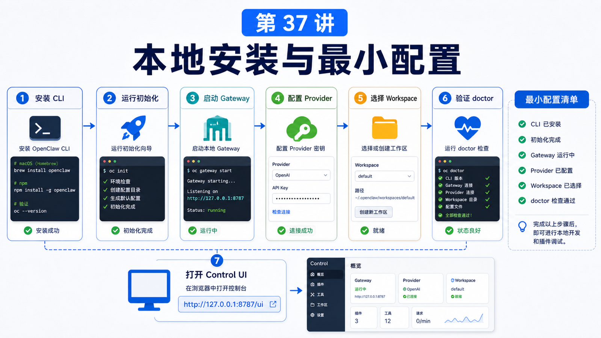

# 本地安装与最小可运行配置



很多人第一次装 OpenClaw 时，会把“安装成功”和“能稳定跑起来”混在一起。

命令执行完，只说明 CLI 在机器上了。

真正的最小可运行状态，还要满足：

```text
CLI 可用
Gateway 能启动
配置能通过校验
模型 Provider 能鉴权
Workspace 有明确位置
Control UI 能打开
doctor 没有阻塞错误
```

这一讲先不追求复杂部署，只把本地单机跑通。

## 先说结论：先跑通本地闭环

本地安装的目标不是“把所有能力都打开”，而是建立一个最小闭环：

```text
安装 CLI
  -> onboarding / 配置
  -> 启动 Gateway
  -> 设置模型
  -> 指定 Workspace
  -> 打开 Control UI
  -> doctor / status 验证
```

只要这个闭环稳定，后面再加 Docker、反向代理、插件、消息通道都不会乱。

## 安装方式怎么选

官方推荐最快路径是安装脚本：

```bash
curl -fsSL https://openclaw.ai/install.sh | bash
```

Windows PowerShell 使用：

```powershell
iwr -useb https://openclaw.ai/install.ps1 | iex
```

如果你已经自己管理 Node，也可以用包管理器：

```bash
npm install -g openclaw@latest
openclaw onboard --install-daemon
```

贡献者或想跟源码的人，可以从源码构建：

```bash
git clone https://github.com/openclaw/openclaw.git
cd openclaw
pnpm install && pnpm build && pnpm ui:build
pnpm link --global
openclaw onboard --install-daemon
```

选择标准很简单：

```text
普通用户：installer
已有 Node 工具链：npm / pnpm / bun
开发 OpenClaw：source checkout
想隔离运行：Docker
```

## 最小配置长什么样

OpenClaw 默认读取：

```text
~/.openclaw/openclaw.json
```

这是 JSON5 文件，可以有注释和尾逗号。

最小配置不需要很大：

```json5
{
  agents: {
    defaults: {
      workspace: "~/.openclaw/workspace",
    },
  },
}
```

如果你要让某个消息通道能触发 Agent，再加对应 channel 配置。

但第一次安装，建议先只验证本地 Gateway 和模型调用。

## Gateway 是必须理解的中心

本地运行时，Gateway 是常驻进程。

它负责：

```text
Control UI
HTTP / WebSocket API
会话路由
模型请求
工具和插件注册
消息通道连接
配置热加载
```

本地直接启动：

```bash
openclaw gateway --port 18789
```

如果要看更多日志：

```bash
openclaw gateway --port 18789 --verbose
```

如果端口被旧进程占用，官方 runbook 提供：

```bash
openclaw gateway --force
```

但日常不要把 `--force` 当成习惯。先搞清楚谁占了端口更好。

## 第一次验证

安装后先跑这组命令：

```bash
openclaw --version
openclaw doctor
openclaw gateway status
openclaw status
```

健康状态通常应该看到：

```text
Gateway reachable
Runtime running
Connectivity probe ok
doctor 没有 blocking error
```

如果 Gateway 没起来，先不要急着改配置。

按顺序查：

```text
CLI 是否在 PATH
Node 版本是否满足
openclaw.json 是否能通过 schema
18789 端口是否被占用
Gateway auth token 是否配置
模型 Provider 是否有 key
```

## Control UI

默认本地 UI 地址通常是：

```text
http://127.0.0.1:18789/
```

如果你忘了地址，可以用：

```bash
openclaw dashboard --no-open
```

第一次不要急着暴露到公网。先保持 loopback，只在本机访问。

## Provider 密钥先用简单方式

最小可运行阶段，可以先用环境变量：

```bash
export OPENAI_API_KEY="..."
export ANTHROPIC_API_KEY="..."
```

然后在配置里选择模型。

等本地闭环跑通，再迁移到 SecretRef 或更严格的密钥管理方式。

## 常见误解

### 误解一：CLI 能运行就等于 OpenClaw 跑起来了

不等于。CLI 是入口，Gateway 才是常驻服务。

### 误解二：配置越完整越好

第一次越简单越好。最小配置通过后，再逐步加通道、插件和远程访问。

### 误解三：直接改 JSON 文件最快

可以改，但 OpenClaw 会严格校验 schema。新手更适合用 `openclaw onboard`、`openclaw configure` 或 Control UI。

### 误解四：本地端口可以马上暴露到公网

不要。远程访问、认证、反向代理和 HTTPS 是第 40 讲的内容。

## 最后总结

本地安装的核心不是“装完”，而是“形成可验证的最小闭环”。

一句话总结：

```text
先让 CLI、Gateway、配置、Provider、Workspace 和 doctor 全部跑通，再考虑复杂部署。
```

## 本节作业

1. 安装 OpenClaw，并运行 `openclaw --version`。
2. 打开 `~/.openclaw/openclaw.json`，确认 workspace 配置。
3. 运行 `openclaw doctor` 和 `openclaw gateway status`。
4. 打开 Control UI，确认本机能访问。
5. 记录本机 Gateway 端口和状态目录。

## 下一节预告

下一节讲 Docker / docker-compose 部署：什么时候应该容器化，什么时候不该。

## 参考资料

- OpenClaw Docs：[Install](https://docs.openclaw.ai/install)
- OpenClaw Docs：[Gateway runbook](https://docs.openclaw.ai/gateway)
- OpenClaw Docs：[Configuration](https://docs.openclaw.ai/gateway/configuration)
- OpenClaw Docs：[Doctor](https://docs.openclaw.ai/gateway/doctor)

