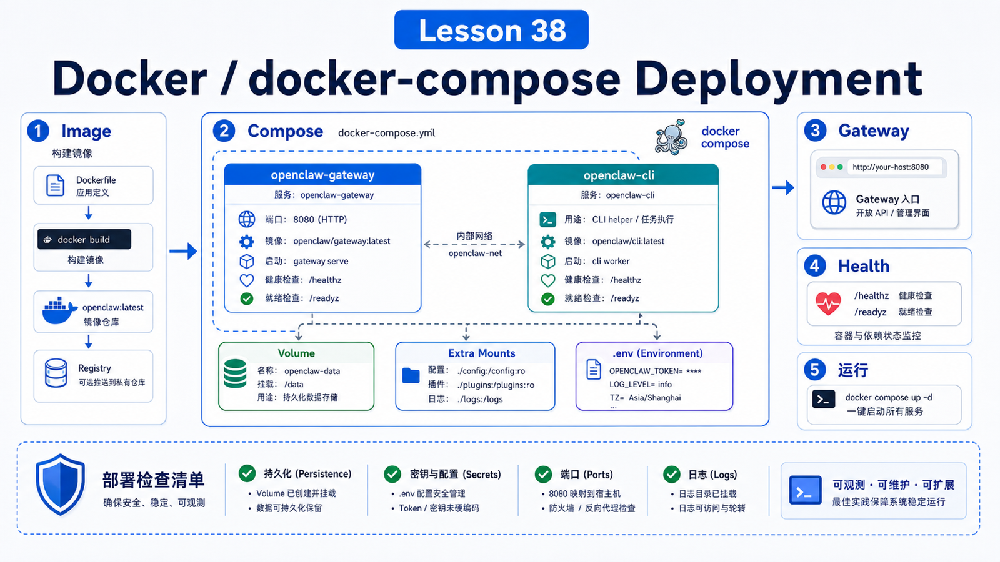

# Docker and docker-compose Deployment



Docker is attractive.

One container, one compose file, one port. It feels cleaner than a local install.

But the OpenClaw docs are clear: Docker is optional. It is useful for a containerized Gateway, server deployments, throwaway environments, and reproducible validation. If you are just iterating on your own laptop, the local install is often faster.

## The Key Idea: Docker Freezes the Runtime Environment

Docker helps with:

```text
fixed runtime dependencies
Gateway process management
explicit ports and mounts
standard logs and health checks
reproducible deployment
```

It does not automatically solve:

```text
secret safety
public exposure
workspace mounts
file permissions
plugin compatibility
model cost
```

Before containerizing, decide what you want to isolate, persist, and expose.

## The Official Docker Flow

From the repo root:

```bash
./scripts/docker/setup.sh
```

The script:

```text
builds the Gateway image
runs onboarding
prompts for provider API keys
generates a Gateway token into .env
creates auth-profile secret key state
starts the Gateway with Docker Compose
```

To use a prebuilt image:

```bash
export OPENCLAW_IMAGE="ghcr.io/openclaw/openclaw:latest"
./scripts/docker/setup.sh
```

The Control UI is usually:

```text
http://127.0.0.1:18789/
```

To print it again:

```bash
docker compose run --rm openclaw-cli dashboard --no-open
```

## Gateway vs CLI Container

A compose deployment normally has two roles:

```text
openclaw-gateway
  long-running service

openclaw-cli
  post-start command helper
```

One common mistake is using the CLI container for setup steps before the Gateway container exists.

The docs recommend running pre-start onboarding and setup-time config writes through the `openclaw-gateway` entrypoint.

## What Must Persist

Containers are easy to recreate. State is not.

Plan for:

```text
~/.openclaw state
openclaw.json
.env
auth profiles
channel credentials
workspace
logs
plugin installs
```

Useful Docker variables include:

```text
OPENCLAW_HOME_VOLUME
  persist /home/node

OPENCLAW_EXTRA_MOUNTS
  add host bind mounts

OPENCLAW_IMAGE_APT_PACKAGES
  install extra Debian packages at build time

OPENCLAW_IMAGE_PIP_PACKAGES
  install extra Python packages at build time
```

If a plugin or tool requires a binary, decide whether it belongs in the image or in a mounted host path.

## Health Checks

Container probes:

```bash
curl -fsS http://127.0.0.1:18789/healthz
curl -fsS http://127.0.0.1:18789/readyz
```

Deep health:

```bash
docker compose exec openclaw-gateway node dist/index.js health --token "$OPENCLAW_GATEWAY_TOKEN"
```

Different checks answer different questions:

```text
/healthz
  is the process alive?

/readyz
  is it ready for traffic?

deep health
  what does the Gateway see internally?
```

## LAN, Loopback, and Security

Docker setup commonly makes host access convenient.

On a VPS or public host, review:

```text
bind address
firewall
Gateway auth
Control UI allowed origins
reverse proxy auth
Docker DOCKER-USER firewall policy
```

Docker is one layer of isolation, not the whole security design.

## Common Misunderstandings

### Docker is always easier for beginners

Not always. Local debugging has fewer moving parts.

### `compose up` protects data

Only if volumes and mounts are correct.

### Host tools are automatically available in the container

They are not. The container needs its own binaries, packages, permissions, and mounts.

### A 200 health check means the product is fully healthy

`healthz` is basic liveness. Business problems require readiness, deep health, logs, and doctor.

## Final Summary

Docker deployment is about making the runtime boundary explicit.

```text
Containers freeze the environment, compose starts services, but persistence, secrets, ports, and safety are still your design work.
```

## Exercises

1. Run the official Docker setup once.
2. Locate the Gateway token in `.env` without printing the value.
3. Check `/healthz` and `/readyz`.
4. List every directory your deployment must persist.
5. Decide which dependencies belong in the image and which belong in mounts.

## Next Lesson Preview

Next we cover configuration files, environment variables, and provider secret management.

## References

- OpenClaw Docs: [Docker](https://docs.openclaw.ai/install/docker)
- OpenClaw Docs: [Gateway runbook](https://docs.openclaw.ai/gateway)
- OpenClaw Docs: [Security](https://docs.openclaw.ai/gateway/security)
- OpenClaw Docs: [Health checks](https://docs.openclaw.ai/gateway/health)

