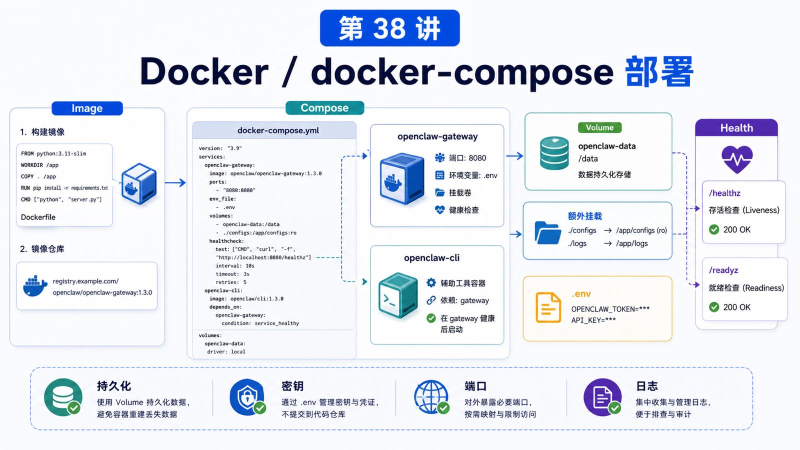

# Docker / docker-compose 部署



Docker 很诱人。

一个容器、一份 compose、一个端口，看起来比本机安装干净。

但 OpenClaw 的 Docker 文档开头就提醒：Docker 是可选的。它适合容器化 Gateway、服务器部署、可丢弃环境和隔离验证；如果你只是在自己的电脑上追求最快迭代，本地安装通常更直接。

## 先说结论：Docker 适合“运行环境固定化”

Docker / docker-compose 解决的是：

```text
运行依赖固定
Gateway 进程托管
端口和挂载明确
日志和健康检查标准化
部署环境可复现
```

它不自动解决：

```text
密钥安全
公网暴露
Workspace 挂载
文件权限
插件兼容
模型费用
```

所以容器化前要先想清楚：你要隔离什么，持久化什么，暴露什么。

## 官方 Docker 流程

在仓库根目录运行：

```bash
./scripts/docker/setup.sh
```

这个脚本会：

```text
构建 Gateway 镜像
运行 onboarding
提示输入 Provider API keys
生成 Gateway token 并写入 .env
创建 auth-profile secret key 目录
通过 Docker Compose 启动 Gateway
```

如果要用预构建镜像：

```bash
export OPENCLAW_IMAGE="ghcr.io/openclaw/openclaw:latest"
./scripts/docker/setup.sh
```

Control UI 默认访问：

```text
http://127.0.0.1:18789/
```

如果忘了地址：

```bash
docker compose run --rm openclaw-cli dashboard --no-open
```

## docker compose 的角色分工

Docker 部署里通常有两个角色：

```text
openclaw-gateway
  常驻服务，真正处理 Gateway 运行时

openclaw-cli
  post-start CLI 工具，用来执行 dashboard、channels、status 等命令
```

一个容易踩的点是：在 Gateway 容器还没启动前，某些初始化命令不能依赖 `openclaw-cli`。

官方文档建议预启动 onboarding 和 setup-time config 写入通过 `openclaw-gateway` 入口执行。

## 需要持久化什么

容器最怕“重启后东西没了”。

至少要想清楚：

```text
~/.openclaw 状态目录
openclaw.json
.env
auth profiles
channel credentials
workspace
logs
plugin installs
```

Docker 文档提供了几个关键变量：

```text
OPENCLAW_HOME_VOLUME
  持久化 /home/node

OPENCLAW_EXTRA_MOUNTS
  额外挂载宿主机目录

OPENCLAW_IMAGE_APT_PACKAGES
  构建时安装额外 Debian 包

OPENCLAW_IMAGE_PIP_PACKAGES
  构建时安装额外 Python 包
```

插件和工具依赖如果不是镜像内置，就要在镜像构建或挂载策略里处理。

## 健康检查

容器探针：

```bash
curl -fsS http://127.0.0.1:18789/healthz
curl -fsS http://127.0.0.1:18789/readyz
```

更深的健康快照：

```bash
docker compose exec openclaw-gateway node dist/index.js health --token "$OPENCLAW_GATEWAY_TOKEN"
```

这两类检查用途不同：

```text
/healthz
  进程是否活着

/readyz
  服务是否准备好接流量

deep health
  Gateway 内部能力、通道、状态更细的诊断
```

## LAN、loopback 和安全

Docker setup 默认更偏向让宿主机能访问 Gateway。

但如果你把容器跑在 VPS 或公网主机上，就必须复查：

```text
绑定地址
防火墙
Gateway auth
Control UI allowed origins
反向代理认证
Docker DOCKER-USER 防火墙策略
```

Docker 不是安全边界的终点。它只是运行环境边界的一部分。

## 常见误解

### 误解一：Docker 一定比本地安装更适合新手

不一定。本地调试路径更短。Docker 更适合部署和复现。

### 误解二：compose up 就等于数据安全

不等于。没有正确 volume 和 mount，状态可能丢失。

### 误解三：容器里装了 OpenClaw，宿主机工具就自动可用

不一定。容器内要有对应二进制、包、权限和挂载路径。

### 误解四：健康检查 200 就说明业务完全正常

`healthz` 是基础存活，业务级问题还要看 `readyz`、deep health、logs 和 doctor。

## 最后总结

Docker 部署的重点不是“把东西装进容器”，而是把运行边界讲清楚。

一句话总结：

```text
容器负责固定运行环境，compose 负责编排服务，但持久化、密钥、端口和安全仍然要你设计。
```

## 本节作业

1. 用官方脚本跑一次 Docker setup。
2. 找到 `.env` 里的 Gateway token，不要打印真实值。
3. 检查 `/healthz` 和 `/readyz`。
4. 列出你的 OpenClaw Docker 部署需要持久化的目录。
5. 判断哪些工具依赖应该进镜像，哪些应该通过挂载解决。

## 下一节预告

下一节讲配置文件、环境变量和 Provider 密钥管理。

## 参考资料

- OpenClaw Docs：[Docker](https://docs.openclaw.ai/install/docker)
- OpenClaw Docs：[Gateway runbook](https://docs.openclaw.ai/gateway)
- OpenClaw Docs：[Security](https://docs.openclaw.ai/gateway/security)
- OpenClaw Docs：[Health checks](https://docs.openclaw.ai/gateway/health)

