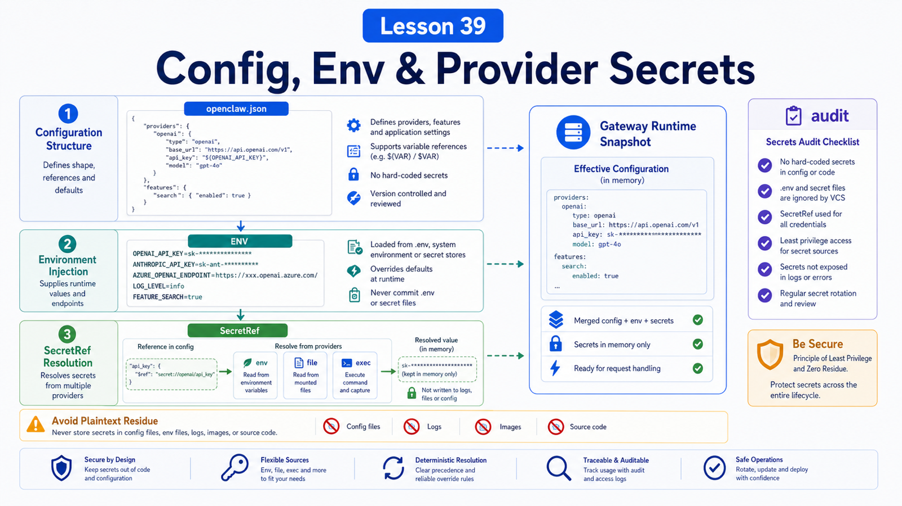

# Config Files, Environment Variables, and Provider Secret Management



Once OpenClaw runs, configuration becomes the next source of confusion.

Model providers, Gateway tokens, channels, plugins, workspaces, and tool policy all touch the config system.

If API keys are scattered across files, debugging and migration become painful.

## The Key Idea: Config Describes Structure, Env Injects Values, SecretRefs Protect Long-Lived Credentials

Think in three layers:

```text
openclaw.json
  system structure and policy

environment variables
  runtime value injection

SecretRef
  supported credentials without plaintext config
```

Do not treat them as interchangeable.

## `openclaw.json` Is the Main Config

Default path:

```text
~/.openclaw/openclaw.json
```

Custom path:

```bash
OPENCLAW_CONFIG_PATH=/path/to/openclaw.json openclaw gateway
```

The docs warn that symlinked `openclaw.json` layouts are not supported for OpenClaw-owned writes, because atomic writes may replace the path.

## Four Ways to Edit Config

```text
openclaw onboard
  first-run interactive setup

openclaw configure
  configuration wizard

openclaw config get/set/unset
  command-line edits

Control UI Config tab
  schema-driven form plus Raw JSON
```

Direct file edits are allowed, but schema validation is strict.

Unknown keys, wrong types, or invalid values can stop the Gateway from starting.

## Provider Configuration

Models are referenced as `provider/model`, for example:

```text
openai/gpt-5.4
anthropic/claude-sonnet-4-6
```

A config can define a primary model and fallbacks:

```json5
{
  agents: {
    defaults: {
      model: {
        primary: "openai/gpt-5.4",
        fallbacks: ["anthropic/claude-sonnet-4-6"],
      },
    },
  },
}
```

Real deployments should answer:

```text
What is the default model?
What is the fallback?
Which models are user-selectable?
Should images be downscaled?
Is long context actually needed?
```

## Where Environment Variables Fit

Environment variables are good for:

```text
container injection
CI/CD temporary values
Gateway tokens
provider API keys
local testing
```

Example:

```bash
export OPENCLAW_GATEWAY_TOKEN="..."
export OPENAI_API_KEY="..."
```

They are simple, but service environments differ. Your terminal may have a variable that launchd, systemd, or Docker does not.

## SecretRef for Long-Lived Secrets

OpenClaw supports SecretRefs:

```json5
{ source: "env", provider: "default", id: "OPENAI_API_KEY" }
```

It also supports file and exec providers:

```json5
{ source: "file", provider: "filemain", id: "/providers/openai/apiKey" }
{ source: "exec", provider: "vault", id: "providers/openai/apiKey#value" }
```

The goal is to avoid plaintext credentials in `openclaw.json`, `auth-profiles.json`, `.env`, and generated model files.

But SecretRef is not process isolation. If plaintext keys remain in files the agent can read, file or shell tools may still expose them.

## A Safer Secret Migration Flow

Use:

```text
1. locate plaintext credentials
2. configure secrets.providers
3. replace supported fields with SecretRefs
4. reload secrets
5. audit for plaintext residue
6. encrypt or redact old backups
```

Useful commands:

```bash
openclaw secrets reload
openclaw secrets audit --check
```

## Common Misunderstandings

### Anything can go in config

No. The schema is strict.

### Environment variables are automatically safer

Not always. They can leak through service managers, debug output, logs, or local processes.

### SecretRef solves everything

Only if old plaintext files and generated residues are cleaned up.

### A provider only needs an API key

Production provider setup also needs fallback, allowlists, context choices, cost awareness, and rate-limit planning.

## Final Summary

Configuration is a runtime boundary, not a bag of fields.

```text
openclaw.json defines structure, environment variables inject runtime values, SecretRefs protect supported long-lived credentials, and doctor/audit detect drift.
```

## Exercises

1. Read the current workspace with `openclaw config get agents.defaults.workspace`.
2. Identify whether your provider key is plaintext, env-based, or SecretRef-based.
3. Inspect the config schema through CLI or Control UI.
4. Draft a migration plan from plaintext keys to SecretRefs.

## Next Lesson Preview

Next we cover ports, reverse proxies, HTTPS, and LAN access.

## References

- OpenClaw Docs: [Configuration](https://docs.openclaw.ai/gateway/configuration)
- OpenClaw Docs: [Configuration reference](https://docs.openclaw.ai/gateway/configuration-reference)
- OpenClaw Docs: [Secrets management](https://docs.openclaw.ai/gateway/secrets)
- OpenClaw Docs: [Models](https://docs.openclaw.ai/concepts/models)
- OpenClaw Docs: [Model failover](https://docs.openclaw.ai/concepts/model-failover)

