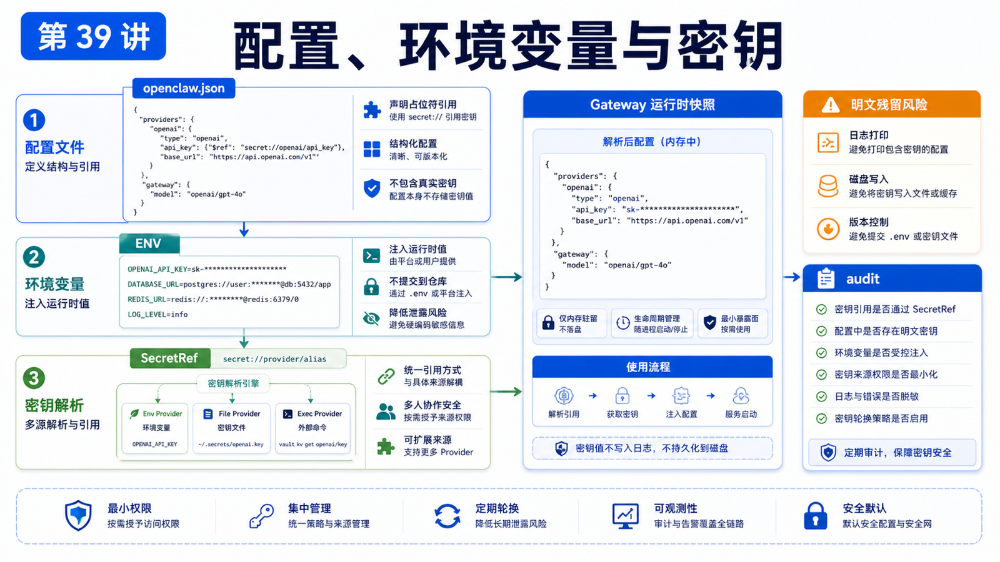

# 配置文件、环境变量和 Provider 密钥管理



OpenClaw 跑起来以后，真正容易乱的是配置。

模型 Provider、Gateway token、消息通道、插件、Workspace、工具权限，都可能写进配置体系。

如果你随手把 key 写进各种文件，后面排错和迁移都会很痛。

## 先说结论：配置管结构，环境变量管注入，SecretRef 管长期密钥

可以用三层来理解：

```text
openclaw.json
  描述系统结构和策略

环境变量
  给进程注入运行时值

SecretRef
  让支持的凭据不以明文留在配置里
```

不要把三者混成一锅。

## openclaw.json 是主配置

默认路径：

```text
~/.openclaw/openclaw.json
```

如果要指定其它路径：

```bash
OPENCLAW_CONFIG_PATH=/path/to/openclaw.json openclaw gateway
```

注意：官方文档提醒，OpenClaw 自己写配置时不支持把 `openclaw.json` 做成软链接布局，因为原子写入可能替换路径本身。

## 修改配置的四种方式

```text
openclaw onboard
  首次交互式设置

openclaw configure
  配置向导

openclaw config get/set/unset
  命令行修改

Control UI Config tab
  表单和 Raw JSON 编辑
```

直接编辑文件也可以，但要记住：OpenClaw 严格校验 schema。

未知 key、类型错误、非法值，都可能导致 Gateway 拒绝启动。

## Provider 配置

模型通常按 `provider/model` 形式引用，例如：

```text
openai/gpt-5.4
anthropic/claude-sonnet-4-6
```

配置里可以定义默认模型、fallback 和模型 allowlist。

示意：

```json5
{
  agents: {
    defaults: {
      model: {
        primary: "openai/gpt-5.4",
        fallbacks: ["anthropic/claude-sonnet-4-6"],
      },
    },
  },
}
```

真实项目里，模型配置要回答：

```text
默认模型是谁
失败时 fallback 到谁
哪些模型允许用户切换
截图/视觉输入是否要降维
长上下文是否真的需要
```

## 环境变量的适合场景

环境变量适合：

```text
容器注入
CI/CD 临时值
Gateway token
Provider API key
本地开发临时测试
```

例如：

```bash
export OPENCLAW_GATEWAY_TOKEN="..."
export OPENAI_API_KEY="..."
```

优点是简单。

缺点是：不同 shell、systemd、launchd、Docker compose 的环境来源不一样，很容易出现“我终端里有，服务里没有”。

## SecretRef：长期密钥更推荐的形态

OpenClaw 支持 SecretRef：

```json5
{ source: "env", provider: "default", id: "OPENAI_API_KEY" }
```

也支持 file 和 exec provider：

```json5
{ source: "file", provider: "filemain", id: "/providers/openai/apiKey" }
{ source: "exec", provider: "vault", id: "providers/openai/apiKey#value" }
```

它的目标是减少明文凭据落在 `openclaw.json`、`auth-profiles.json`、`.env` 或生成的模型文件里。

但要注意：SecretRef 不是进程隔离边界。

如果明文 key 仍然留在 Agent 可以读取的文件里，Agent 仍然可能通过文件或 shell 工具看到它。

## 密钥迁移流程

更安全的迁移顺序：

```text
1. 找出明文密钥位置
2. 配置 secrets.providers
3. 把支持的字段改成 SecretRef
4. reload secrets
5. audit 检查明文残留
6. 备份旧文件前先脱敏或加密
```

常用命令：

```bash
openclaw secrets reload
openclaw secrets audit --check
```

## 常见误解

### 误解一：配置文件能写什么就写什么

不对。OpenClaw 的配置 schema 是严格的，乱写会阻塞启动。

### 误解二：环境变量一定比配置安全

不一定。环境变量可能被服务管理器、日志、debug 输出或同机进程暴露。

### 误解三：SecretRef 一配置就万事大吉

不够。还要确认旧明文文件、备份、生成文件、`.env` 没有残留。

### 误解四：Provider 只需要一个 API key

生产配置还要考虑 fallback、模型 allowlist、长上下文、费用和限流。

## 最后总结

配置不是一堆字段，而是运行时边界。

一句话总结：

```text
openclaw.json 管结构，环境变量管注入，SecretRef 管长期凭据，doctor 和 audit 负责帮你发现配置漂移。
```

## 本节作业

1. 用 `openclaw config get agents.defaults.workspace` 读取当前 workspace。
2. 找出你当前 Provider key 是明文、环境变量还是 SecretRef。
3. 运行一次 `openclaw config schema` 或查看 Control UI Config。
4. 设计一个从明文 key 迁移到 SecretRef 的计划。

## 下一节预告

下一节讲端口、反向代理、HTTPS 和内网访问。

## 参考资料

- OpenClaw Docs：[Configuration](https://docs.openclaw.ai/gateway/configuration)
- OpenClaw Docs：[Configuration reference](https://docs.openclaw.ai/gateway/configuration-reference)
- OpenClaw Docs：[Secrets management](https://docs.openclaw.ai/gateway/secrets)
- OpenClaw Docs：[Models](https://docs.openclaw.ai/concepts/models)
- OpenClaw Docs：[Model failover](https://docs.openclaw.ai/concepts/model-failover)

