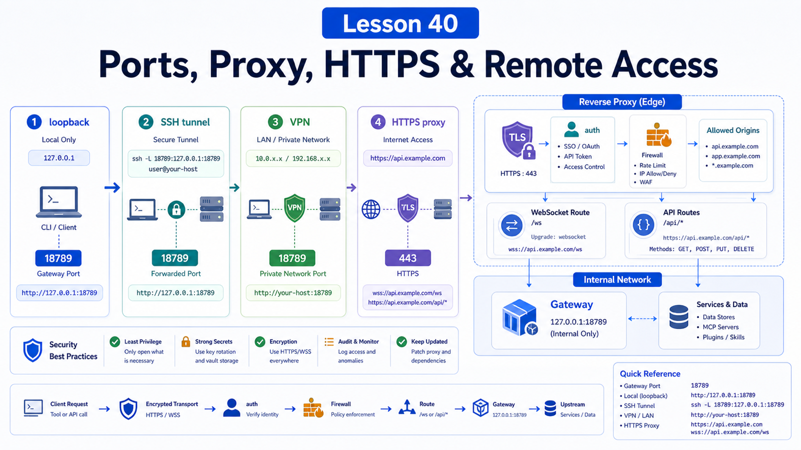

# Ports, Reverse Proxies, HTTPS, and Remote Access



After OpenClaw works locally, the next question is usually:

```text
Can I access it from my phone?
Can I run it on a VPS?
Can a team use it?
Can I put it behind a domain and HTTPS?
```

Yes, but this is where risk expands quickly.

## The Key Idea: Define the Access Boundary Before Opening Ports

The Gateway is safest as a local loopback service by default.

Before remote access, answer:

```text
Who can reach the Gateway?
Through which network path?
Is HTTPS involved?
Where does authentication happen?
Are Control UI allowed origins correct?
Do you really need public exposure?
```

Do not open port 18789 first and design safety later.

## Gateway Port and Bind

Port precedence:

```text
--port
  -> OPENCLAW_GATEWAY_PORT
  -> gateway.port
  -> 18789
```

Bind modes are roughly:

```text
loopback
  local machine only

lan
  LAN or container-host access, requiring stronger auth and firewall review
```

After changing `gateway.port` on a supervised service, run:

```bash
openclaw doctor --fix
```

or reinstall the service:

```bash
openclaw gateway install --force
```

Supervisor metadata may still contain the old port.

## A Safer Remote Access Ladder

Prefer this order:

```text
1. local loopback
2. SSH tunnel
3. Tailscale / VPN
4. LAN
5. HTTPS reverse proxy
6. public exposure
```

SSH tunnel:

```bash
ssh -N -L 18789:127.0.0.1:18789 user@host
```

Then connect locally:

```text
http://127.0.0.1:18789/
```

The tunnel does not bypass Gateway auth. Clients still need token or password auth.

## What the Reverse Proxy Must Handle

The main Gateway port carries:

```text
Control UI
WebSocket control/RPC
HTTP APIs
OpenAI-compatible endpoints
plugin routes
health endpoints
```

So the proxy is not just serving a static site.

Verify:

```text
WebSocket upgrade works
auth headers are preserved
HTTPS origin is in gateway.controlUi.allowedOrigins
timeouts support long requests
body size limits fit files and images
metrics or admin routes are not exposed without auth
```

## HTTPS Is Not Authentication

HTTPS protects transport.

Gateway auth controls access.

Reverse-proxy auth, token/password auth, and trusted-proxy mode are separate layers.

For trusted-proxy mode, ensure:

```text
only the trusted proxy can reach the Gateway
the proxy injects identity correctly
outside clients cannot forge trusted headers
the Gateway cannot be reached directly
```

Otherwise the trust model collapses.

## Control UI Allowed Origins

For a remote HTTPS domain:

```json5
{
  gateway: {
    controlUi: {
      allowedOrigins: [
        "https://openclaw.example.com",
      ],
    },
  },
}
```

Local origins may be seeded automatically. Remote HTTPS origins usually need explicit configuration.

## Common Misunderstandings

### HTTPS makes it safe

Not by itself. You still need auth, proxy policy, and firewall rules.

### An undocumented port is hidden

Public ports are scanned.

### LAN is always safe

LANs can include shared Wi-Fi, infected devices, misconfigured proxies, and lateral movement risk.

### If the page loads, the proxy is done

You still need WebSockets, long requests, streaming, uploads, tool calls, and auth.

## Final Summary

Remote access is about identity and path, not just reachability.

```text
Start with loopback, prefer tunnels or VPNs, expose HTTPS only when auth, origins, firewall, and logs are designed together.
```

## Exercises

1. Identify where your Gateway port comes from: CLI, env, config, or default.
2. Connect to a remote Gateway through SSH tunnel.
3. Write an `allowedOrigins` entry for an HTTPS domain.
4. List the Gateway features your proxy must support.
5. Decide whether your deployment truly needs public access.

## Next Lesson Preview

Next we cover workspace mounts, state directories, and persistence.

## References

- OpenClaw Docs: [Gateway runbook](https://docs.openclaw.ai/gateway)
- OpenClaw Docs: [Remote Gateway](https://docs.openclaw.ai/gateway/remote)
- OpenClaw Docs: [Authentication](https://docs.openclaw.ai/gateway/authentication)
- OpenClaw Docs: [Tailscale](https://docs.openclaw.ai/gateway/tailscale)
- OpenClaw Docs: [Security exposure runbook](https://docs.openclaw.ai/gateway/security/exposure-runbook)

