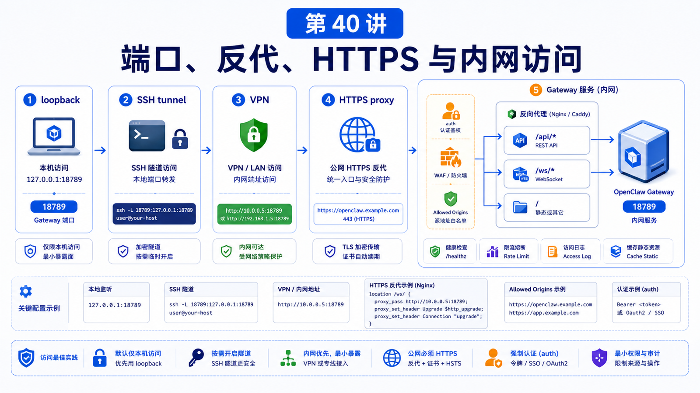

# 端口、反向代理、HTTPS 和内网访问



OpenClaw 本地跑通以后，很多人下一步就想：

```text
能不能手机访问？
能不能放到 VPS？
能不能给团队用？
能不能接一个域名和 HTTPS？
```

可以，但这里是安全风险最容易放大的地方。

## 先说结论：先明确访问边界，再开放端口

OpenClaw Gateway 默认更适合本机 loopback 访问。

远程访问要先回答：

```text
谁能访问 Gateway？
通过什么网络路径访问？
是否经过 HTTPS？
认证在哪里发生？
Control UI 的 allowed origins 是否正确？
是否真的需要公网？
```

不要先开放 18789，再补安全。

## Gateway 端口和绑定

Gateway 端口解析优先级：

```text
--port
  -> OPENCLAW_GATEWAY_PORT
  -> gateway.port
  -> 18789
```

绑定模式大致可以理解为：

```text
loopback
  只给本机访问，最适合本地默认运行

lan
  给局域网或容器宿主机访问，需要额外认证和防火墙
```

修改 `gateway.port` 后，如果你安装了托管服务，官方文档建议运行：

```bash
openclaw doctor --fix
```

或重新安装服务：

```bash
openclaw gateway install --force
```

因为 launchd、systemd、schtasks 这类 supervisor 可能记录了旧端口。

## 推荐的远程访问顺序

不要一开始就公网反代。

更稳的顺序是：

```text
1. 本机 loopback
2. SSH tunnel
3. Tailscale / VPN
4. 局域网
5. HTTPS reverse proxy
6. 公网暴露
```

SSH tunnel 示例：

```bash
ssh -N -L 18789:127.0.0.1:18789 user@host
```

然后本地访问：

```text
http://127.0.0.1:18789/
```

注意：SSH tunnel 不会绕过 Gateway auth。该带 token 或 password 仍然要带。

## 反向代理要代理什么

Gateway 主端口上承载很多能力：

```text
Control UI
WebSocket control/RPC
HTTP APIs
OpenAI-compatible endpoints
plugin routes
health endpoints
```

所以反向代理不能只按普通静态网站配置。

要确认：

```text
WebSocket upgrade 正常
Authorization / token 头没有被吞
HTTPS origin 已加入 gateway.controlUi.allowedOrigins
超时时间适合长请求
请求体大小限制适合文件和图片
不要公开未认证 metrics 或 admin route
```

## HTTPS 不是认证

HTTPS 保护传输。

Gateway auth 控制谁能进系统。

反向代理认证、Gateway token/password、trusted-proxy 模式，是不同层次。

如果使用 trusted-proxy，就必须保证：

```text
只有可信代理能直连 Gateway
代理正确注入身份
外部请求不能伪造 trusted headers
Gateway 不被绕过代理直接访问
```

否则 trusted-proxy 会变成“信任所有能打到端口的人”。

## Control UI allowed origins

当你从远程域名访问 UI 时，要显式配置：

```json5
{
  gateway: {
    controlUi: {
      allowedOrigins: [
        "https://openclaw.example.com",
      ],
    },
  },
}
```

本地启动时，OpenClaw 会给本地 origin 做一些默认处理；远程 HTTPS 域名通常要你自己加。

## 常见误解

### 误解一：开了 HTTPS 就安全了

不够。HTTPS 只是传输加密，权限边界仍然要靠 Gateway auth、代理策略和防火墙。

### 误解二：端口只要不公开文档就没人知道

端口扫描不看文档。公网暴露要按公网服务处理。

### 误解三：内网就一定安全

内网也可能有共享 Wi-Fi、被感染设备、误配代理和横向移动风险。

### 误解四：反代只要能打开页面就配置好了

还要验证 WebSocket、长请求、工具调用、流式输出、文件上传和认证。

## 最后总结

远程访问的核心不是“能不能打开”，而是“谁通过什么路径、以什么身份打开”。

一句话总结：

```text
先 loopback，再隧道或 VPN，最后才是公网 HTTPS；每扩大一层访问面，都要同步检查 auth、origin、防火墙和日志。
```

## 本节作业

1. 查出当前 Gateway 端口来源：CLI、env、config 还是默认。
2. 用 SSH tunnel 访问一次远程 Gateway。
3. 为一个 HTTPS 域名写出 `allowedOrigins` 配置。
4. 列出你的反向代理必须支持的 Gateway 能力。
5. 判断你的部署是否真的需要公网访问。

## 下一节预告

下一节讲 Workspace 挂载、数据目录和持久化。

## 参考资料

- OpenClaw Docs：[Gateway runbook](https://docs.openclaw.ai/gateway)
- OpenClaw Docs：[Remote Gateway](https://docs.openclaw.ai/gateway/remote)
- OpenClaw Docs：[Authentication](https://docs.openclaw.ai/gateway/authentication)
- OpenClaw Docs：[Tailscale](https://docs.openclaw.ai/gateway/tailscale)
- OpenClaw Docs：[Security exposure runbook](https://docs.openclaw.ai/gateway/security/exposure-runbook)

