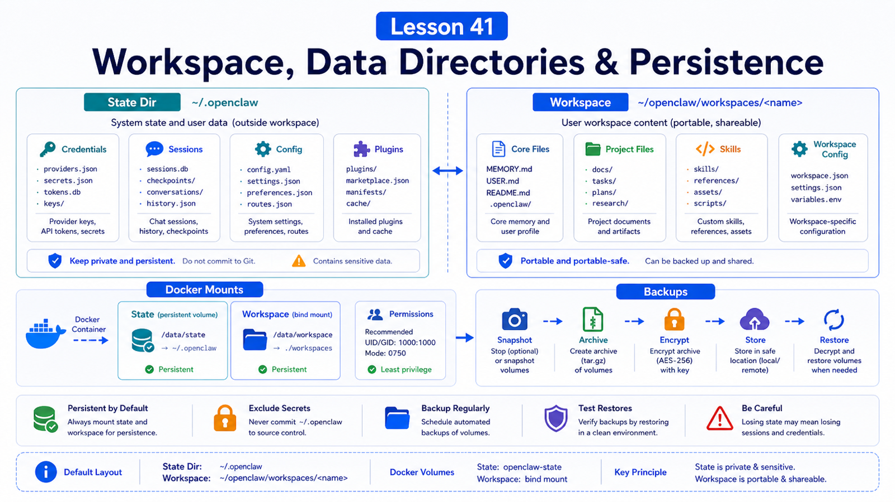

# Workspace Mounts, Data Directories, and Persistence



Every OpenClaw deployment eventually hits the same question:

```text
Where is my data?
```

If the answer is unclear, migration, backup, Docker rebuilds, and permission repair all become guesswork.

## The Key Idea: Separate State Directory from Workspace

The two most important locations are:

```text
State directory
  OpenClaw runtime state, usually ~/.openclaw

Workspace
  where the agent works: memory, files, skills, and task artifacts
```

They may live together or separately.

You must know where both are.

## What Lives in the State Directory

Default:

```text
~/.openclaw/
```

It may contain:

```text
openclaw.json
.env
agents/
credentials/
sessions/
logs/
plugins/
auth profiles
channel state
```

The migration docs are explicit: copying only `openclaw.json` is not enough.

Model auth, OAuth profiles, channel state, sessions, and plugin state may all live in the state directory.

## What Lives in the Workspace

The workspace is where the agent actually works.

Common files:

```text
MEMORY.md
USER.md
source code
local documents
workspace skills
task artifacts
temporary analysis files
```

Example:

```json5
{
  agents: {
    defaults: {
      workspace: "~/.openclaw/workspace",
    },
  },
}
```

If you point the workspace at a real project, review tool permissions and backup policy.

## Mount Design in Docker

In Docker, decide:

```text
Should /home/node be a named volume?
Where does the host workspace mount?
Are plugin dependencies baked into the image?
Are logs persistent?
Are backups performed on the host?
```

Useful variables:

```text
OPENCLAW_HOME_VOLUME
OPENCLAW_EXTRA_MOUNTS
```

Example mount:

```text
/srv/projects/my-app:/workspace/my-app:rw
```

Then configure the agent workspace as `/workspace/my-app`.

## Permissions and Ownership

Common symptoms after migration or mounting:

```text
Gateway fails to start
credentials cannot be read
sessions cannot be written
tools cannot modify workspace files
container UID differs from host file owner
```

Debug with:

```text
identify the Gateway user
check state dir ownership
check workspace ownership
avoid root-owned copies
tighten sensitive file modes
run openclaw doctor
```

## What to Back Up

At minimum:

```text
state directory
workspace
external secret reference config
Docker .env / compose override
reverse proxy config
```

The state directory can contain real credentials and channel login state.

Encrypt backups. Use safe transfer. Rotate keys if exposure is suspected.

## Common Misunderstandings

### Workspace is always `~/.openclaw`

No. Workspace is configurable, and state directory can also vary by profile or env.

### Migration means copying config

Not enough. Copy state directory and workspace.

### Docker volume means backup

No. A volume is persistence, not a backup.

### Mounting the whole home directory is convenient

It expands the agent-visible blast radius.

## Final Summary

Persistence means understanding which files represent runtime state, work content, and secrets.

```text
State dir stores how OpenClaw runs; workspace stores where the agent works. Draw both paths, permissions, mounts, and backups before deploying.
```

## Exercises

1. Run `openclaw status` and identify the state directory.
2. Read `agents.defaults.workspace`.
3. List directories required for a machine migration.
4. Write a Docker mount table.
5. Check whether the workspace contains files the agent should not read.

## Next Lesson Preview

Next we cover doctor/debug and practical troubleshooting.

## References

- OpenClaw Docs: [Migration guide](https://docs.openclaw.ai/install/migrating)
- OpenClaw Docs: [Configuration](https://docs.openclaw.ai/gateway/configuration)
- OpenClaw Docs: [Docker](https://docs.openclaw.ai/install/docker)
- OpenClaw Docs: [Security](https://docs.openclaw.ai/gateway/security)

