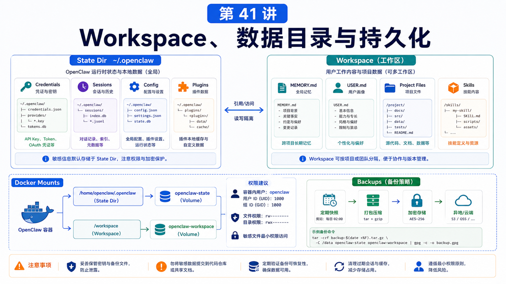

# Workspace 挂载、数据目录和持久化



部署 OpenClaw 时，有一个问题迟早会出现：

```text
我的数据到底在哪？
```

如果这个问题没答清楚，迁移、备份、Docker 重建、权限修复都会变成猜谜。

## 先说结论：区分 State Dir 和 Workspace

最重要的两类目录：

```text
State directory
  OpenClaw 自己的状态，默认 ~/.openclaw

Workspace
  Agent 工作目录，通常保存 MEMORY.md、USER.md、项目文件、技能和上下文
```

它们可以在一起，也可以分开。

但你必须知道它们分别在哪里。

## State directory 里有什么

默认：

```text
~/.openclaw/
```

里面可能包含：

```text
openclaw.json
.env
agents/
credentials/
sessions/
logs/
plugins/
auth profiles
channel state
```

迁移到新机器时，官方 migration 文档明确说：只复制 `openclaw.json` 不够。

模型认证、OAuth、通道登录态、会话历史和插件状态，都可能在 state dir 里。

## Workspace 里有什么

Workspace 是 Agent 真正工作的地方。

常见内容：

```text
MEMORY.md
USER.md
项目源码
本地文档
workspace skills
任务产物
临时分析文件
```

配置示例：

```json5
{
  agents: {
    defaults: {
      workspace: "~/.openclaw/workspace",
    },
  },
}
```

如果你把 workspace 指向真实项目目录，要明确工具权限和备份策略。

## Docker 里的挂载设计

Docker 部署要特别小心。

你要决定：

```text
/home/node 是否用 named volume
宿主机 workspace 挂到容器哪里
插件依赖是否在镜像里
日志是否持久化
备份是否在宿主机做
```

常见变量：

```text
OPENCLAW_HOME_VOLUME
OPENCLAW_EXTRA_MOUNTS
```

例如，你可能把宿主机项目挂载到容器内：

```text
/srv/projects/my-app:/workspace/my-app:rw
```

然后让 agent workspace 指向 `/workspace/my-app`。

## 权限和所有权

迁移或挂载后最常见的问题是权限。

症状包括：

```text
Gateway 启动失败
credentials 读不到
session 写入失败
工具无法修改 workspace 文件
Docker 容器内 UID 和宿主机文件 owner 不匹配
```

处理思路：

```text
确认运行 Gateway 的用户
确认 state dir owner
确认 workspace owner
避免 root 拷贝后忘记 chown
敏感文件权限收紧
运行 openclaw doctor
```

## 备份应该备什么

至少备：

```text
state directory
workspace
外部密钥系统的引用配置
Docker .env / compose override
反向代理配置
```

但要注意：state dir 可能包含真实凭据和通道登录态。

备份应加密，传输应安全。如果怀疑泄露，要轮换 Provider key 和 Gateway token。

## 常见误解

### 误解一：Workspace 就是 ~/.openclaw

不一定。Workspace 可配置，state dir 也可通过环境或 profile 改变。

### 误解二：迁移只要复制配置文件

不够。官方迁移文档强调要复制 state directory 和 workspace。

### 误解三：Docker volume 自动等于备份

volume 是持久化，不是备份。它仍可能被删除、损坏或覆盖。

### 误解四：挂载整个家目录最省事

风险很高。Agent 可见范围越大，误操作和泄露面越大。

## 最后总结

持久化不是“目录别丢”，而是清楚地区分系统状态、工作内容和密钥。

一句话总结：

```text
State dir 保存 OpenClaw 怎么运行，Workspace 保存 Agent 在哪里工作；部署前先画出两者路径、权限、挂载和备份。
```

## 本节作业

1. 运行 `openclaw status`，确认当前 state dir。
2. 用 `openclaw config get agents.defaults.workspace` 找到 workspace。
3. 列出迁移新机器时必须复制的目录。
4. 为 Docker 部署写一份 mount 表。
5. 检查 workspace 是否包含不该让 Agent 读取的敏感文件。

## 下一节预告

下一节讲 doctor / debug：常见错误如何定位。

## 参考资料

- OpenClaw Docs：[Migration guide](https://docs.openclaw.ai/install/migrating)
- OpenClaw Docs：[Configuration](https://docs.openclaw.ai/gateway/configuration)
- OpenClaw Docs：[Docker](https://docs.openclaw.ai/install/docker)
- OpenClaw Docs：[Security](https://docs.openclaw.ai/gateway/security)

