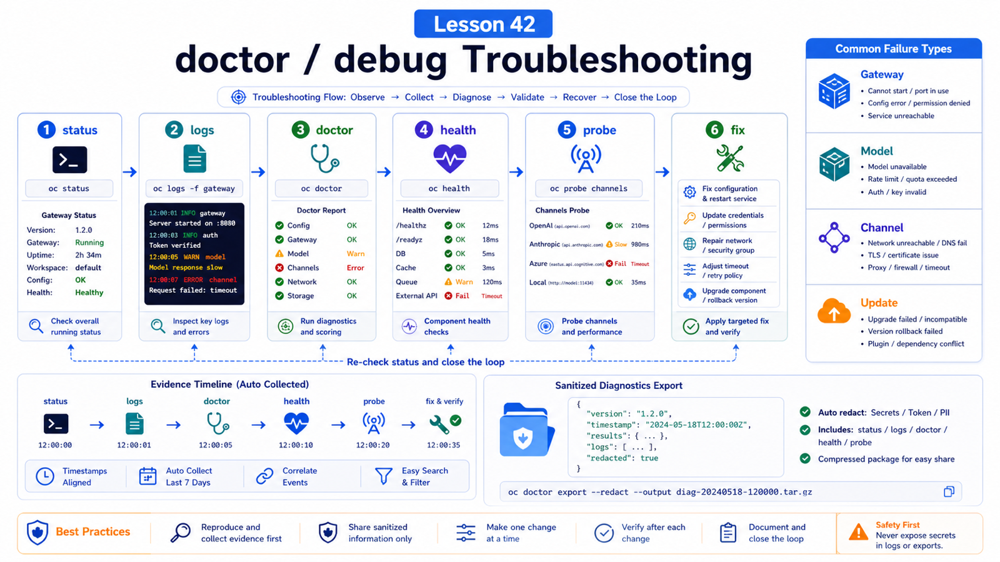

# doctor / debug: How to Locate Common Errors



The worst debugging strategy is changing configuration by instinct.

Today you change a port, tomorrow you delete a token, then you reinstall a plugin. Soon you no longer know which change caused the failure.

This lesson gives you a stable troubleshooting order.

## The Key Idea: Observe Before You Repair

Use:

```text
status
  -> gateway status
  -> logs
  -> doctor
  -> health
  -> channels probe
  -> targeted fix
```

Do not jump straight to `--fix`.

## Layer One: Quick Status

Start with:

```bash
openclaw status
openclaw gateway status
```

Look for:

```text
Gateway reachability
Runtime running
Connectivity probe ok
version and update hints
recent sessions and channel state
```

If the Gateway is unreachable, do not debug the model yet.

Fix the Gateway first.

## Layer Two: Logs

Follow logs:

```bash
openclaw logs --follow
```

Logs are for building a timeline:

```text
when the Gateway started
when config loaded
when plugins registered
when model calls failed
when channels disconnected
whether protocol mismatch appeared
whether errors were 401 / 403 / 429
```

Always align the user-reported time with log timestamps.

## Layer Three: doctor

`openclaw doctor` is the repair and migration tool.

Common modes:

```bash
openclaw doctor
openclaw doctor --lint
openclaw doctor --lint --json
openclaw doctor --fix
openclaw doctor --deep
```

Meaning:

```text
doctor
  interactive check

--lint
  read-only, good for CI and preflight

--fix
  apply recommended repairs

--deep
  scan supervisors, extra services, stale gateways
```

Run `doctor` or `--lint` before applying fixes.

## Layer Four: Health

Use:

```bash
openclaw health
openclaw health --verbose
openclaw health --json
openclaw status --deep
```

This reports:

```text
Gateway health snapshot
channel connectivity
session-store summary
probe duration
reachability
```

In Docker:

```bash
curl -fsS http://127.0.0.1:18789/healthz
curl -fsS http://127.0.0.1:18789/readyz
```

## Common Failure Paths

### Gateway does not start

Check:

```text
port conflict
config schema error
Node version
state directory permissions
supervisor pointing to old binary
```

Commands:

```bash
openclaw gateway status --deep
openclaw doctor --deep
openclaw logs --follow
```

### Model calls fail

Look for:

```text
provider key validity
model name
401 / 403 / 429
fallback config
long-context restrictions
```

Do not assume every model error is an OpenClaw bug. Upstream WAFs, quotas, regions, and account permissions also fail requests.

### Channels do not receive messages

Start with:

```bash
openclaw channels status --probe
openclaw health --verbose
```

Then check:

```text
login state
sender allowlist
group mention rules
channel health monitor restarts
```

### Something broke after update

Use:

```bash
openclaw status --all
openclaw update status --json
openclaw gateway status --deep
openclaw doctor --fix
openclaw gateway restart
```

Look for old binaries, newer config guards, protocol mismatch, or corrupted plugin dependencies.

## Diagnostics Export

For shareable debugging:

```bash
openclaw gateway diagnostics export
```

The docs describe this as a sanitized bundle: summary, stability bundle, sanitized log metadata, Gateway status/health snapshots, and config shape.

It omits chat text, webhook bodies, tool outputs, credentials, cookies, account/message identifiers, and secret values.

## Common Misunderstandings

### `doctor --fix` is a reinstall button

No. It applies known repairs and migrations.

### More logs automatically help

Only when tied to timestamps, error codes, and config changes.

### Gateway healthy means every channel is healthy

No. A channel can be disconnected while the Gateway runs.

### Update problems always require rollback

Often they are stale services, old clients, plugin state, or incomplete migrations.

## Final Summary

Debugging is about evidence.

```text
Run status, logs, doctor, and health before making the smallest targeted repair.
```

## Exercises

1. Run `openclaw status --all`.
2. Run `openclaw doctor --lint --json`.
3. Locate the latest Gateway log.
4. Design a model-401 troubleshooting path.
5. Create a diagnostics export and confirm it is sanitized.

## Next Lesson Preview

Next we cover slow requests, long context, CPU pressure, and concurrency.

## References

- OpenClaw Docs: [Doctor](https://docs.openclaw.ai/gateway/doctor)
- OpenClaw Docs: [Troubleshooting](https://docs.openclaw.ai/gateway/troubleshooting)
- OpenClaw Docs: [Health checks](https://docs.openclaw.ai/gateway/health)
- OpenClaw Docs: [Diagnostics export](https://docs.openclaw.ai/gateway/diagnostics)
- OpenClaw Docs: [Gateway logging](https://docs.openclaw.ai/gateway/logging)

