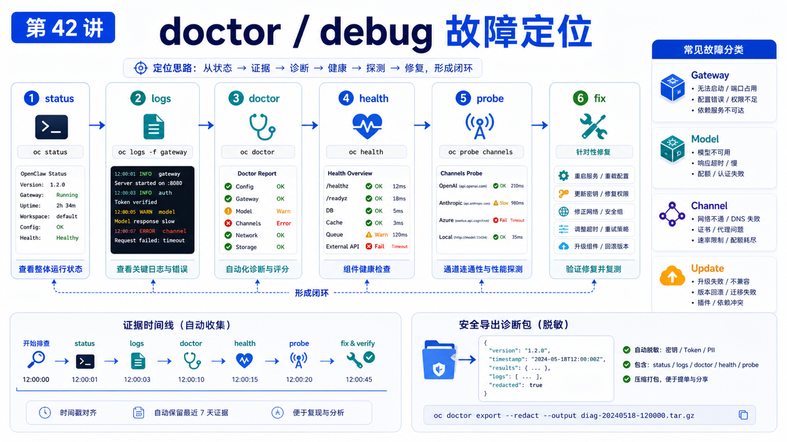

# doctor / debug：常见错误如何定位



OpenClaw 出问题时，最糟糕的排错方式是凭感觉乱改配置。

今天改端口，明天删 token，后天重装插件，最后你已经不知道是哪一步把系统弄坏的。

这一讲给你一个固定排错顺序。

## 先说结论：先观察，再修复

排错流程应该是：

```text
status
  -> gateway status
  -> logs
  -> doctor
  -> health
  -> channels probe
  -> targeted fix
```

不要跳过观察阶段直接 `--fix`。

## 第一层：快速状态

先跑：

```bash
openclaw status
openclaw gateway status
```

你要看：

```text
Gateway 是否可达
Runtime 是否 running
Connectivity probe 是否 ok
当前版本和更新提示
最近会话和通道状态
```

如果这里已经显示 Gateway 不可达，不要继续查模型。

先修 Gateway。

## 第二层：日志

看日志：

```bash
openclaw logs --follow
```

日志的作用不是“看有没有红字”，而是找时间线：

```text
Gateway 什么时候启动
配置什么时候加载
插件什么时候注册
模型请求什么时候失败
通道什么时候断开
是否有 protocol mismatch
是否有 401 / 403 / 429
```

排错时，永远把用户报告的时间点和日志时间点对齐。

## 第三层：doctor

`openclaw doctor` 是修复和迁移工具。

常用模式：

```bash
openclaw doctor
openclaw doctor --lint
openclaw doctor --lint --json
openclaw doctor --fix
openclaw doctor --deep
```

区别：

```text
doctor
  交互式检查

--lint
  只读，适合 CI 或部署前检查

--fix
  应用推荐修复

--deep
  扫描额外 Gateway 服务、supervisor、旧进程
```

先 `doctor` 或 `--lint`，再决定是否 `--fix`。

## 第四层：health

健康检查命令：

```bash
openclaw health
openclaw health --verbose
openclaw health --json
openclaw status --deep
```

它能告诉你：

```text
Gateway 内部健康快照
通道连接状态
session store 摘要
probe 时长
是否 reachable
```

如果你在 Docker 中，还可以查：

```bash
curl -fsS http://127.0.0.1:18789/healthz
curl -fsS http://127.0.0.1:18789/readyz
```

## 常见错误定位

### Gateway 起不来

顺序：

```text
端口是否冲突
config schema 是否错误
Node 版本是否满足
state dir 权限是否正确
supervisor 是否指向旧 binary
```

命令：

```bash
openclaw gateway status --deep
openclaw doctor --deep
openclaw logs --follow
```

### 模型调用失败

看：

```text
Provider key 是否可用
模型名是否存在
是否 401 / 403 / 429
fallback 是否配置
长上下文是否触发额外限制
```

不要把所有模型错误都归因于 OpenClaw。上游 WAF、额度、地区和账号权限都可能导致失败。

### 通道收不到消息

看：

```bash
openclaw channels status --probe
openclaw health --verbose
```

再查：

```text
账号是否已登录
allowlist 是否允许发送者
群聊是否需要 mention
channel health monitor 是否在重启
```

### 更新后坏了

官方 troubleshooting 给出的顺序：

```bash
openclaw status --all
openclaw update status --json
openclaw gateway status --deep
openclaw doctor --fix
openclaw gateway restart
```

重点看是否有旧 binary、新 config、protocol mismatch 或插件依赖损坏。

## 诊断导出

如果要给别人看，可以用：

```bash
openclaw gateway diagnostics export
```

官方文档说明，导出包会包含摘要、稳定性 bundle、脱敏日志元数据、Gateway status/health 快照和配置形状。

它不会包含聊天正文、webhook body、工具输出、凭据、cookie、账号/message 标识和 secret 值。

## 常见误解

### 误解一：doctor --fix 是万能重装

不是。它是按规则修复和迁移，不替你判断所有业务问题。

### 误解二：日志越多越好

日志要和时间线、错误码、配置变更对应起来看。

### 误解三：Gateway healthy 等于通道 healthy

不一定。Gateway 活着，某个 channel 仍可能掉线或权限不对。

### 误解四：更新后问题只能回滚

不一定。很多是旧服务、旧 client、旧插件状态或 config migration 未完成。

## 最后总结

排错的关键是建立证据链。

一句话总结：

```text
先 status，再 logs，再 doctor，再 health，最后做最小修复；不要凭感觉改配置。
```

## 本节作业

1. 跑一次 `openclaw status --all`。
2. 跑一次 `openclaw doctor --lint --json`，观察结构化输出。
3. 找到最近的 Gateway 日志。
4. 设计一条“模型 401”问题的排查路径。
5. 生成一次 diagnostics export，并确认它是脱敏包。

## 下一节预告

下一节讲性能问题：慢请求、长上下文、CPU 占用和并发任务。

## 参考资料

- OpenClaw Docs：[Doctor](https://docs.openclaw.ai/gateway/doctor)
- OpenClaw Docs：[Troubleshooting](https://docs.openclaw.ai/gateway/troubleshooting)
- OpenClaw Docs：[Health checks](https://docs.openclaw.ai/gateway/health)
- OpenClaw Docs：[Diagnostics export](https://docs.openclaw.ai/gateway/diagnostics)
- OpenClaw Docs：[Gateway logging](https://docs.openclaw.ai/gateway/logging)

