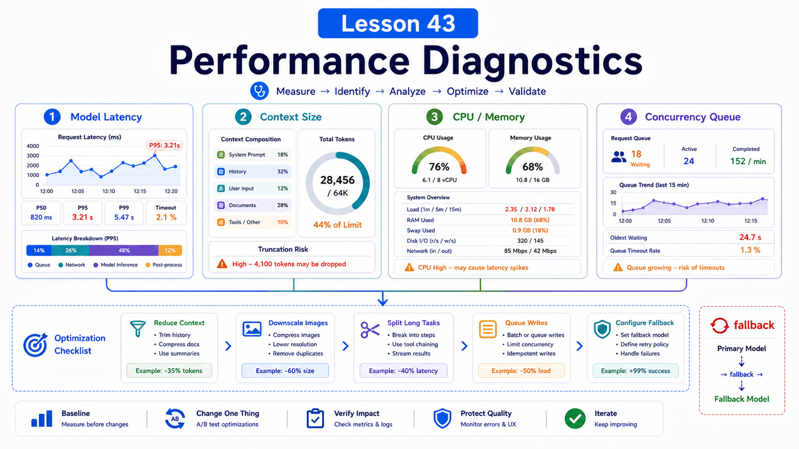

# Performance: Slow Requests, Long Context, CPU Usage, and Concurrent Tasks



"The agent is slow" rarely has one cause.

It may be the model, context size, screenshots, a stuck tool, or too many tasks running at once.

This lesson focuses on locating the bottleneck before optimizing.

## The Key Idea: Classify Before Optimizing

Put performance issues into four buckets:

```text
model latency
context volume
local resources
concurrency and queues
```

Each bucket needs a different fix.

## Slow Requests: Split the Timeline

A single request may include:

```text
receive user input
load session history
prepare context
first model token
streaming output
tool call
tool result injection
final response
```

When someone says "slow," ask:

```text
Is first token slow?
Is tool execution slow?
Is completion slow?
Is it only screenshot-heavy work?
Do all models behave the same?
```

If the delay happens before the model request, suspect context preparation or tools.

If it happens after the model request, suspect upstream latency, long context, rate limits, or network.

## Long Context Is Not Always Better

Long context brings:

```text
higher token cost
longer request time
more provider limit risk
more truncation or compaction work
more attention noise
```

The troubleshooting docs note that long-context Anthropic requests can hit eligibility or quota limits and return 429.

Fixes include:

```text
remove unrelated history
compact old conversation
downscale screenshots
summarize or retrieve long files
use standard-window models
configure fallbacks
```

`agents.defaults.imageMaxDimensionPx` can reduce transcript/tool image size, which helps screenshot-heavy sessions.

## CPU and Memory Pressure

Common sources:

```text
browser automation
multiple long shell tasks
large file parsing
image and PDF processing
plugin background jobs
low-memory Docker hosts
```

Useful diagnostics:

```bash
openclaw health --verbose
openclaw gateway stability --bundle latest
openclaw logs --follow
```

The health docs describe diagnostics that record RSS/heap, event-loop delay, CPU-core ratio, and active/waiting/queued session counts.

Those facts are more useful than "it feels high."

## Concurrency and Queues

More concurrency is not always better.

Too much can cause:

```text
provider rate limits
tools fighting over files
browser resource contention
session lock waits
simultaneous compaction
visible reply latency
```

Separate:

```text
same-session sequential work
cross-session parallel work
tool-internal concurrency
plugin background concurrency
provider concurrency limits
```

Optimization is often about queueing risky writes and parallelizing safe reads.

## Performance Checklist

Use this order:

```text
1. identify the slow segment
2. reduce context and image size
3. remove irrelevant tool calls
4. configure model fallback
5. split long tasks into stages
6. isolate heavy tasks in a workspace or queue
7. observe health, stability, and logs
```

Do not start by buying a bigger server.

## Common Misunderstandings

### A stronger model is always faster

Not necessarily. It may be slower, more expensive, and subject to stricter context limits.

### More context always improves quality

Relevant context matters more than huge context.

### High CPU means a bug

Browsers, PDFs, images, builds, and indexes can legitimately use CPU. Watch duration and user impact.

### More concurrency always improves throughput

After provider, CPU, memory, file-lock, or browser limits, concurrency increases waiting and failure.

## Final Summary

Performance tuning starts with diagnosis.

```text
Break slow work into model, context, resource, and concurrency buckets, then make the smallest targeted change.
```

## Exercises

1. Draw the timeline for one slow request.
2. Check whether screenshots or long files enter context.
3. Run `openclaw health --verbose`.
4. Design a staged plan for a long task.
5. Plan fallback behavior for an expensive model.

## Next Lesson Preview

Next we cover upgrades and migration: protecting config and data as versions change.

## References

- OpenClaw Docs: [Health checks](https://docs.openclaw.ai/gateway/health)
- OpenClaw Docs: [Troubleshooting](https://docs.openclaw.ai/gateway/troubleshooting)
- OpenClaw Docs: [Model failover](https://docs.openclaw.ai/concepts/model-failover)
- OpenClaw Docs: [Configuration](https://docs.openclaw.ai/gateway/configuration)
- OpenClaw Docs: [OpenTelemetry export](https://docs.openclaw.ai/gateway/opentelemetry)

