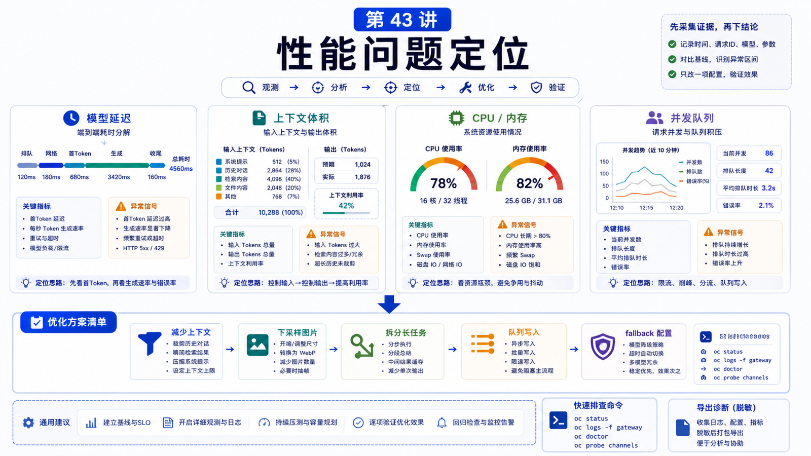

# 性能问题：慢请求、长上下文、CPU 占用和并发任务



Agent 系统的“慢”，通常不是一个原因。

可能是模型慢，可能是上下文太长，可能是截图太大，可能是工具卡住，也可能是同时跑了太多任务。

这一讲不追求一次性调到极致，而是教你定位瓶颈在哪里。

## 先说结论：先分类，再优化

性能问题先分成四类：

```text
模型延迟
上下文体积
本机资源
并发和排队
```

不同类型的解决办法完全不同。

## 慢请求：先拆时间线

一次请求可能包含：

```text
接收用户输入
加载会话历史
整理上下文
模型首 token
流式输出
工具调用
工具结果回填
最终回复
```

用户说“慢”，你要先问：

```text
是首 token 慢？
是工具执行慢？
是最终完成慢？
是只有截图任务慢？
是所有模型都慢？
```

如果日志显示模型请求前已经花很久，问题可能在上下文整理或工具。

如果模型请求后才慢，可能是上游模型、长上下文、限流或网络。

## 长上下文：不是越大越好

长上下文会带来：

```text
更多 token 成本
更长请求时间
更高 provider 限制风险
更多压缩/截断工作
更复杂的注意力负担
```

官方 troubleshooting 中提到 Anthropic 长上下文可能触发额外资格或额度限制，出现 429。

处理思路：

```text
减少无关历史
压缩旧对话
降低截图尺寸
把长文件改为检索或摘要
用标准上下文模型替代超长上下文
配置 fallback
```

OpenClaw 配置里 `agents.defaults.imageMaxDimensionPx` 可以控制 transcript/tool image 下采样，截图重的任务尤其有用。

## CPU 和内存压力

本机资源问题常见于：

```text
大量浏览器自动化
多个 Shell 长任务
大型文件解析
图片和 PDF 处理
插件后台任务
Docker 内存不足
```

诊断方式：

```bash
openclaw health --verbose
openclaw gateway stability --bundle latest
openclaw logs --follow
```

OpenClaw 健康文档提到，诊断事件会记录 RSS/heap、事件循环延迟、CPU-core ratio、活跃/等待/排队 session 等运行事实。

这些比“感觉 CPU 很高”更有用。

## 并发和排队

Agent 任务不是越并发越好。

并发过高会导致：

```text
Provider 限流
工具互相争文件
浏览器实例抢资源
session 锁等待
上下文压缩同时进行
用户看到回复延迟
```

你要区分：

```text
同一会话内顺序任务
不同会话并行任务
工具内部并发
插件后台并发
模型 Provider 并发限制
```

优化并发不是简单“开更多 worker”，而是把高风险任务排队，把只读任务并行。

## 性能优化清单

优先级建议：

```text
1. 找到慢在哪一段
2. 降低上下文和图片体积
3. 减少无关工具调用
4. 设置模型 fallback
5. 把长任务拆成阶段
6. 给重任务单独 workspace 或队列
7. 观察 health / stability / logs
```

不要第一步就换服务器。

## 常见误解

### 误解一：换更强模型一定更快

不一定。更强模型可能更慢、更贵，长上下文路径也可能限制更多。

### 误解二：上下文越长效果越好

上下文越长，噪声也越多。好上下文是相关，不是巨大。

### 误解三：CPU 高就是 bug

浏览器、PDF、图片、构建和索引都可能合理消耗 CPU。关键看是否持续、是否阻塞事件循环、是否影响用户。

### 误解四：并发越高吞吐越高

达到 Provider、CPU、内存、文件锁或浏览器资源上限后，并发只会增加排队和失败。

## 最后总结

性能优化是定位问题，不是盲目加资源。

一句话总结：

```text
先把慢请求拆成模型、上下文、资源和并发四类，再针对瓶颈做最小优化。
```

## 本节作业

1. 找一个慢请求，画出它的时间线。
2. 检查是否有大截图或长文件进入上下文。
3. 运行 `openclaw health --verbose`，观察健康字段。
4. 设计一个长任务拆分方案。
5. 为高成本模型配置 fallback 思路。

## 下一节预告

下一节讲升级与迁移：版本变化时怎么保护配置和数据。

## 参考资料

- OpenClaw Docs：[Health checks](https://docs.openclaw.ai/gateway/health)
- OpenClaw Docs：[Troubleshooting](https://docs.openclaw.ai/gateway/troubleshooting)
- OpenClaw Docs：[Model failover](https://docs.openclaw.ai/concepts/model-failover)
- OpenClaw Docs：[Configuration](https://docs.openclaw.ai/gateway/configuration)
- OpenClaw Docs：[OpenTelemetry export](https://docs.openclaw.ai/gateway/opentelemetry)

