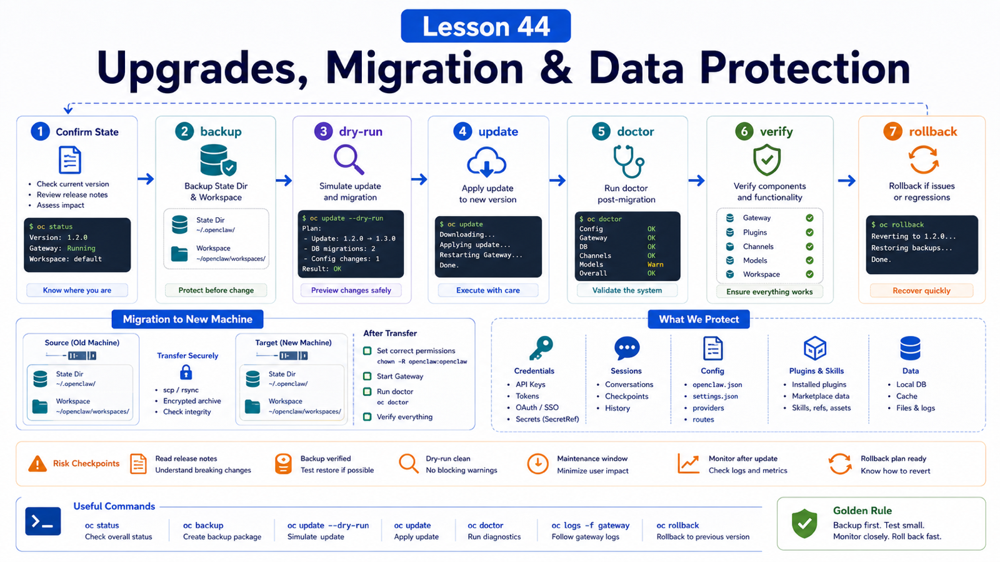

# Upgrades and Migration: Protecting Config and Data Across Versions



The scariest upgrade problem is not failure.

It is failure without a path back.

OpenClaw manages CLI code, Gateway service state, plugins, config schema, state directory, workspace, and channel credentials. Without a backup and verification checklist, recovery becomes luck.

## The Key Idea: Make Upgrades Recoverable

A safe upgrade order:

```text
confirm current state
back up state dir and workspace
preview update
apply update
run doctor
restart Gateway
verify status and channels
record version and changes
```

The goal is not "nothing ever fails." The goal is diagnosable, recoverable change.

## Recommended Update Path

Use:

```bash
openclaw update
```

It detects install type, fetches the target version, runs doctor, and restarts the Gateway.

Preview:

```bash
openclaw update --dry-run
openclaw update status --json
```

Channels:

```bash
openclaw update --channel stable
openclaw update --channel beta
openclaw update --channel dev
```

Avoid making manual `npm i -g` your first choice, especially while a managed Gateway is running. The docs warn that replacing a package tree while the Gateway runs can leave it reading a half-swapped install.

## What to Back Up

At minimum:

```text
~/.openclaw/
workspace
Docker .env
compose override
reverse proxy config
external secret provider config
```

For machine migration, the docs say to copy the state directory and workspace, not just `openclaw.json`.

Example:

```bash
openclaw gateway stop
cd ~
tar -czf openclaw-state.tgz .openclaw
```

If you use multiple profiles or custom `OPENCLAW_STATE_DIR`, back up each one.

## Verify After Upgrade

Run:

```bash
openclaw --version
curl -fsS http://127.0.0.1:18789/readyz
openclaw plugins list --json
openclaw gateway status --deep --json
openclaw doctor --lint --json
openclaw channels status --probe
```

Confirm:

```text
Gateway version is correct
port is reachable
config validates
plugins load
channels stay connected
model auth works
workspace files remain present
```

## Move to a New Machine

Migration flow:

```text
1. stop Gateway on old machine
2. archive state dir
3. archive workspace
4. install OpenClaw on new machine
5. extract state dir and workspace
6. fix ownership and permissions
7. run doctor
8. restart Gateway
9. verify channels and sessions
```

If sessions or channel logins disappear, check:

```text
same profile?
same OPENCLAW_STATE_DIR?
credentials copied?
file owner correct?
workspace path still valid?
```

## Version Changes and Config Protection

OpenClaw config uses a strict schema. New versions may migrate fields, deprecate keys, or change plugin contracts.

Protect yourself:

```text
save openclaw.json before upgrade
use update --dry-run
run doctor --lint read-only
after upgrade, use doctor --fix for migrations
do not use an old binary to mutate config written by a newer version
```

The troubleshooting docs describe `meta.lastTouchedVersion`, which prevents older binaries from performing dangerous actions against newer config.

That guard is protection, not friction.

## Plugin Upgrades

Check plugins separately:

```text
same plugin id?
config schema changed?
contracts.tools changed?
optional tools and allowlist still valid?
dependency tree intact?
runtime inspect sees tools?
```

Do not trust only the install record. Verify runtime registration.

## Common Misunderstandings

### If update fails, reinstall immediately

Reinstalling can erase clues. Start with status, update status, doctor, and logs.

### Backing up `openclaw.json` is enough

No. Auth profiles, credentials, sessions, channel state, and plugins may be in state.

### If the UI opens, migration is done

Still verify channels, models, workspace, plugins, and history.

### Older versions can freely edit newer config

They should not. Version guards protect the schema and service state.

## Final Summary

Upgrades and migrations are data-protection work, not just install work.

```text
Back up before upgrading, preview before applying, run doctor after, and migrate both state directory and workspace.
```

## Exercises

1. Run `openclaw update --dry-run`.
2. Write backup commands for your state directory and workspace.
3. Design a post-upgrade verification checklist.
4. Check whether any plugin needs separate upgrade verification.
5. Draft a new-machine migration directory list.

## Next Lesson Preview

Next we enter real-world scenarios, starting with Enterprise WeChat, Telegram, and WhatsApp integration ideas.

## References

- OpenClaw Docs: [Updating](https://docs.openclaw.ai/install/updating)
- OpenClaw Docs: [Migration guide](https://docs.openclaw.ai/install/migrating)
- OpenClaw Docs: [Doctor](https://docs.openclaw.ai/gateway/doctor)
- OpenClaw Docs: [Troubleshooting](https://docs.openclaw.ai/gateway/troubleshooting)
- OpenClaw Docs: [Manage plugins](https://docs.openclaw.ai/plugins/manage-plugins)

