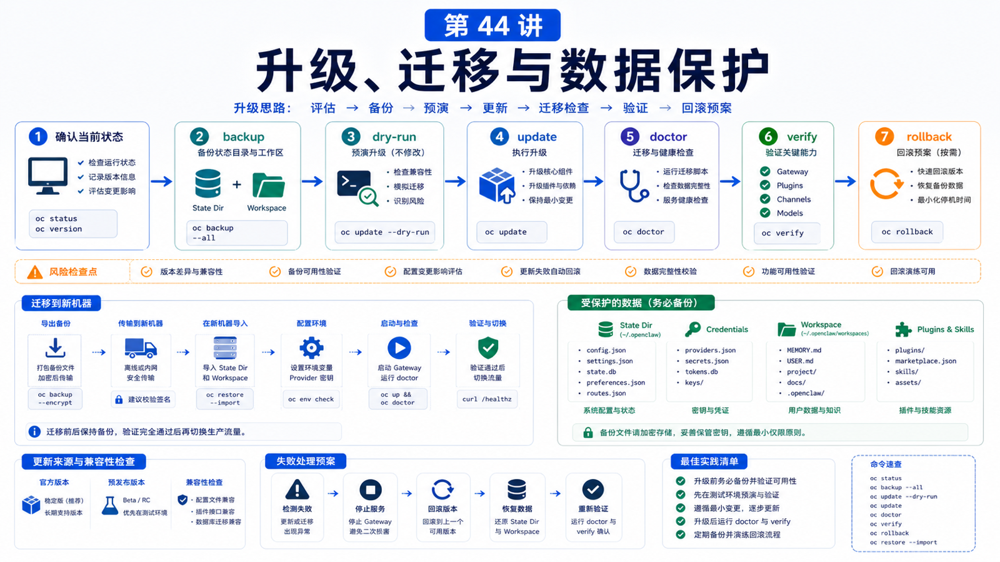

# 升级与迁移：版本变化时怎么保护配置和数据



升级最怕的不是失败。

最怕的是：失败以后你不知道怎么回去。

OpenClaw 会管理 CLI、Gateway、插件、配置 schema、state dir、workspace 和通道凭据。升级前没有备份和验证清单，出问题时就只能凭运气。

## 先说结论：升级前先保证可恢复

安全升级的顺序：

```text
确认当前状态
备份 state dir 和 workspace
预览更新
执行更新
运行 doctor
重启 Gateway
验证状态和通道
记录版本与变更
```

核心目标不是“永远不出错”，而是“出错可诊断、可回滚、可迁移”。

## 推荐更新方式

官方推荐：

```bash
openclaw update
```

它会检测安装类型，拉取新版本，运行 doctor，并重启 Gateway。

预览：

```bash
openclaw update --dry-run
openclaw update status --json
```

切换通道：

```bash
openclaw update --channel stable
openclaw update --channel beta
openclaw update --channel dev
```

不要把手工 `npm i -g` 当作首选，特别是托管 Gateway 正在运行时。官方文档提醒，手工替换 package tree 时，运行中的 Gateway 可能读到半替换状态。

## 升级前备份什么

至少：

```text
~/.openclaw/
workspace
Docker .env
compose override
反向代理配置
外部 secret provider 配置
```

迁移到新机器时，官方 migration 文档要求复制 state directory 和 workspace，而不是只复制 `openclaw.json`。

备份命令示意：

```bash
openclaw gateway stop
cd ~
tar -czf openclaw-state.tgz .openclaw
```

如果有多个 profile 或自定义 `OPENCLAW_STATE_DIR`，分别备份。

## 升级后的验证

升级后跑：

```bash
openclaw --version
curl -fsS http://127.0.0.1:18789/readyz
openclaw plugins list --json
openclaw gateway status --deep --json
openclaw doctor --lint --json
openclaw channels status --probe
```

你要确认：

```text
Gateway 版本正确
端口可达
配置通过 schema
插件能加载
通道还在线
模型 auth 没坏
workspace 文件还在
```

## 迁移到新机器

迁移步骤：

```text
1. 老机器停止 Gateway
2. 打包 state dir
3. 打包 workspace
4. 新机器安装 OpenClaw
5. 解压 state dir 和 workspace
6. 修复 owner/permission
7. 运行 doctor
8. 重启 Gateway
9. 验证通道和会话
```

如果新机器看不到旧会话或通道登录态，优先查：

```text
是否用了同一个 profile
OPENCLAW_STATE_DIR 是否一致
credentials 是否复制
文件 owner 是否正确
workspace 路径是否仍然有效
```

## 版本变化和配置保护

OpenClaw 配置有严格 schema。新版本可能引入字段迁移、废弃旧字段或改变插件 contract。

保护策略：

```text
升级前保存 openclaw.json
使用 update --dry-run
用 doctor --lint 做只读检查
升级后用 doctor --fix 应用迁移
不要用旧 binary 操作新版本写过的 config
```

官方 troubleshooting 提到，OpenClaw 会用 `meta.lastTouchedVersion` 防止旧二进制对新配置做危险变更。

这不是麻烦，而是保护。

## 插件升级

插件也要单独看：

```text
plugin id 是否不变
config schema 是否变更
contracts.tools 是否变更
optional tools / allowlist 是否仍然有效
依赖树是否完整
runtime inspect 是否能看到工具
```

升级后不要只看插件安装记录，要验证运行时是否注册成功。

## 常见误解

### 误解一：升级失败就重装

重装可能覆盖线索。先看 status、update status、doctor、logs。

### 误解二：只备份 openclaw.json 就够

不够。auth profiles、credentials、sessions、channel state、plugins 都可能在 state dir。

### 误解三：能打开 UI 就说明迁移完成

还要验证通道、模型、workspace、插件和历史会话。

### 误解四：旧版本能随便操作新配置

不应该。版本保护能避免旧二进制破坏新 schema。

## 最后总结

升级和迁移是数据保护问题，不只是安装问题。

一句话总结：

```text
升级前备份，升级中预览，升级后 doctor；迁移时复制 state dir 和 workspace，验证 Gateway、通道、插件和模型。
```

## 本节作业

1. 运行 `openclaw update --dry-run`。
2. 写出你机器上的 state dir 和 workspace 备份命令。
3. 设计一份升级后验证清单。
4. 检查插件是否需要单独升级或验证。
5. 模拟一次迁移到新机器的目录清单。

## 下一节预告

下一部分进入真实场景实战：企业微信 / Telegram / WhatsApp 接入思路。

## 参考资料

- OpenClaw Docs：[Updating](https://docs.openclaw.ai/install/updating)
- OpenClaw Docs：[Migration guide](https://docs.openclaw.ai/install/migrating)
- OpenClaw Docs：[Doctor](https://docs.openclaw.ai/gateway/doctor)
- OpenClaw Docs：[Troubleshooting](https://docs.openclaw.ai/gateway/troubleshooting)
- OpenClaw Docs：[Manage plugins](https://docs.openclaw.ai/plugins/manage-plugins)

