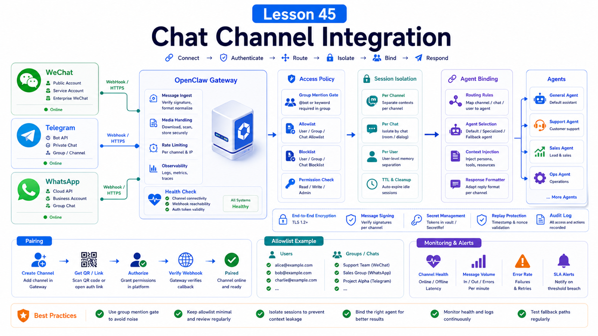

# Enterprise WeChat, Telegram, and WhatsApp Integration Patterns



Connecting an agent to chat looks simple: receive a message, send a reply.

In production, the hard questions are different:

```text
Who can DM the bot?
Must group messages mention it?
Can one account serve multiple people?
Should different customers route to different agents?
Can one user's context leak into another user's session?
Can group members drive the same tool authority?
```

This lesson uses WeChat, Telegram, and WhatsApp to explain channel design in OpenClaw.

## The Key Idea: A Channel Is an Entry Point, Not the Whole Permission Model

An OpenClaw channel normalizes external messages and routes them to agents.

A production channel design needs:

```text
channel login and account model
DM / group access policy
pairing / allowlist
mention gating
session isolation
agent bindings
tool policy
health monitoring
```

A token or QR login is only the beginning.

## Three Channel Shapes

### Telegram

Telegram uses a bot-token model.

Flow:

```text
create bot in BotFather
configure botToken
set dmPolicy / allowFrom
configure groups and requireMention
start Gateway
approve pairing or use allowlists
```

The docs note that long polling is the default and webhooks are optional. Groups also involve Privacy Mode, admin status, group chat IDs, and user IDs.

Example:

```json5
{
  channels: {
    telegram: {
      enabled: true,
      botToken: "123:abc",
      dmPolicy: "pairing",
      allowFrom: ["tg:123456789"],
      groupPolicy: "allowlist",
      groups: {
        "-1001234567890": { requireMention: true },
      },
    },
  },
}
```

### WhatsApp

WhatsApp runs through the Gateway web channel and starts automatically after a linked session exists.

Care about:

```text
linked account state
multi-account config
dmPolicy
allowFrom
groupPolicy
groupAllowFrom
textChunkLimit
mediaMaxMb
health monitoring
```

Example:

```json5
{
  web: { enabled: true },
  channels: {
    whatsapp: {
      dmPolicy: "pairing",
      allowFrom: ["+15555550123"],
      groups: { "*": { requireMention: true } },
      groupPolicy: "allowlist",
    },
  },
}
```

### Enterprise WeChat / WeChat

OpenClaw documents WeChat integration through the external `@tencent-weixin/openclaw-weixin` plugin.

That separation matters. Login, Tencent iLink API calls, media transfer, and account monitoring are owned by the external channel plugin, not OpenClaw core.

Simplified flow:

```text
install openclaw-weixin plugin
enable plugin
restart Gateway
scan QR code
plugin stores account credentials
Gateway loads the plugin and starts monitors
messages are normalized through the channel contract
agent replies through the plugin outbound path
```

Commands:

```bash
npx -y @tencent-weixin/openclaw-weixin-cli install
openclaw gateway restart
openclaw channels login --channel openclaw-weixin
```

If your target is Enterprise WeChat rather than personal WeChat, confirm whether you have a channel plugin, a webhook flow, or need to build a new channel integration. Those are not the same architecture.

## Entry Control: Pairing, Allowlist, Open

DM policy choices:

```text
pairing
  unknown senders get a code for approval

allowlist
  only configured senders can trigger

open
  anyone can trigger, requires allowFrom: ["*"]

disabled
  ignore DMs
```

Production defaults:

```text
personal assistant: pairing or allowlist
team group: allowlist + requireMention
public bot: open + very narrow tool policy
```

## Group Chats Need Extra Care

Groups need at least two checks:

```text
Is this group allowed?
Which senders in the group are allowed?
```

Also decide:

```text
must the bot be mentioned?
can unmentioned context be read?
are replies automatically visible?
do group members share tool authority?
```

Start with `requireMention: true`.

## Session Isolation

OpenClaw can share one main DM session by default, which is convenient for a single-user assistant.

If multiple people can DM the bot, isolate sessions:

```json5
{
  session: {
    dmScope: "per-channel-peer",
  },
}
```

For multi-account setups:

```json5
{
  session: {
    dmScope: "per-account-channel-peer",
  },
}
```

Without this, one person's context can affect another's conversation.

## Multi-Agent Bindings

If one Gateway serves several people or business units, session isolation may not be enough.

Multiple agents can have separate:

```text
workspace
agentDir
auth profiles
session store
skills
model config
```

Bindings route channel accounts, groups, or users to the right agent.

Use this for:

```text
support agent
engineering agent
finance agent
customer-specific agents
multiple WhatsApp numbers
multiple Telegram bots
```

## Common Misunderstandings

### Receiving messages means integration is complete

No. Access, groups, sessions, tools, and health all matter.

### Pairing authorizes the user everywhere

Not necessarily. Telegram separates DM pairing from group sender authorization.

### Everyone in a group can safely use the tools

If tools read files, send messages, or run commands, group members share delegated authority.

### Enterprise WeChat, WeChat, and Weixin are the same integration

They may require different plugins or webhook models.

## Final Summary

Chat channels are where routing, context, and permission meet.

```text
Design who can speak, which agent receives it, what context is shared, and which tools are allowed before wiring Telegram, WhatsApp, or WeChat.
```

## Exercises

1. Design Telegram `groups`, `groupPolicy`, and `requireMention` for one group.
2. Write single-account and multi-account WhatsApp session isolation strategies.
3. Decide whether your WeChat need is plugin, webhook, or custom channel work.
4. List allowed and denied tools for one chat entry point.

## Next Lesson Preview

Next we build a web automation assistant from user need to Browser execution flow.

## References

- OpenClaw Docs: [Telegram](https://docs.openclaw.ai/channels/telegram)
- OpenClaw Docs: [WeChat](https://docs.openclaw.ai/channels/wechat)
- OpenClaw Docs: [Channel configuration](https://docs.openclaw.ai/gateway/config-channels)
- OpenClaw Docs: [Session management](https://docs.openclaw.ai/concepts/session)
- OpenClaw Docs: [Multi-agent routing](https://docs.openclaw.ai/concepts/multi-agent)

---

Original link: [Enterprise WeChat, Telegram, and WhatsApp Integration Patterns](https://en.harries.blog/enterprise-wechat-telegram-and-whatsapp-integration-patterns/)
