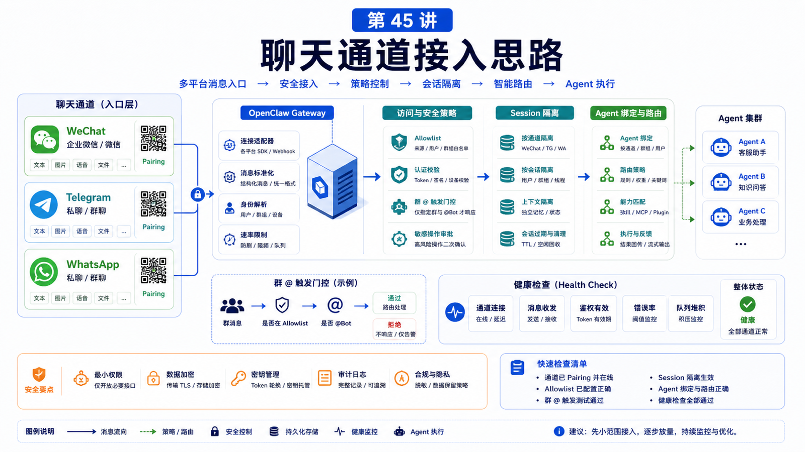

# 企业微信 / Telegram / WhatsApp 接入思路



把 Agent 接到聊天软件里，看起来只是“收消息、回消息”。

真正上线后你会发现，难点不在发一条回复，而在这些问题：

```text
谁可以私聊？
群里是否必须 @ 才触发？
一个账号要不要服务多个人？
不同客户要不要不同 Agent？
消息历史能不能串到别人那里？
工具权限是否会被群成员共同驱动？
```

这一讲用企业微信 / WeChat、Telegram、WhatsApp 三类通道，讲 OpenClaw 接入聊天入口时的设计思路。

## 先说结论：Channel 是入口，不是权限边界的全部

OpenClaw 的消息通道负责把外部消息标准化后路由给 Agent。

但一个安全可用的接入方案至少要同时设计：

```text
Channel 登录和账号
DM / group access policy
pairing / allowlist
mention gating
session isolation
agent binding
tool policy
health monitoring
```

只配置 token 或扫码登录，离“可上线”还差很远。

## 三种通道的接入形态

### Telegram

Telegram 是典型 Bot API 形态。

流程：

```text
BotFather 创建 bot
配置 botToken
设置 dmPolicy / allowFrom
配置 groups 和 requireMention
启动 Gateway
审批 pairing 或使用 allowlist
```

官方文档提醒：Telegram 默认使用 long polling，webhook 是可选的；群里还要考虑 Privacy Mode、管理员权限、group chat ID 和用户 ID。

典型配置：

```json5
{
  channels: {
    telegram: {
      enabled: true,
      botToken: "123:abc",
      dmPolicy: "pairing",
      allowFrom: ["tg:123456789"],
      groupPolicy: "allowlist",
      groups: {
        "-1001234567890": { requireMention: true },
      },
    },
  },
}
```

### WhatsApp

WhatsApp 走 Gateway 的 web channel，链接会话后自动启动。

你要关心：

```text
账号登录态
多账号 accounts
dmPolicy
allowFrom
groupPolicy
groupAllowFrom
textChunkLimit
mediaMaxMb
health monitor
```

典型配置：

```json5
{
  web: { enabled: true },
  channels: {
    whatsapp: {
      dmPolicy: "pairing",
      allowFrom: ["+15555550123"],
      groups: { "*": { requireMention: true } },
      groupPolicy: "allowlist",
    },
  },
}
```

### 企业微信 / WeChat

OpenClaw 文档里 WeChat 通过外部插件 `@tencent-weixin/openclaw-weixin` 接入。

这个点很重要：WeChat 的登录、腾讯 iLink API、媒体上传下载、账号监控，不在 OpenClaw core 里，而由外部 channel plugin 实现。

简化流程：

```text
安装 openclaw-weixin 插件
启用插件
重启 Gateway
扫码登录
插件保存账号凭据
Gateway 启动时加载插件并启动 monitor
消息经 channel contract 标准化后路由到 Agent
```

示例命令：

```bash
npx -y @tencent-weixin/openclaw-weixin-cli install
openclaw gateway restart
openclaw channels login --channel openclaw-weixin
```

如果你说的是企业微信而不是个人 WeChat，就要先确认目标通道是否已有对应插件或是否需要自己按 channel plugin SDK 接。不能把“企业微信机器人 webhook”和“个人 WeChat 登录插件”混为一谈。

## 入口控制：pairing、allowlist、open

DM policy 常见选项：

```text
pairing
  未知发送者拿到一次性 code，人工批准

allowlist
  只有配置里的发送者可触发

open
  所有人可触发，必须配合 allowFrom: ["*"]

disabled
  禁用 DM
```

生产环境里，默认建议：

```text
个人助手：pairing 或 allowlist
团队群：allowlist + requireMention
公开 bot：open + 极窄工具权限
```

## 群聊要特别小心

群里至少有两层控制：

```text
这个群能不能触发？
这个群里的哪个人能触发？
```

还要考虑：

```text
是否要求 @
是否读取未 @ 的上下文
回复是自动可见还是必须 message tool
群成员是否共享同一工具权限
```

这就是为什么群聊最好先从 `requireMention: true` 开始。

## Session 隔离

OpenClaw 默认 DM 可以共享一个主 session，这对单用户助手很方便。

但如果多个用户能 DM 同一个 bot，必须启用隔离：

```json5
{
  session: {
    dmScope: "per-channel-peer",
  },
}
```

多账号场景更推荐：

```json5
{
  session: {
    dmScope: "per-account-channel-peer",
  },
}
```

否则 Alice 的上下文可能影响 Bob 的会话。

## 多 Agent 和绑定

如果一个 Gateway 服务多个人或多业务线，不要只靠 session 分隔。

多 Agent 可以拥有各自的：

```text
workspace
agentDir
auth profiles
session store
skills
model config
```

然后用 bindings 把某个 channel account、群、用户路由到对应 Agent。

这适合：

```text
客服 Agent
研发 Agent
财务 Agent
不同客户的独立助手
不同 WhatsApp 号码
不同 Telegram bot
```

## 常见误解

### 误解一：能收到消息就接入完成

不够。还要处理权限、群聊、session、工具和健康检查。

### 误解二：pairing 后这个用户在哪里都授权

不一定。Telegram 文档明确区分 DM pairing 和 group sender authorization。

### 误解三：群里所有人都能用工具没问题

如果工具能读文件、发消息、跑命令，群成员实际上共享了同一套 delegated tool authority。

### 误解四：企业微信、WeChat、Weixin 是同一个接法

不一定。个人 WeChat 插件、企业微信机器人、企业应用回调是不同接入模型。

## 最后总结

聊天通道不是简单入口，而是权限、路由和上下文的交汇处。

一句话总结：

```text
先设计谁能说话、说给哪个 Agent、共享什么上下文、能用哪些工具，再配置 Telegram、WhatsApp 或 WeChat。
```

## 本节作业

1. 为一个 Telegram 群设计 `groups`、`groupPolicy` 和 `requireMention`。
2. 写出 WhatsApp 单账号和多账号的 session 隔离策略。
3. 判断你的 WeChat/企业微信需求属于插件、webhook 还是自建 channel。
4. 列出一个聊天入口允许的工具和禁止的工具。

## 下一节预告

下一节讲网页自动化助手：从需求到 Browser 执行链路。

## 参考资料

- OpenClaw Docs：[Telegram](https://docs.openclaw.ai/channels/telegram)
- OpenClaw Docs：[WeChat](https://docs.openclaw.ai/channels/wechat)
- OpenClaw Docs：[Channel configuration](https://docs.openclaw.ai/gateway/config-channels)
- OpenClaw Docs：[Session management](https://docs.openclaw.ai/concepts/session)
- OpenClaw Docs：[Multi-agent routing](https://docs.openclaw.ai/concepts/multi-agent)

