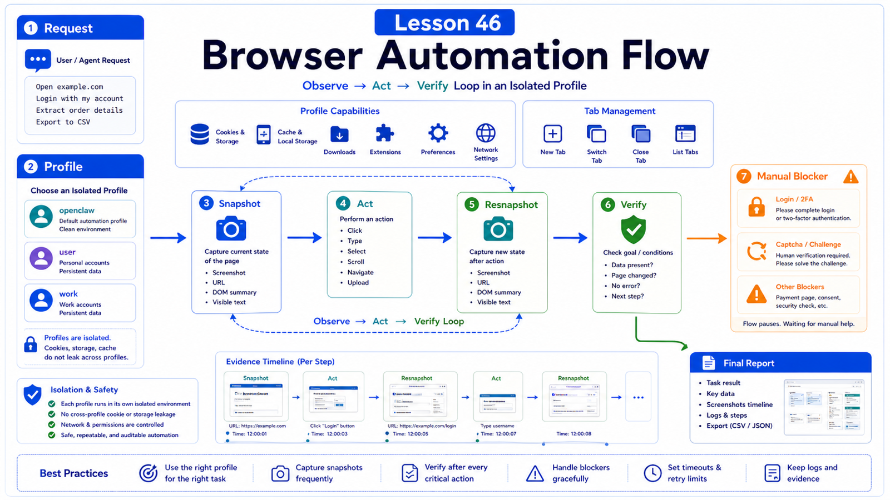

# Web Automation Assistant: From User Need to Browser Execution Flow



Web automation is easy to underestimate.

When a user says "fill out this form," the actual chain is long:

```text
understand task
choose browser profile
open page
observe DOM / snapshot
click and type
handle login / 2FA / captcha
wait for page changes
verify with screenshot
report result
```

This lesson is about the full execution flow, not just clicking buttons.

## The Key Idea: Browser Automation Is Observe-Act-Verify

OpenClaw can run a dedicated agent-only browser profile, and can attach to a real user browser profile when needed.

Either way, use:

```text
clarify goal
  -> choose profile
  -> check browser status
  -> open or select tab
  -> snapshot
  -> act
  -> resnapshot
  -> verify
  -> report result or blocker
```

Do not click blindly.

## Why Use an Isolated Profile

The managed browser is an agent-only browser.

It gives you:

```text
separation from daily browser profile
deterministic tabs
screenshots and snapshots
headless or visible mode
profile-level task isolation
```

Default profile is usually `openclaw`.

Use `profile="user"` only when existing login state matters, and tell the user that manual approval, login, or 2FA may be required.

## The Browser Tool Must Be Allowed

A coding tool profile may not include the full browser tool.

Allow it explicitly:

```json5
{
  tools: {
    profile: "coding",
    alsoAllow: ["browser"],
  },
}
```

Individual agents can also have their own tool allow settings.

## A Typical Execution Chain

```text
user request
  -> decide whether browser work is needed
  -> check browser status
  -> choose openclaw / user / work profile
  -> open URL or reuse tab
  -> snapshot page structure
  -> click / type / select
  -> wait for response
  -> resnapshot or screenshot
  -> verify completion
  -> return result and evidence
```

Snapshot and verification are the important parts.

Without observation, actions are fragile.

Without verification, "clicked" can be mistaken for "done."

## Login and Manual Blockers

Common blockers:

```text
not logged in
2FA
captcha
payment confirmation
permission popup
camera / microphone access
sensitive production action
```

Do not guess.

Instead:

```text
explain the blocker
ask the user to complete login or approval
keep the tab state
continue with a fresh snapshot
```

For payment, deletion, publishing, or bulk submission, require explicit confirmation.

## SSRF and Private Network Access

Browser automation is not just "opening websites."

If it can reach private network addresses, it can become an internal probing surface.

OpenClaw browser config includes SSRF policy; private-network access should be deliberate.

Principles:

```text
do not allow private network by default
use hostname allowlists for trusted tasks
review remote CDP and proxy config
treat browser access and Gateway exposure separately
```

## Real Scenario: Expense Form Drafting

Do not let the agent directly submit expenses in one shot.

Safer flow:

```text
1. open expense system
2. check login
3. read form fields
4. fill a draft from user-provided invoice data
5. show screenshot for confirmation
6. submit only after approval
7. capture confirmation number
```

This catches field mistakes before submission.

## Common Misunderstandings

### Browser automation is just a Playwright script

Agent workflows must handle uncertain pages, user blockers, interpretation, and verification.

### Clicking means the task is complete

Clicking is an action. Completion is a verified state.

### The real user browser is always easier

It is convenient but riskier. Prefer the isolated profile unless login state is required.

### Screenshots are only for the user

They are also evidence for verification and debugging.

## Final Summary

Reliable web automation comes from the loop, not from a single action.

```text
Observe, act, verify; return control to the user for login, captcha, payment, or production submission.
```

## Exercises

1. Draw a login-fill-confirm-submit flow.
2. Mark which steps are automatic and which need human confirmation.
3. Choose a browser profile for one task.
4. Define what evidence proves completion.

## Next Lesson Preview

Next we cover knowledge-base Q&A: RAG, file indexing, and permission boundaries.

## References

- OpenClaw Docs: [Browser](https://docs.openclaw.ai/tools/browser)
- OpenClaw Docs: [Security](https://docs.openclaw.ai/gateway/security)
- OpenClaw Docs: [Operator scopes](https://docs.openclaw.ai/gateway/operator-scopes)
- OpenClaw Docs: [Gateway configuration](https://docs.openclaw.ai/gateway/configuration)

---

Original link: [Web Automation Assistant: From User Need to Browser Execution Flow](https://en.harries.blog/web-automation-assistant-from-user-need-to-browser-execution-flow/)
