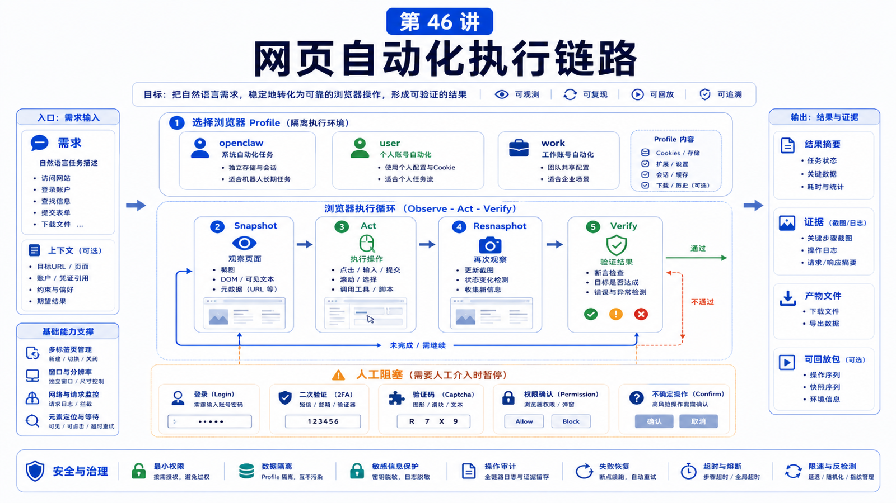

# 网页自动化助手：从需求到 Browser 执行链路



网页自动化最容易被低估。

用户说一句“帮我把这个表单填了”，背后其实是一条很长的执行链：

```text
理解任务
选择浏览器 profile
打开页面
观察 DOM / snapshot
点击和输入
处理登录 / 二次验证 / captcha
等待页面变化
截图验证
回传结果
```

这一讲不讲“怎么点按钮”这么小，而是讲一个可靠网页助手的完整链路。

## 先说结论：Browser 自动化是观察-行动-验证循环

OpenClaw managed Browser 可以使用独立的 agent-only browser profile，也可以在需要时附着到用户真实浏览器 profile。

但无论哪种模式，执行策略都应该是：

```text
明确目标
  -> 选择 profile
  -> 检查 browser 状态
  -> 打开或定位 tab
  -> snapshot
  -> act
  -> resnapshot
  -> verify
  -> 报告结果或人工阻塞
```

不要盲点。

## 为什么要用独立 profile

OpenClaw 文档把默认 managed browser 描述成 agent-only browser。

它的价值是：

```text
不碰你的日常浏览器 profile
可控 tab
可截图和 snapshot
可配置 headless / visible
可按 profile 隔离任务
```

默认 profile 通常是 `openclaw`。

如果任务必须使用用户已有登录态，才考虑 `profile="user"`，并且要让用户知道可能需要手动确认、登录或 2FA。

## Browser 工具需要被允许

如果工具 profile 是 coding，并不一定默认包含完整 browser tool。

可以在配置中显式允许：

```json5
{
  tools: {
    profile: "coding",
    alsoAllow: ["browser"],
  },
}
```

单个 agent 也可以配置自己的 tools allow。

## 一条典型执行链

```text
用户需求
  -> 判断是否需要网页操作
  -> 浏览器状态检查
  -> 选择 openclaw / user / work profile
  -> 打开 URL 或复用 tab
  -> snapshot 获取结构
  -> 点击 / 输入 / 选择
  -> 等待页面响应
  -> resnapshot 或 screenshot
  -> 校验目标是否完成
  -> 返回结果和证据
```

这里最关键的是 snapshot 和验证。

没有观察就行动，容易点错。

没有验证就回复，容易把“已点击”误当成“已完成”。

## 登录和人工阻塞

网页任务常见阻塞：

```text
未登录
2FA
captcha
支付确认
权限弹窗
摄像头 / 麦克风权限
敏感生产操作
```

遇到这些，不应该猜。

正确做法是：

```text
说明当前卡在哪里
请求用户完成登录或确认
保持 tab 状态
用户完成后继续 snapshot
```

尤其是付款、删除、发布、批量提交这类操作，应该有明确人工确认。

## SSRF 和私网访问

Browser 不只是“打开网页”。

如果允许它访问内网地址，就可能变成探测内部服务的工具。

OpenClaw browser config 有 SSRF policy，私网访问默认要谨慎启用。

原则：

```text
默认不要允许 private network
只给可信任务打开 hostname allowlist
远程 CDP 和代理配置要审查
浏览器访问权限和 Gateway 暴露权限分开看
```

## 真实场景：报销系统自动填写

不要让 Agent 一次性“直接提交报销”。

更稳的流程：

```text
1. 打开报销系统
2. 检查是否已登录
3. 读取表单字段
4. 根据用户提供的发票信息填写草稿
5. 截图给用户确认
6. 用户确认后再提交
7. 截图或记录提交编号
```

这样即使字段识别错，也能在提交前拦住。

## 常见误解

### 误解一：Browser 自动化就是 Playwright 脚本

不完全。Agent 场景要处理不确定页面、用户阻塞、上下文解释和验证。

### 误解二：能点击就能完成任务

点击只是动作。完成要靠页面状态验证。

### 误解三：用用户真实浏览器最方便

方便但风险高。默认用 isolated `openclaw` profile，只有登录态必要时才用 user profile。

### 误解四：截图只是给用户看的

截图也是验证证据，尤其在提交、下载、表单填写和异常排查时。

## 最后总结

网页自动化助手的可靠性来自循环，而不是单次动作。

一句话总结：

```text
先观察，再行动，再复查；遇到登录、验证码、付款和生产提交时，把控制权交回用户确认。
```

## 本节作业

1. 画出一个网页登录-填写-确认-提交流程。
2. 判断哪些步骤可以自动执行，哪些必须人工确认。
3. 为一个浏览器任务选择 `openclaw`、`user` 或 `work` profile。
4. 写出任务完成后的验证证据。

## 下一节预告

下一节讲知识库问答：RAG、文件索引和权限边界。

## 参考资料

- OpenClaw Docs：[Browser](https://docs.openclaw.ai/tools/browser)
- OpenClaw Docs：[Security](https://docs.openclaw.ai/gateway/security)
- OpenClaw Docs：[Operator scopes](https://docs.openclaw.ai/gateway/operator-scopes)
- OpenClaw Docs：[Gateway configuration](https://docs.openclaw.ai/gateway/configuration)

