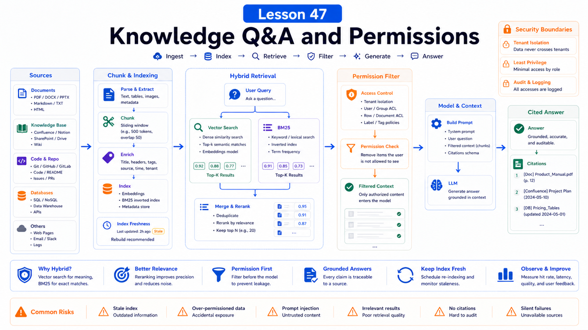

# Knowledge-Base Q&A: RAG, File Indexing, and Permission Boundaries



The most common knowledge-base misunderstanding is:

```text
Put files in, and the agent knows everything.
```

Reality is messier.

A Q&A system must answer:

```text
Can it find relevant content?
Can that content be trusted?
Is this user allowed to see it?
```

RAG is only one part.

## The Key Idea: Retrieval Is Not Authorization

A knowledge-base design should separate:

```text
document source
  -> cleaning and chunking
  -> indexing
  -> retrieval
  -> permission filtering
  -> citation and answer
  -> feedback and update
```

Vector search handles relevance. It does not enforce access control.

## OpenClaw Memory as a Knowledge Foundation

OpenClaw memory uses Markdown files in the workspace:

```text
MEMORY.md
memory/YYYY-MM-DD.md
DREAMS.md
```

`MEMORY.md` is compact, durable memory loaded at session start.

`memory/YYYY-MM-DD.md` is the working layer for detailed daily context.

Agents can use:

```text
memory_search
memory_get
```

This resembles a knowledge base, but enterprise Q&A also needs source control, permissions, versions, and audit.

## How Memory Search Works

The docs describe `memory_search` as chunking memory files and searching with embeddings, keywords, or both.

Hybrid retrieval:

```text
Query
  -> Embedding
  -> Vector Search

Query
  -> Tokenize
  -> BM25 Search

Vector + BM25
  -> Weighted Merge
  -> Top Results
```

Vector search handles semantic similarity. BM25 is good for IDs, error strings, and config keys.

## RAG Request Flow

A Q&A request can flow like this:

```text
user question
  -> identify domain and permission
  -> build retrieval query
  -> retrieve candidate chunks
  -> apply permission filter
  -> dedupe and rerank
  -> read source snippets
  -> answer with citations
  -> record gaps or freshness issues
```

Permission filtering must happen before content reaches the model.

Do not put everything into the prompt and ask the model to hide restricted material.

## What File Indexing Must Decide

Before indexing, define:

```text
which directories are indexed?
which file types are allowed?
maximum file size?
PDF / docx / xlsx parsing?
table preservation?
multilingual and CJK handling?
version rebuild strategy?
delete cleanup strategy?
```

For CJK search issues, the docs recommend rebuilding the FTS index:

```bash
openclaw memory index --force
```

## Permission Boundaries

Knowledge-base permission often has several layers:

```text
user identity
tenant / team
document ACL
directory scope
field redaction
tool policy
audit log
```

Be careful with multi-user Q&A inside one shared Gateway.

OpenClaw security docs state that the default model is a personal-assistant trust boundary, not a hostile multi-tenant security boundary. Strong isolation should use separate Gateways, OS users, or hosts.

## Real Scenario: Support Knowledge Base

Do not do this:

```text
Index all FAQ, contracts, and customer records together, then let the model decide what to reveal.
```

Better:

```text
public FAQ
  all support staff can query

customer-specific contracts
  filter by customerId

internal SOPs
  internal agents only

sensitive fields
  filter before retrieval or redact before answer
```

Answers should cite title, version, update time, and passage location.

## Common Misunderstandings

### RAG equals knowledge base

RAG is retrieval-augmented generation. A knowledge base also needs source, permission, versioning, governance, and audit.

### Vector search always finds the right answer

Not always. IDs and config fields often need keyword search.

### The model can enforce permissions

It should not. Filter before context injection.

### Everything belongs in `MEMORY.md`

`MEMORY.md` should stay compact. Detailed material belongs in searchable notes or a real knowledge base.

## Final Summary

Knowledge Q&A is retrieval plus permission plus citation.

```text
First decide who can see what, then index and retrieve. Relevance finds content; permission decides whether it can be shown.
```

## Exercises

1. Draw a support RAG flow.
2. Design permission rules for three document classes.
3. Decide which queries need BM25 and which need vector search.
4. Define a citation format.
5. Write an index rebuild and delete-sync strategy.

## Next Lesson Preview

Next we build a data analysis assistant: file reading, script execution, and result visualization.

## References

- OpenClaw Docs: [Memory overview](https://docs.openclaw.ai/concepts/memory)
- OpenClaw Docs: [Memory search](https://docs.openclaw.ai/concepts/memory-search)
- OpenClaw Docs: [Session management](https://docs.openclaw.ai/concepts/session)
- OpenClaw Docs: [Security](https://docs.openclaw.ai/gateway/security)
- OpenClaw Docs: [Sandboxing](https://docs.openclaw.ai/gateway/sandboxing)

