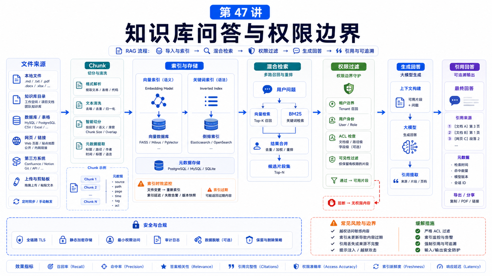

# 知识库问答：RAG、文件索引和权限边界



知识库问答最常见的误解是：

```text
把文件丢进去，Agent 就会知道一切。
```

现实不是这样。

知识库系统要解决三个问题：

```text
能不能找到相关内容？
找到的内容能不能被信任？
这个用户有没有权限看到？
```

RAG 只是其中一部分。

## 先说结论：检索不是权限系统

一个 OpenClaw 知识库问答方案应该拆成：

```text
文件来源
  -> 清洗和切分
  -> 索引
  -> 检索
  -> 权限过滤
  -> 引用和回答
  -> 反馈和更新
```

向量搜索负责“相关性”，不负责“授权”。

## OpenClaw 的记忆和知识基础

OpenClaw memory 使用 workspace 中的 Markdown 文件：

```text
MEMORY.md
memory/YYYY-MM-DD.md
DREAMS.md
```

`MEMORY.md` 是紧凑、长期、每次会话启动会加载的 durable memory。

`memory/YYYY-MM-DD.md` 更像工作层，保存日常记录和更详细上下文。

Agent 可以使用：

```text
memory_search
memory_get
```

来查找和读取记忆。

这和企业知识库有相似处，但不完全等同。企业知识库通常还要额外处理文档来源、权限、版本和审计。

## Memory Search 如何工作

官方文档说明，`memory_search` 会把记忆文件切成小块，并用向量、关键词或二者结合搜索。

混合检索可以理解为：

```text
Query
  -> Embedding
  -> Vector Search

Query
  -> Tokenize
  -> BM25 Search

Vector + BM25
  -> Weighted Merge
  -> Top Results
```

向量搜索适合语义相似，BM25 适合精确 ID、错误码、配置 key。

## RAG 问答链路

一个知识库问答请求可以这样流动：

```text
用户问题
  -> 识别领域和权限
  -> 生成检索 query
  -> 检索候选 chunk
  -> 权限过滤
  -> 去重和重排
  -> 读取原文片段
  -> 带引用回答
  -> 记录无法回答或过期信号
```

注意：权限过滤要在“给模型看内容前”完成。

不要先把所有检索结果塞进 prompt，再让模型自己决定不能说什么。

## 文件索引要设计什么

索引前要定义：

```text
哪些目录进入索引？
哪些文件类型允许？
单文件大小上限？
是否解析 PDF / docx / xlsx？
是否保留表格结构？
多语言和中文分词怎么处理？
版本更新如何重建索引？
删除文件后索引如何清理？
```

OpenClaw memory search 对 CJK 文本也有排错建议：如果中文找不到，重建 FTS index。

```bash
openclaw memory index --force
```

## 权限边界

知识库权限通常有几层：

```text
用户身份
租户 / 团队
文档 ACL
目录范围
字段脱敏
工具权限
审计记录
```

如果你在一个 shared Gateway 里让多个人查询知识库，要谨慎。

OpenClaw security 文档明确说，它默认是个人助手信任模型，不是多个敌对用户共享一个 Gateway 的强多租户安全边界。

强隔离应该使用单独 Gateway、单独 OS 用户或单独主机。

## 真实场景：客服知识库

你要做一个客服问答助手。

不要这样：

```text
把所有客服文档、合同、客户资料都放进一个索引，然后让模型判断能不能回答。
```

更合理：

```text
公开 FAQ
  所有客服可查

客户专属合同
  按 customerId 过滤

内部处理 SOP
  仅内部坐席可查

敏感字段
  检索前过滤或回答前脱敏
```

回答要带引用，例如文档标题、版本、更新时间和段落位置。

## 常见误解

### 误解一：RAG 等于知识库

RAG 是检索增强生成。知识库还包括来源、权限、版本、治理和审计。

### 误解二：向量搜索会自动找到正确答案

不一定。ID、错误码、配置字段经常需要关键词检索。

### 误解三：权限可以交给模型遵守

不应该。权限过滤应在上下文注入前完成。

### 误解四：把所有历史都放进 MEMORY.md

`MEMORY.md` 应该紧凑。详细材料应放入可检索的日常笔记或知识库。

## 最后总结

知识库问答不是“把文档喂给模型”，而是检索、权限和引用的系统工程。

一句话总结：

```text
先确定谁能看什么，再做索引和检索；相关性解决找得到，权限边界解决能不能看。
```

## 本节作业

1. 画出一个客服知识库的 RAG 流程。
2. 给三类文档设计权限规则。
3. 判断哪些查询需要 BM25，哪些适合向量搜索。
4. 设计回答中的引用格式。
5. 写一条索引重建和删除同步策略。

## 下一节预告

下一节讲数据分析助手：文件读取、脚本执行和结果可视化。

## 参考资料

- OpenClaw Docs：[Memory overview](https://docs.openclaw.ai/concepts/memory)
- OpenClaw Docs：[Memory search](https://docs.openclaw.ai/concepts/memory-search)
- OpenClaw Docs：[Session management](https://docs.openclaw.ai/concepts/session)
- OpenClaw Docs：[Security](https://docs.openclaw.ai/gateway/security)
- OpenClaw Docs：[Sandboxing](https://docs.openclaw.ai/gateway/sandboxing)

---

原文外链：[知识库问答：RAG、文件索引和权限边界](https://www.harries.blog/archives/720449.html)
