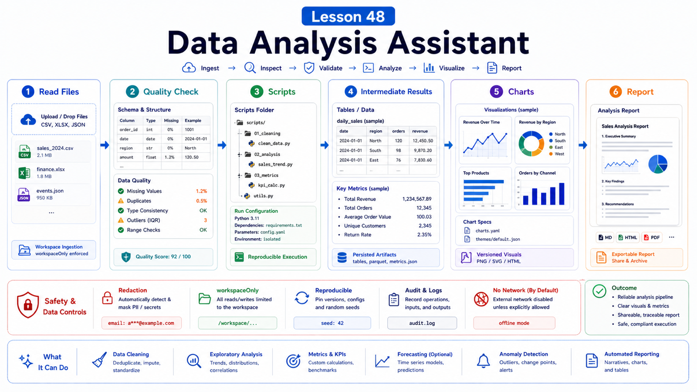

# Data Analysis Assistant: File Reading, Script Execution, and Visualization



A data analysis assistant is not just an agent that can write Python.

Users need it to:

```text
understand files
check data quality
choose analysis methods
run reproducible scripts
produce inspectable results
explain conclusions and limits
```

This lesson turns data analysis into a workflow.

## The Key Idea: Analysis Must Be Reproducible, Inspectable, and Explainable

Use:

```text
receive file
  -> identify format and fields
  -> check data quality
  -> write analysis script
  -> save intermediate results
  -> generate charts / tables
  -> explain conclusions
  -> state limitations
```

Do not start with a chart.

## Step One: Read the File

First confirm:

```text
file type: csv / xlsx / json / parquet / pdf
encoding
row and column counts
field meaning
missing values
duplicates
date fields
money and units
sensitive fields
```

For Excel, also check:

```text
sheet names
header row
merged cells
summary rows
hidden columns
```

Field confirmation matters more than guessing column names.

## Step Two: Execute Scripts

Analysis should be scripted, not only described in chat.

Scripts give:

```text
reproducibility
reviewability
reruns
intermediate outputs
large-file handling
```

Common structure:

```text
analysis/
  input/
  scripts/
    clean.py
    analyze.py
    plot.py
  output/
    summary.csv
    chart.png
    report.md
```

Even for exploratory work, preserve the important steps in scripts or notebook-style Markdown.

## Step Three: Visualize Results

Visualization should answer the question.

Choose:

```text
time trend: line chart
category comparison: bar chart
composition: stacked bar or table
distribution: histogram / boxplot
correlation: scatter plot
outliers: table plus marked chart
```

If the user needs to audit the data, tables may matter more than charts.

## Step Four: Produce Artifacts

Save outputs:

```text
output/cleaned.csv
output/summary.md
output/chart.png
output/report.html
```

This makes results inspectable and shareable.

If interactivity matters, generate HTML or a notebook-like artifact.

Do not leave the user with only a chat conclusion and no evidence.

## Safety and Permissions

Data analysis often touches sensitive data:

```text
customer lists
order amounts
employee records
financial reports
medical or legal material
API exports
```

Principles:

```text
read only files needed for the task
do not send sensitive fields to external tools
redact when needed
avoid raw PII in reports
use workspaceOnly or sandbox for risky paths
```

OpenClaw security docs warn that multiple people driving one tool-enabled agent share delegated tool authority.

Data analysis agents should avoid mixing personal and team data in one workspace.

## Real Scenario: Sales Funnel Analysis

User uploads `deals.xlsx` and asks why conversion dropped this month.

Good flow:

```text
1. read sheets and fields
2. validate stage names
3. group by date, owner, and channel
4. compute stage conversion rates
5. compare with last month or last year
6. find biggest drops
7. generate charts and summary.md
8. state sample-size and methodology limits
```

The final answer should include evidence and definitions, not only "Channel A dropped."

## Common Misunderstandings

### Data analysis means the model reads the CSV directly

Small previews are fine, but reliable analysis needs structured reading and scripts.

### A chart is the result

The result includes conclusion, method, limits, and reproducible code.

### Missing values can be ignored

Missingness may be part of the finding.

### Intermediate files should be deleted immediately

Keep them long enough for review and reruns.

## Final Summary

A data analysis assistant turns fuzzy questions into inspectable workflows.

```text
Understand the file and method first, analyze with scripts, then save charts, tables, and reports for review.
```

## Exercises

1. Design a CSV analysis folder structure.
2. Write a data quality checklist.
3. Choose three charts for a sales dataset.
4. Identify fields that need redaction.
5. Draft a limitations section for a report.

## Next Lesson Preview

Next we cover multi-agent systems and task queues: when to split work.

## References

- OpenClaw Docs: [Security](https://docs.openclaw.ai/gateway/security)
- OpenClaw Docs: [Sandboxing](https://docs.openclaw.ai/gateway/sandboxing)
- OpenClaw Docs: [Migration guide](https://docs.openclaw.ai/install/migrating)
- OpenClaw Docs: [Background tasks](https://docs.openclaw.ai/automation/tasks)
- OpenClaw Docs: [Health checks](https://docs.openclaw.ai/gateway/health)

