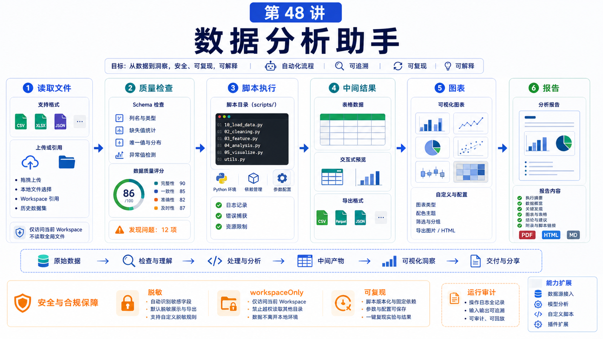

# 数据分析助手：文件读取、脚本执行和结果可视化



数据分析助手不是“会写 Python”就够了。

用户真正要的是：

```text
读懂文件
检查数据质量
选择分析方法
运行可复现脚本
生成可查看结果
解释结论和限制
```

这一讲把一个数据分析任务拆成完整工作流。

## 先说结论：数据分析要可复现、可检查、可解释

可靠链路：

```text
接收文件
  -> 确认格式和字段
  -> 做数据质量检查
  -> 写脚本分析
  -> 保存中间结果
  -> 生成图表 / 表格
  -> 解释结论
  -> 说明限制
```

不要一上来就画图。

## 第一步：文件读取

先确认：

```text
文件类型：csv / xlsx / json / parquet / pdf
编码：UTF-8 / GBK / 其它
行数和列数
字段含义
缺失值
重复值
时间字段
金额和单位
敏感字段
```

对于 Excel，尤其要确认：

```text
sheet 名
表头从第几行开始
是否有合并单元格
是否有汇总行
是否有隐藏列
```

分析前的字段确认，比模型“猜列名”更重要。

## 第二步：脚本执行

数据分析最好写成脚本，而不是只在对话里描述。

脚本带来：

```text
可复现
可审查
可重跑
可保存中间结果
可处理大文件
```

常见结构：

```text
analysis/
  input/
  scripts/
    clean.py
    analyze.py
    plot.py
  output/
    summary.csv
    chart.png
    report.md
```

如果是一次性探索，也要把关键步骤保存在脚本或 notebook 风格的 Markdown 中。

## 第三步：结果可视化

可视化不是“越漂亮越好”，而是要回答问题。

选择图表：

```text
时间变化：折线图
分类对比：柱状图
占比结构：堆叠条形或表格
分布：直方图 / 箱线图
相关性：散点图
异常点：表格 + 标记图
```

如果用户要复核数据，表格往往比图更重要。

## 第四步：把结果变成产物

结果最好落盘：

```text
output/cleaned.csv
output/summary.md
output/chart.png
output/report.html
```

这样用户可以打开、复核、分享。

如果结果需要交互，可以生成 HTML 或 notebook-like artifact。

关键是：不要只在聊天里给一段结论，却没有可检查的数据依据。

## 安全和权限

数据分析经常碰到敏感数据：

```text
客户名单
订单金额
员工信息
财务报表
医疗或法律材料
API 导出数据
```

处理原则：

```text
只读取任务需要的文件
不把敏感字段发到外部工具
必要时先脱敏
输出报告避免暴露原始 PII
高风险目录启用 workspaceOnly 或 sandbox
```

OpenClaw 的安全文档提醒：如果多个人能驱动同一个工具型 Agent，他们共享同一套工具权限。

数据分析 Agent 尤其要避免把个人数据和团队数据混在一个 workspace。

## 真实场景：销售漏斗分析

用户上传 `deals.xlsx`，问：“帮我看这个月转化率为什么下降。”

正确流程：

```text
1. 读取 sheet 和字段
2. 检查阶段枚举是否一致
3. 按创建时间、负责人、渠道分组
4. 计算各阶段转化率
5. 对比上月或去年同期
6. 找出下降最大的渠道 / 负责人 / 阶段
7. 生成图表和 summary.md
8. 说明样本量和口径限制
```

最终回答不应该只有“渠道 A 下降明显”，还应给出计算口径和证据。

## 常见误解

### 误解一：数据分析就是让模型直接看 CSV

小文件可以预览，但可靠分析要用结构化读取和脚本。

### 误解二：图表就是结果

图表是证据之一。结论、口径、限制和可复现脚本同样重要。

### 误解三：缺失值可以自动忽略

不能。缺失机制可能就是结论的一部分。

### 误解四：所有中间文件都可以删除

不要急着删。中间结果能帮助复核和重跑。

## 最后总结

数据分析助手的价值在于把模糊问题变成可检查流程。

一句话总结：

```text
先理解文件和口径，再用脚本分析，最后把结果保存成可复核的图表、表格和报告。
```

## 本节作业

1. 设计一个 CSV 分析目录结构。
2. 写出数据质量检查清单。
3. 为一个销售数据问题选择 3 种图表。
4. 说明哪些字段需要脱敏。
5. 设计报告里的“限制说明”段落。

## 下一节预告

下一节讲多 Agent 与任务队列：什么时候需要拆分任务。

## 参考资料

- OpenClaw Docs：[Security](https://docs.openclaw.ai/gateway/security)
- OpenClaw Docs：[Sandboxing](https://docs.openclaw.ai/gateway/sandboxing)
- OpenClaw Docs：[Workspace and persistence](https://docs.openclaw.ai/install/migrating)
- OpenClaw Docs：[Background tasks](https://docs.openclaw.ai/automation/tasks)
- OpenClaw Docs：[Health checks](https://docs.openclaw.ai/gateway/health)

