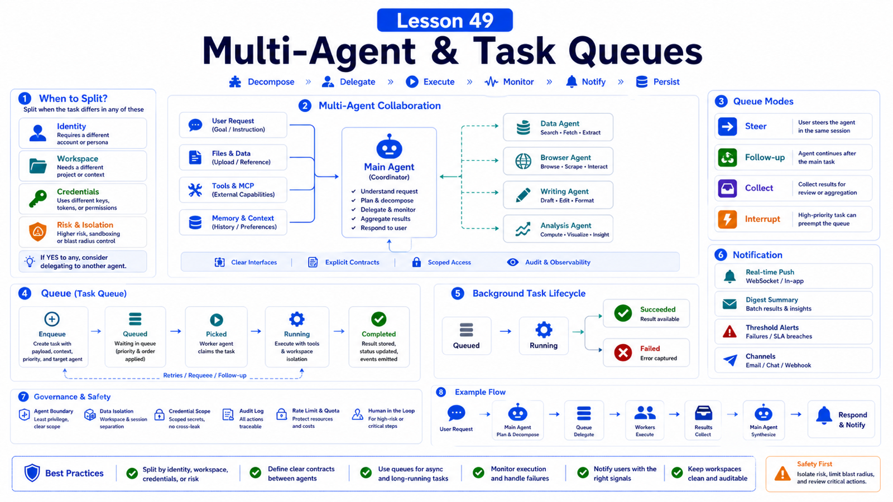

# Multi-Agent Systems and Task Queues: When to Split Work



When a task gets complex, it is tempting to "add more agents."

But multi-agent design is not magic.

Done well, it clarifies permissions, context, and concurrency.

Done poorly, it creates sessions that wait on each other, pollute each other, and duplicate work.

## The Key Idea: Split by Boundary, Not by Drama

Split agents when you have different:

```text
identities
workspaces
credentials
tool permissions
session histories
SLA / queues
business responsibilities
```

Do not split just because a task feels complex.

You can split steps without splitting agents.

## An OpenClaw Agent Is a Full Scope

The multi-agent docs define an agent as having:

```text
Workspace
agentDir
auth profiles
model registry
session store
skills
```

An agent is not a temporary function call. It is a scoped working brain.

If two tasks must share all context, credentials, and tools, separate agents may add little value.

## When to Use Multiple Agents

### Split by Person

Different people share a Gateway but need separate context.

```text
agent: alex
agent: mia
```

Each gets a workspace and session store.

### Split by Business Function

Support, engineering, and finance need different knowledge and tools.

```text
support-agent
engineering-agent
finance-agent
```

Finance credentials do not need to be visible to support.

### Split by Risk

Read-only research and production changes should be separate.

```text
research-agent
deployment-agent
```

The deployment agent can have tighter approvals and narrower tools.

### Split by Long-Running Work

Long analysis, browser collection, and batch report generation can run as background tasks or subagents.

The main session starts, tracks, and explains the work.

## What Queues Solve

OpenClaw command queue prevents auto-reply runs from colliding.

It guarantees only one active run per session key and caps global concurrency.

Modes:

```text
steer
  inject new messages into the active turn

followup
  run each message after the current run

collect
  coalesce messages into one followup

interrupt
  abort current run and run newest message
```

This matters in groups and high-frequency conversations.

## Background Tasks Are an Activity Ledger

Background tasks are not the scheduler.

They record:

```text
ACP background runs
subagent spawns
cron executions
CLI operations
media generation jobs
```

Statuses:

```text
queued
running
succeeded
failed
timed_out
cancelled
lost
```

For long work:

```text
create task
report that it started
notify state changes when useful
push result or wake session when done
```

Do not make users poll chat for progress.

## Split Decision Table

```text
reply is too long
  -> split steps, not agents

different files and memory
  -> split agents

different credentials
  -> split agents

long-running background work
  -> task / subagent

same user follow-up
  -> same session + queue

multi-user shared entry
  -> session isolation + bindings

high-risk action
  -> separate agent + approval + narrow tools
```

## Real Scenario: Monthly Business Report

Do not make one agent do everything in one run.

Better:

```text
main agent
  understands goal, coordinates, summarizes

data agent
  cleans sales, cost, inventory data

web agent
  collects external market prices

writing agent
  drafts report

review step
  human confirms key numbers and sensitive claims
```

Queue logic:

```text
data cleaning and web collection can run in parallel
writing waits for data
final sending requires confirmation
```

## Common Misunderstandings

### More agents are always smarter

No. More agents mean more synchronization, state, and failure modes.

### Queues only prevent bugs

Queues also shape conversation UX: steer, collect, followup, and interrupt feel different.

### Background tasks automatically notify all progress

Notification depends on policy and delivery path. Tasks are records, not schedulers.

### Multiple agents under one workspace are isolated

Not fully. Isolation depends on workspace, agentDir, auth profiles, tools, and host boundary.

## Final Summary

Multi-agent design and queues should reduce confusion.

```text
Split agents for identity, permission, workspace, credentials, or lifecycle boundaries; use queues for message rhythm within a session.
```

## Exercises

1. Pick a complex workflow and decide which steps need separate agents.
2. Choose a queue mode for a busy group chat.
3. Design a background task notification policy.
4. Decide which agent should own a high-risk tool.
5. Draw a multi-agent report-generation flow.

## Next Lesson Preview

Next we cover SaaS adaptation: users, tenants, quotas, audit, and isolation.

## References

- OpenClaw Docs: [Multi-agent routing](https://docs.openclaw.ai/concepts/multi-agent)
- OpenClaw Docs: [Command queue](https://docs.openclaw.ai/concepts/queue)
- OpenClaw Docs: [Background tasks](https://docs.openclaw.ai/automation/tasks)
- OpenClaw Docs: [Session management](https://docs.openclaw.ai/concepts/session)
- OpenClaw Docs: [Security](https://docs.openclaw.ai/gateway/security)

