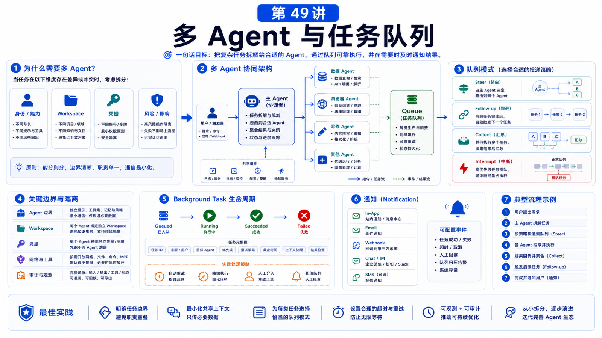

# 多 Agent 与任务队列：什么时候需要拆分任务



很多人一遇到复杂任务，就想“多开几个 Agent”。

但多 Agent 不是银弹。

拆得好，会让权限、上下文和并发更清晰。

拆得不好，只会多一堆互相等待、互相污染、互相重复工作的会话。

## 先说结论：按边界拆，不按热闹拆

应该拆 Agent 的情况：

```text
不同身份
不同 workspace
不同凭据
不同工具权限
不同会话历史
不同 SLA / 队列
不同业务责任
```

不应该因为“任务看起来复杂”就拆。

复杂任务可以先拆步骤，不一定拆 Agent。

## OpenClaw 里的 Agent 是完整作用域

官方多 Agent 文档说，一个 agent 包含：

```text
Workspace
agentDir
auth profiles
model registry
session store
skills
```

也就是说，Agent 不是一个临时子函数，而是一套独立工作脑。

如果两个任务必须共享全部上下文、凭据和工具，拆成两个 Agent 未必有意义。

## 什么时候拆成多个 Agent

### 按人拆

不同人使用同一个 Gateway，但要隔离会话和资料。

```text
agent: alex
agent: mia
```

每个人有自己的 workspace 和 session store。

### 按业务拆

客服、研发、财务使用不同知识库和工具。

```text
support-agent
engineering-agent
finance-agent
```

这样财务凭据不会暴露给客服 Agent。

### 按风险拆

读-only 查询和生产变更分开。

```text
research-agent
deployment-agent
```

部署 Agent 可以有更严格审批和更窄工具。

### 按长任务拆

长分析、浏览器采集、批量报告生成，可以作为 background task 或子 Agent 跑。

主会话只负责发起、跟踪和解释结果。

## 队列解决什么

OpenClaw command queue 的目标是防止多个自动回复 run 撞在一起。

它会按 session key 保证同一 session 同时只有一个 active run，并通过全局 lane 控制并发。

常见模式：

```text
steer
  新消息注入当前运行中的 turn

followup
  等当前 run 结束后逐条执行

collect
  收集一段时间内消息，合成一个 followup

interrupt
  中断当前 run，执行最新消息
```

这对群聊和高频消息尤其重要。

## Background tasks 是活动账本

OpenClaw 的 background tasks 不是 scheduler。

它记录：

```text
ACP background runs
subagent spawns
cron executions
CLI operations
media generation jobs
```

任务状态：

```text
queued
running
succeeded
failed
timed_out
cancelled
lost
```

当你启动长任务，不要让用户轮询聊天窗口。

更好的体验是：

```text
创建 task
返回任务已开始
必要时通知状态变化
完成后推送结果或唤醒会话
```

## 拆分决策表

```text
只是不想让一个回复太长
  -> 拆步骤，不拆 Agent

需要不同文件和记忆
  -> 拆 Agent

需要不同凭据
  -> 拆 Agent

需要后台长跑
  -> task / subagent

同一用户连续追问
  -> 同一 session + queue

多人共享入口
  -> session isolation + bindings

高风险操作
  -> 单独 Agent + approval + narrow tools
```

## 真实场景：月度经营报告

不要让一个 Agent 一口气完成所有事。

更合理：

```text
主 Agent
  理解目标、协调流程、汇总结论

数据 Agent
  清洗销售、成本、库存数据

网页 Agent
  采集外部市场价格

写作 Agent
  生成报告草稿

审核步骤
  人工确认关键数字和敏感结论
```

队列上：

```text
数据清洗和网页采集可以并行
报告写作必须等数据完成
最终发送必须人工确认
```

## 常见误解

### 误解一：多 Agent 一定更聪明

不一定。更多 Agent 也意味着更多同步、更多状态和更多失败点。

### 误解二：队列只是防止并发 bug

队列也是用户体验设计：steer、collect、followup、interrupt 对应不同对话节奏。

### 误解三：background task 会自动告诉用户所有进度

取决于 notify policy 和 delivery path。任务是账本，不是调度器。

### 误解四：同一个 workspace 下多 Agent 就隔离了

不完全。真正隔离要看 workspace、agentDir、auth profiles、工具和宿主机边界。

## 最后总结

多 Agent 和队列的目标是降低混乱，而不是制造并行幻觉。

一句话总结：

```text
身份、权限、workspace、凭据和生命周期不同，就拆 Agent；只是同一会话里的消息节奏，就交给 queue。
```

## 本节作业

1. 选一个复杂业务流程，判断哪些步骤需要独立 Agent。
2. 为一个群聊配置选择 queue mode。
3. 设计一个 background task 的状态通知策略。
4. 判断一个高风险工具应该放在哪个 Agent。
5. 画出一个多 Agent 报告生成流程。

## 下一节预告

下一节讲 SaaS 化改造：用户、租户、额度、审计和隔离。

## 参考资料

- OpenClaw Docs：[Multi-agent routing](https://docs.openclaw.ai/concepts/multi-agent)
- OpenClaw Docs：[Command queue](https://docs.openclaw.ai/concepts/queue)
- OpenClaw Docs：[Background tasks](https://docs.openclaw.ai/automation/tasks)
- OpenClaw Docs：[Session management](https://docs.openclaw.ai/concepts/session)
- OpenClaw Docs：[Security](https://docs.openclaw.ai/gateway/security)

