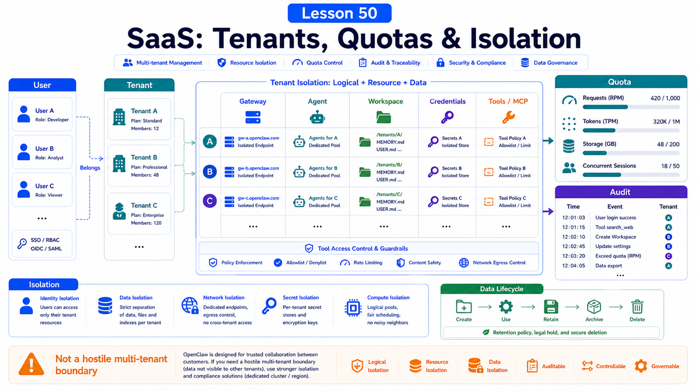

# SaaS Adaptation: Users, Tenants, Quotas, Audit, and Isolation



The dangerous SaaS assumption is:

```text
It works for one person, so adding a users table is enough.
```

It is not.

Agent systems can read files, call models, use browsers, run tools, send messages, and remember context. Multi-user SaaS is mostly about isolation boundaries.

## The Key Idea: OpenClaw Is Not a Hostile Multi-Tenant Boundary by Default

OpenClaw security docs state that one Gateway is a trusted operator boundary, suitable for a personal assistant or a cooperative team inside one trust boundary.

Multiple mutually untrusted users sharing one tool-enabled agent or Gateway is not strong isolation.

SaaS design needs:

```text
user identity
tenant boundary
Gateway / agent isolation
workspace isolation
credential isolation
tool policy
quotas and billing
audit logs
data retention and deletion
```

## Users and Tenants

At minimum, separate:

```text
User
  the person signing in

Tenant
  organization, team, customer, or billing unit

Agent
  working subject under a tenant

Session
  conversation or task context

Workspace
  files and artifacts visible to the agent
```

Do not treat `sessionKey` as user authentication.

The security docs note that session identifiers are routing selectors, not auth tokens.

## Three Isolation Models

### Lightweight Shared Model

```text
one Gateway
multiple agents
separate workspaces / agentDirs
strict allowlists
low-risk tools
same trust boundary
```

Fits:

```text
one company
cooperative team
non-adversarial users
```

Not ideal for public SaaS.

### Gateway Per Tenant

```text
tenant A -> Gateway A
tenant B -> Gateway B
```

Pros:

```text
config, credentials, sessions, workspace easier to isolate
smaller blast radius
clearer audit
```

Cons:

```text
higher cost
more operations
batch upgrades required
```

### Host or OS User Per Tenant

Stronger isolation:

```text
separate OS user
separate container or VM
separate secret store
separate network policy
separate backup
```

Use for sensitive customers, regulated data, and high-risk tooling.

## Quotas and Cost Control

Agent SaaS cost is not just request count.

Measure:

```text
model tokens
image / audio / video generation
embeddings and indexing
browser automation duration
shell / analysis task duration
concurrent tasks
storage
external API calls
message-channel sends
```

Quota checks should happen before a task starts.

Policies:

```text
monthly token cap per tenant
max context per task
max file size
concurrent task limit
expensive models require plan enablement
long tasks require confirmation
```

## Audit Logs

SaaS must answer:

```text
who initiated the request?
which agent ran?
which model was used?
which tools were called?
which files were read or written?
which external messages were sent?
was there human approval?
who received the result?
```

Audit logs should not store plaintext secrets or full sensitive content.

Record:

```text
timestamp
tenant
user
session
task
tool name
resource summary
approval result
error code
cost estimate
```

## Permission and Tool Strategy

Do not give every tenant the same tools.

Tier examples:

```text
free trial
  no shell, no private-network browser, no external send

standard tenant
  workspaceOnly file access, low-risk browser, limited models

enterprise tenant
  dedicated Gateway, tenant credentials, approvals, audit export

high-risk actions
  optional tool + approval + human confirmation
```

Operator scopes, plugin approvals, exec approvals, and sandboxing are guardrails. They are not hostile multi-tenant isolation by themselves.

## Data Lifecycle

Design:

```text
session retention
artifact retention
tenant deletion paths
backup retention
log redaction
data export
embedding index deletion
```

If original documents are deleted but index chunks remain, data can still leak.

## Common Misunderstandings

### Login makes it SaaS

Login is only the entry. Tenant isolation, tool policy, audit, and quotas are the core.

### Multi-agent equals multi-tenant

No. Multi-agent scoping helps, but it is not a hostile-user security boundary.

### Audit means storing chat text

Tool calls, files, approvals, cost, and delivery paths often matter more.

### Open features first, restrict later

Agent capability is broad. Start with least privilege and widen deliberately.

## Final Summary

SaaS adaptation is trust-boundary design.

```text
Separate users, tenants, Gateways, agents, workspaces, credentials, tools, and audit before turning OpenClaw capability into a product.
```

## Exercises

1. Draw a tenant-isolated OpenClaw SaaS architecture.
2. Define tool permissions for free, pro, and enterprise tiers.
3. Write a quota table for tokens, tasks, and storage.
4. Design audit log fields.
5. Decide whether your scenario needs one Gateway per tenant.

## Next Lesson Preview

Next we begin the final section: designing reliable agent workflows.

## References

- OpenClaw Docs: [Security](https://docs.openclaw.ai/gateway/security)
- OpenClaw Docs: [Operator scopes](https://docs.openclaw.ai/gateway/operator-scopes)
- OpenClaw Docs: [Multi-agent routing](https://docs.openclaw.ai/concepts/multi-agent)
- OpenClaw Docs: [Session management](https://docs.openclaw.ai/concepts/session)
- OpenClaw Docs: [Background tasks](https://docs.openclaw.ai/automation/tasks)
- OpenClaw Docs: [Prometheus metrics](https://docs.openclaw.ai/gateway/prometheus)
- OpenClaw Docs: [OpenTelemetry export](https://docs.openclaw.ai/gateway/opentelemetry)

