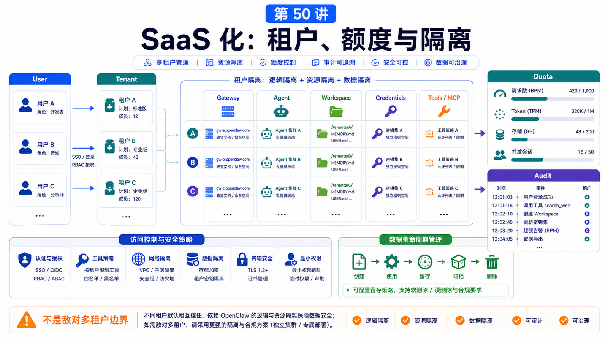

# SaaS 化改造：用户、租户、额度、审计和隔离



把 OpenClaw 能力做成 SaaS，最危险的想法是：

```text
现在一个人能用，那多加几个用户表就行。
```

不行。

Agent 系统能读文件、调用模型、访问浏览器、运行工具、发消息、记忆上下文。多用户 SaaS 的核心不是 UI，而是隔离边界。

## 先说结论：OpenClaw 默认不是敌对多租户边界

OpenClaw 官方安全文档明确说明：它假设一个 Gateway 是一个可信操作员边界，适合个人助手或同一信任边界内的团队。

如果多个互不信任的用户共享一个工具型 Agent 或 Gateway，这不是强安全隔离。

真正 SaaS 化要单独设计：

```text
用户身份
租户边界
Gateway / agent 隔离
Workspace 隔离
凭据隔离
工具权限
额度和计费
审计日志
数据保留和删除
```

## 用户和租户

最少要区分：

```text
User
  登录的人

Tenant
  组织、团队、客户或计费实体

Agent
  某个租户下的工作主体

Session
  一次对话或任务上下文

Workspace
  Agent 可见的文件和产物范围
```

不要把 `sessionKey` 当成用户认证。

OpenClaw 安全文档也提醒：session identifier 是路由选择器，不是授权 token。

## 三种隔离模型

### 轻量共享模型

```text
一个 Gateway
多个 Agent
不同 workspace / agentDir
严格 allowlist
低风险工具
同一信任边界
```

适合：

```text
同一家公司内部
协作团队
非敌对用户
```

不适合陌生客户 SaaS。

### 每租户独立 Gateway

```text
tenant A -> Gateway A
tenant B -> Gateway B
```

优点：

```text
配置、凭据、session、workspace 更容易隔离
事故影响范围更小
审计更清晰
```

缺点：

```text
成本更高
运维更复杂
升级要批量编排
```

### 每租户独立主机 / OS 用户

更强隔离：

```text
独立 OS user
独立容器或 VM
独立 secret store
独立网络策略
独立备份
```

适合高风险客户、敏感数据、强合规场景。

## 额度和成本控制

Agent SaaS 成本不是只看请求数。

要计量：

```text
模型 token
图片 / 音频 / 视频生成
embedding 和索引
浏览器自动化时长
Shell / 数据分析任务时长
并发任务数
存储空间
外部 API 调用
消息通道发送量
```

额度控制要发生在任务启动前，而不是账单月底才发现爆了。

典型策略：

```text
每租户月度 token 上限
单任务最大上下文
单文件大小限制
并发任务上限
高价模型需显式开通
长任务需要确认
```

## 审计日志

SaaS 化必须能回答：

```text
谁发起了请求？
哪个 Agent 执行？
用了哪个模型？
调用了哪些工具？
读写了哪些文件？
发送了哪些外部消息？
是否有人工审批？
结果交付给谁？
```

审计日志不应该记录明文密钥和完整敏感内容。

要记录：

```text
时间
租户
用户
session
task
tool name
目标资源摘要
审批结果
错误码
成本估算
```

## 权限和工具策略

不要给所有租户同一套工具。

按层次配置：

```text
免费试用
  无 shell，无 browser 私网，无外部发送

普通租户
  workspaceOnly 文件访问，低风险 browser，有限模型

企业租户
  单独 Gateway，专属凭据，审批流，审计导出

高风险操作
  optional tool + approval + 人工确认
```

OpenClaw 的 operator scopes、plugin approvals、exec approvals、sandboxing 都是 guardrails，但不是敌对多租户隔离本身。

## 数据生命周期

还要设计：

```text
会话保留多久
任务产物保留多久
删除租户时删哪些目录
备份保留多久
日志如何脱敏
用户能否导出数据
embedding index 是否同步删除
```

如果删除了原文但忘了删除索引，仍然可能泄露片段。

## 常见误解

### 误解一：加登录就是 SaaS

登录只是入口。租户隔离、工具权限、审计和额度才是核心。

### 误解二：多 Agent 就等于多租户

不等于。多 Agent 提供一定作用域隔离，但不是敌对用户安全边界。

### 误解三：审计只记录聊天内容

更重要的是工具、文件、审批、成本和交付路径。

### 误解四：先开放功能，出问题再加限制

Agent 的能力面太大。应该默认最小权限，再逐步放开。

## 最后总结

SaaS 化不是把个人助手放到网页上，而是重新设计信任边界。

一句话总结：

```text
把用户、租户、Gateway、Agent、Workspace、凭据、工具和审计分清楚，才能把 OpenClaw 能力可靠地做成产品。
```

## 本节作业

1. 画出一个 OpenClaw SaaS 的租户隔离架构。
2. 为免费、专业、企业三档设计工具权限。
3. 写一份 token、任务、存储额度表。
4. 设计审计日志字段。
5. 判断你的场景是否需要每租户独立 Gateway。

## 下一节预告

下一部分进入“从理解到创造”：如何设计一个可靠的 Agent 工作流。

## 参考资料

- OpenClaw Docs：[Security](https://docs.openclaw.ai/gateway/security)
- OpenClaw Docs：[Operator scopes](https://docs.openclaw.ai/gateway/operator-scopes)
- OpenClaw Docs：[Multi-agent routing](https://docs.openclaw.ai/concepts/multi-agent)
- OpenClaw Docs：[Session management](https://docs.openclaw.ai/concepts/session)
- OpenClaw Docs：[Background tasks](https://docs.openclaw.ai/automation/tasks)
- OpenClaw Docs：[Prometheus metrics](https://docs.openclaw.ai/gateway/prometheus)
- OpenClaw Docs：[OpenTelemetry export](https://docs.openclaw.ai/gateway/opentelemetry)

