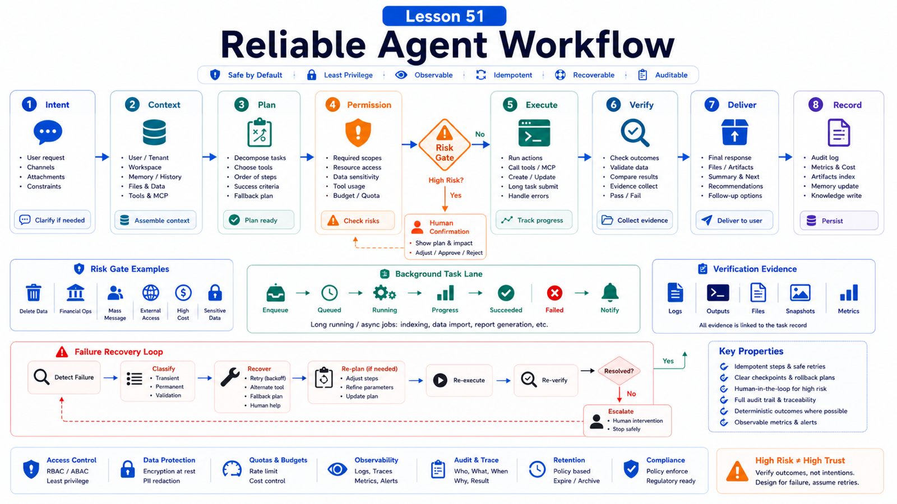

# How to Design a Reliable Agent Workflow



A reliable agent is not just an agent that chats better.

It is a system that can complete real tasks, stop when it should, ask for help when needed, and leave evidence when something fails.

"Help the user file expenses" is not a workflow. It is a wish.

A reliable workflow answers:

```text
What is the input?
Where does context come from?
Which actions are automatic?
Which actions need confirmation?
How does failure recover?
How is completion proven?
```

## The Key Idea: Design Agent Workflows as State Machines

A practical agent workflow looks like:

```text
Intent
  -> Context
  -> Plan
  -> Permission
  -> Execute
  -> Verify
  -> Deliver
  -> Record
```

Do not put everything into one model turn.

Models understand and generate. Reliability comes from boundaries, checkpoints, and observable state.

## Step One: Define the Task Boundary

Write down:

```text
target user
entry point
success result
failure result
required inputs
conditions where it must not run
```

For a refund assistant:

```text
entry: support group or ticket page
input: order id, refund reason, customer identity
actions: query order, check policy, draft recommendation
forbidden: refund without human confirmation
success: recommendation with citations and optional ticket note
```

## Step Two: Design Context Sources

Context may come from:

```text
user message
session history
workspace files
memory / RAG
browser page
MCP tool result
business database
config and skills
```

The question is not only "can it read this?" but "should it read this, when, and how trustworthy is it?"

Knowledge needs citations. Web state needs snapshot or screenshot. Business data needs query conditions and summarized results.

## Step Three: Split Actions by Risk

Use:

```text
read-only
  query order, read page, search knowledge base

low-risk write
  create draft, add internal note, generate report

high-risk write
  refund, delete, publish, deploy, send external message
```

Read-only actions can often run automatically.

Low-risk writes can create drafts.

High-risk writes need confirmation, approval, or handoff.

## Step Four: Use Queues and Tasks for Long Work

If work takes time, do not keep the main conversation blocked.

Use:

```text
background task
subagent
cron job
staged execution
```

OpenClaw background tasks record `queued -> running -> terminal` status.

High-frequency messages in the same session are handled with queue modes: `steer`, `followup`, `collect`, and `interrupt`.

## Step Five: Verify Instead of Assuming

Every reliable workflow needs verification.

Examples:

```text
form filling
  screenshot or read page values

data analysis
  scripts, charts, intermediate tables

knowledge answer
  cited sources

deployment
  status, logs, health endpoint
```

"Done" without verification is only model confidence.

## Step Six: Record and Review

Record:

```text
input summary
key decisions
tools called
approval points
output artifacts
failures and retries
follow-up suggestions
```

This improves reuse, debugging, and audit.

## Common Misunderstandings

### A good prompt equals a good workflow

Prompting is one part. Reliability needs state, tools, permissions, verification, and records.

### Agents should automate everything

No. High-risk actions should involve humans.

### Failure means the model is weak

Failure may come from bad context, tool timeout, missing permission, changed UI, or queue pressure.

### More workflow steps mean more reliability

Only meaningful checkpoints help.

## Final Summary

Reliable agent workflows put probabilistic model behavior inside deterministic process boundaries.

```text
Design the agent as a state machine: input, context, permission, execution, verification, and record.
```

## Exercises

1. Define success and failure for one business task.
2. Split actions into read-only, low-risk write, and high-risk write.
3. Design confirmation points.
4. Define completion evidence.
5. Write a recovery path for failure.

## Next Lesson Preview

Next we write high-quality business Skills.

## References

- OpenClaw Docs: [Session management](https://docs.openclaw.ai/concepts/session)
- OpenClaw Docs: [Command queue](https://docs.openclaw.ai/concepts/queue)
- OpenClaw Docs: [Background tasks](https://docs.openclaw.ai/automation/tasks)
- OpenClaw Docs: [Security](https://docs.openclaw.ai/gateway/security)
- OpenClaw Docs: [Health checks](https://docs.openclaw.ai/gateway/health)

