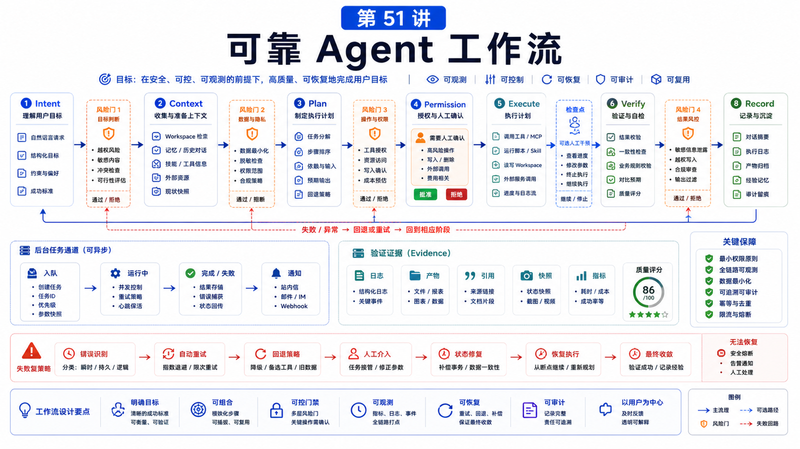

# 如何设计一个可靠的 Agent 工作流



可靠的 Agent 不是“更会聊天”的 Agent。

它是一个在真实环境里能稳定完成任务、知道什么时候停下、知道什么时候求助、失败后能留下线索的系统。

如果你只写一句“帮用户完成报销”，那只是愿望。

可靠工作流要回答：

```text
输入是什么？
上下文从哪里来？
哪些动作可以自动做？
哪些动作必须确认？
失败后怎么恢复？
如何证明完成了？
```

## 先说结论：把 Agent 工作流设计成状态机

一个可落地的 Agent 工作流，应该像这样：

```text
Intent
  -> Context
  -> Plan
  -> Permission
  -> Execute
  -> Verify
  -> Deliver
  -> Record
```

不要把所有东西交给一次模型回复。

模型擅长理解和生成，但可靠性来自清晰的边界、检查点和可观察状态。

## 第一步：定义任务边界

先写清楚：

```text
目标用户是谁
触发入口是什么
成功结果是什么
失败结果是什么
哪些输入必须补齐
哪些情况不应该执行
```

例如“客服退款助手”不是一句话，而是：

```text
入口：客服群或工单详情页
输入：订单号、退款原因、客户身份
动作：查询订单、查政策、生成退款建议
禁止：未经人工确认直接退款
成功：给出建议和引用，必要时生成工单备注
```

## 第二步：设计上下文来源

上下文通常来自：

```text
用户消息
会话历史
Workspace 文件
Memory / RAG
Browser 页面
MCP 工具返回
业务数据库
配置和 Skill
```

关键问题不是“能不能读到”，而是“应该读哪些、什么时候读、读到后是否可信”。

知识库材料要有引用；网页状态要 snapshot 或截图；业务数据要保留查询条件和返回摘要。

## 第三步：拆分动作和风险

把动作分层：

```text
只读
  查询订单、读取页面、搜索知识库

低风险写入
  创建草稿、添加内部备注、生成报告

高风险写入
  退款、删除、发布、部署、发送外部消息
```

只读动作可以自动化。

低风险写入可以自动生成草稿。

高风险写入需要确认、approval 或人工接管。

## 第四步：用队列和任务处理长流程

如果任务会耗时很久，不要让主会话一直挂着。

可以把它变成：

```text
background task
subagent
cron job
分阶段执行
```

OpenClaw 的 background tasks 会记录 `queued -> running -> terminal` 的状态，适合长任务追踪。

同一个 session 内的高频消息，则交给 queue 模式处理：`steer`、`followup`、`collect` 或 `interrupt`。

## 第五步：验证而不是假设

可靠工作流必须有验证。

例如：

```text
表单填写
  截图或读取页面确认字段

数据分析
  输出脚本、图表和中间表

知识库回答
  给出引用来源

部署任务
  检查状态、日志和 health endpoint
```

没有验证的“完成了”，只是模型的自信。

## 第六步：记录和复盘

任务结束后记录：

```text
输入摘要
关键决策
调用过的工具
人工确认点
输出产物
失败和重试
后续建议
```

这能帮助下次复用，也能帮助排错和审计。

## 常见误解

### 误解一：好 prompt 就等于好工作流

Prompt 是一部分。真正可靠的是状态、工具、权限、验证和记录。

### 误解二：Agent 应该尽量自动完成所有事

不。高风险动作应该让人确认。

### 误解三：失败就是模型不够强

失败可能来自上下文错误、工具超时、权限缺失、页面变化或队列堵塞。

### 误解四：流程越复杂越可靠

不是。可靠流程应该少而清晰，每个检查点都有意义。

## 最后总结

可靠 Agent 工作流，本质是把不确定的模型能力放进确定的流程边界里。

一句话总结：

```text
用状态机设计 Agent：明确输入、上下文、权限、执行、验证和记录，让系统知道什么时候做、什么时候停、什么时候问人。
```

## 本节作业

1. 选一个业务任务，写出成功和失败定义。
2. 把动作分成只读、低风险写入、高风险写入。
3. 为每个高风险动作设计确认点。
4. 写出任务完成的验证证据。
5. 设计一个失败后的恢复路径。

## 下一节预告

下一节讲如何为业务写高质量 Skill。

## 参考资料

- OpenClaw Docs：[Session management](https://docs.openclaw.ai/concepts/session)
- OpenClaw Docs：[Command queue](https://docs.openclaw.ai/concepts/queue)
- OpenClaw Docs：[Background tasks](https://docs.openclaw.ai/automation/tasks)
- OpenClaw Docs：[Security](https://docs.openclaw.ai/gateway/security)
- OpenClaw Docs：[Health checks](https://docs.openclaw.ai/gateway/health)

