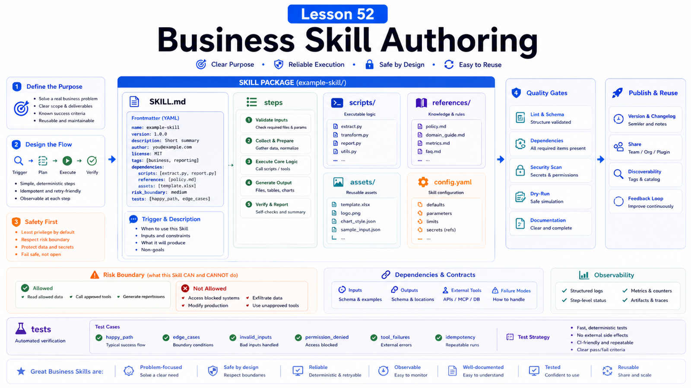

# How to Write High-Quality Business Skills



Business Skills often become internal manuals.

But an agent does not need an encyclopedia. It needs operating guidance:

```text
When should this trigger?
What is the first step?
Which tools are needed?
When must it stop?
How does it recover from failure?
```

This lesson turns business knowledge into usable Skills.

## The Key Idea: A Skill Is Executable Business Guidance

An OpenClaw Skill is a directory with at least:

```text
SKILL.md
```

`SKILL.md` uses YAML frontmatter:

```yaml
---
name: refund-review
description: Review refund requests using order data and policy documents.
---
```

Use lowercase letters, digits, and hyphens for `name`. The `description` strongly affects whether the agent knows to use the Skill.

## Good Skill Structure

Use:

```text
when to use
when not to use
required inputs
steps
tools and scripts
confirmation points
failure handling
output format
referenced materials
```

Put repeatable logic in `scripts/`.

Put long documentation, field maps, and examples in `references/`.

Put templates in `assets/`.

## Write the Trigger Description

Weak:

```text
Useful for business tasks.
```

Better:

```text
Use when reviewing customer refund requests; checks order status, refund policy, and drafts a recommendation without issuing the refund.
```

Include:

```text
task type
trigger scenario
boundary
key actions
forbidden actions
```

## Write Steps

Do not write:

```text
Analyze carefully and provide professional advice.
```

Write:

```text
1. Confirm order id and refund reason.
2. Query order status.
3. Read references/refund-policy.md.
4. Check whether the request qualifies.
5. Draft a recommendation only; do not issue refund.
6. Ask for human confirmation on high-value or abnormal orders.
```

Agents need concrete steps, not motivational language.

## Gating and Dependencies

Skill frontmatter can gate by OS, binaries, and config.

Example:

```yaml
metadata:
  openclaw:
    requires:
      bins: ["jq"]
      config: ["channels.telegram.enabled"]
```

If a Skill needs a CLI, API key, or config, do not let it appear usable when dependencies are missing.

## Safety Boundaries

Business Skills should explicitly say:

```text
do not issue refunds directly
do not send external messages
do not read unauthorized customer records
do not put PII into public reports
ask for confirmation before production changes
```

If using `exec`, avoid shell command injection from user input.

If using browser, document login, 2FA, payment, deletion, and other manual blockers.

## Test the Skill

After creating it:

```bash
openclaw skills list
openclaw agent --message "review refund request for order 123"
```

Test:

```text
normal path
missing input
permission missing
tool failure
high-risk action
similar task that should not trigger
```

## Common Misunderstandings

### Longer Skills are better

No. `SKILL.md` should be short and precise.

### A Skill is just a prompt template

It can include scripts, resources, dependencies, boundaries, and workflows.

### Business rules can be left to the model

High-risk rules should be explicit and, where possible, scripted.

### No testing is needed after writing

Triggering, false triggering, and failure paths all need tests.

## Final Summary

A high-quality Skill is engineered business knowledge.

```text
Make the trigger precise, steps clear, risk explicit, long context external, and repeatable logic scripted.
```

## Exercises

1. Write Skill frontmatter for one business task.
2. Write an execution flow in six steps or fewer.
3. List three cases that must request confirmation.
4. Decide what belongs in references or scripts.
5. Design trigger and false-trigger tests.

## Next Lesson Preview

Next we evaluate agent success rate and risk.

## References

- OpenClaw Docs: [Creating skills](https://docs.openclaw.ai/tools/creating-skills)
- OpenClaw Docs: [Skills](https://docs.openclaw.ai/tools/skills)
- OpenClaw Docs: [Skills config](https://docs.openclaw.ai/tools/skills-config)
- OpenClaw Docs: [Security](https://docs.openclaw.ai/gateway/security)
- OpenClaw Docs: [Building plugins](https://docs.openclaw.ai/plugins/building-plugins)

