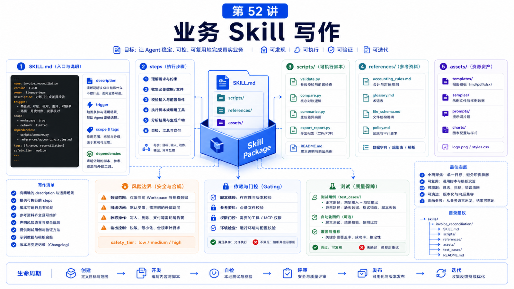

# 如何为业务写高质量 Skill



业务 Skill 最容易写成“公司内部说明书”。

但 Agent 需要的不是百科全书，而是行动指南：

```text
什么时候触发？
第一步做什么？
需要哪些工具？
什么情况必须停下？
失败了怎么恢复？
```

这篇讲如何把业务经验写成真正能被 Agent 用起来的 Skill。

## 先说结论：Skill 是业务操作的可执行说明

OpenClaw Skill 是一个目录，至少包含：

```text
SKILL.md
```

`SKILL.md` 需要 YAML frontmatter：

```yaml
---
name: refund-review
description: Review refund requests using order data and policy documents.
---
```

`name` 用小写、数字和连字符。`description` 很重要，因为它影响 Agent 是否知道该用这个 Skill。

## 好 Skill 的结构

建议结构：

```text
什么时候使用
不要在什么情况下使用
输入需要哪些信息
执行步骤
工具和脚本
确认点
失败处理
输出格式
引用的 references
```

把固定、可重复、容易抄错的逻辑放进 `scripts/`。

把长文档、字段表、案例放进 `references/`。

把模板放进 `assets/`。

## 写触发描述

坏描述：

```text
Useful for business tasks.
```

好描述：

```text
Use when reviewing customer refund requests; checks order status, refund policy, and drafts a recommendation without issuing the refund.
```

描述应该包含：

```text
任务类型
触发场景
边界
关键动作
禁止动作
```

## 写步骤

不要写：

```text
仔细分析用户需求并给出专业建议。
```

要写：

```text
1. 确认订单号和退款原因。
2. 查询订单状态。
3. 读取 references/refund-policy.md。
4. 判断是否符合自动退款条件。
5. 只生成建议，不执行退款。
6. 高金额或异常订单必须请求人工确认。
```

Agent 需要明确步骤，而不是鼓励口号。

## Gating 和依赖

OpenClaw Skill frontmatter 支持 OS、bin、config 等 gating。

这适合业务 Skill：

```yaml
metadata:
  openclaw:
    requires:
      bins: ["jq"]
      config: ["channels.telegram.enabled"]
```

如果 Skill 需要特定 CLI、API key 或配置，不要让它在缺依赖时假装可用。

## 安全边界

业务 Skill 要特别写清楚：

```text
不得直接退款
不得发送外部消息
不得读取非授权客户资料
不得把 PII 写进公开报告
生产变更前必须确认
```

如果用 `exec`，要避免把用户输入直接拼进 shell 命令。

如果用 browser，要说明登录、2FA、付款、删除等人工阻塞。

## 测试 Skill

创建后运行：

```bash
openclaw skills list
openclaw agent --message "帮我审核订单 123 的退款申请"
```

测试用例至少包括：

```text
正常路径
缺少输入
权限不足
工具失败
高风险操作
不应触发的相似任务
```

## 常见误解

### 误解一：Skill 越长越好

不。`SKILL.md` 应短而准，长资料放 references。

### 误解二：Skill 是提示词模板

不只是。它还可以组织脚本、资源、依赖、边界和操作流程。

### 误解三：业务规则都让模型自己判断

高风险规则要明确写出来，并尽量用脚本或结构化检查。

### 误解四：写完就不用测试

Skill 触发、误触发和失败路径都要测。

## 最后总结

高质量 Skill 是业务经验的工程化封装。

一句话总结：

```text
把触发写准，把步骤写清，把风险写死，把长资料外置，把重复逻辑脚本化。
```

## 本节作业

1. 为一个业务任务写 Skill frontmatter。
2. 写出 6 步以内的执行流程。
3. 列出三个必须停止并请求确认的情况。
4. 判断哪些内容应该放进 references 或 scripts。
5. 设计三条触发测试和三条误触发测试。

## 下一节预告

下一节讲如何评估一个 Agent 的成功率和风险。

## 参考资料

- OpenClaw Docs：[Creating skills](https://docs.openclaw.ai/tools/creating-skills)
- OpenClaw Docs：[Skills](https://docs.openclaw.ai/tools/skills)
- OpenClaw Docs：[Skills config](https://docs.openclaw.ai/tools/skills-config)
- OpenClaw Docs：[Security](https://docs.openclaw.ai/gateway/security)
- OpenClaw Docs：[Building plugins](https://docs.openclaw.ai/plugins/building-plugins)

