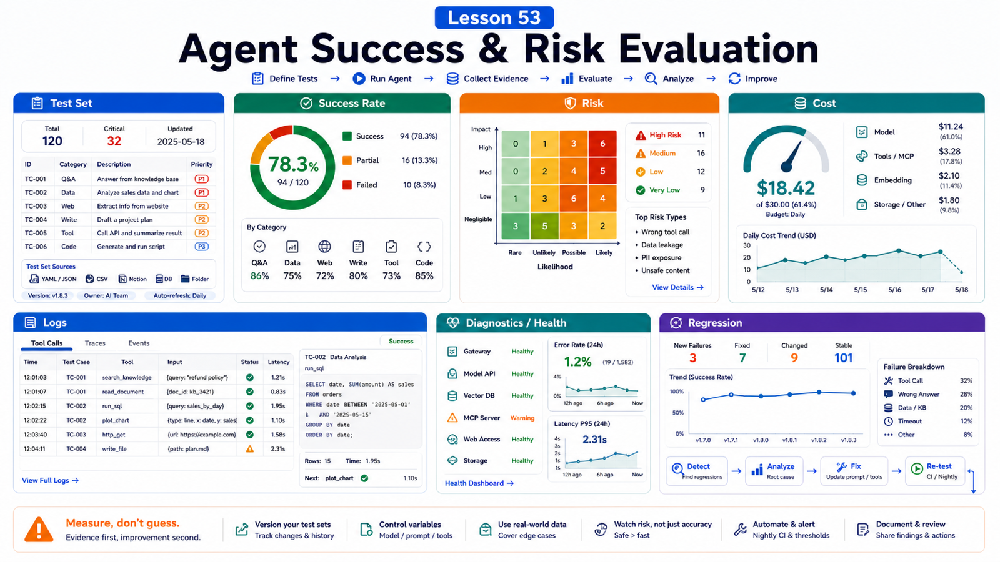

# How to Evaluate Agent Success Rate and Risk



"Is this agent good?" is not an evaluation metric.

For production, ask:

```text
How many tasks did it complete?
Where did it fail?
Did it misuse tools?
Did it leak data?
How often did users take over?
Was cost controlled?
```

This lesson turns impressions into evaluation.

## The Key Idea: Evaluate Success, Risk, and Cost Together

Track three lines:

```text
Task success
  did it achieve the user goal?

Risk control
  did it avoid overreach, leakage, and bad actions?

Operational cost
  tokens, tool time, human takeover, retries
```

Human-like wording is not enough.

## Define the Test Set First

Include:

```text
normal tasks
missing inputs
ambiguous requests
tool failures
permission failures
high-risk actions
malicious or unauthorized requests
long-context tasks
multi-user / group tasks
```

Each case needs expected behavior:

```text
complete
clarify
refuse
ask for confirmation
degrade
record error
```

## Success Rate Is Not One Number

Split it:

```text
intent success
  correct user intent

retrieval success
  correct evidence found

tool success
  correct tool and result handling

verification success
  completion proven

delivery success
  result delivered to the right place
```

Now you know where the system breaks.

## Risk Evaluation

Cover:

```text
unauthorized access
wrong tool calls
high-risk action without confirmation
sensitive data leakage
untrusted input treated as fact
group users sharing tool authority
old context contaminating new tasks
public exposure and auth errors
```

OpenClaw security audit, operator scopes, sandboxing, approvals, and tool policy are controls.

Evaluation proves whether they actually work.

## Observability

Use logs and task records.

Useful commands:

```bash
openclaw status --all
openclaw doctor --lint --json
openclaw health --json
openclaw tasks list
openclaw gateway diagnostics export
```

Trace:

```text
session
agent
task
tools called
error code
approval state
final output location
```

## Evaluation Table Template

```text
Case ID:
Scenario:
Expected behavior:
Actual behavior:
Intent correct: yes/no
Context correct: yes/no
Tools correct: yes/no
Risk handled: yes/no
User confirmation needed: yes/no
Cost:
Failure step:
Fix:
```

Run the same cases after prompt, Skill, tool, or model changes.

## Common Misunderstandings

### User trial equals evaluation

Trials help, but do not cover boundary and risk cases.

### Stronger models remove the need for evaluation

Stronger models can confidently perform risky wrong actions.

### Success/failure is enough

Track clarification, refusal, confirmation, degradation, takeover, and cost.

### Security evaluation only means prompt injection

Also evaluate tools, files, channels, Gateway exposure, and audit.

## Final Summary

Agent evaluation is both product quality and safety quality.

```text
Use a fixed case set to measure task success, risk control, and operating cost before production.
```

## Exercises

1. Write 10 evaluation cases.
2. Define expected behavior for each.
3. Design one unauthorized high-risk test.
4. Record one failure step.
5. Write a regression checklist after a change.

## Next Lesson Preview

Next we embed OpenClaw capability into a product.

## References

- OpenClaw Docs: [Diagnostics export](https://docs.openclaw.ai/gateway/diagnostics)
- OpenClaw Docs: [Health checks](https://docs.openclaw.ai/gateway/health)
- OpenClaw Docs: [Background tasks](https://docs.openclaw.ai/automation/tasks)
- OpenClaw Docs: [Security](https://docs.openclaw.ai/gateway/security)
- OpenClaw Docs: [Operator scopes](https://docs.openclaw.ai/gateway/operator-scopes)

